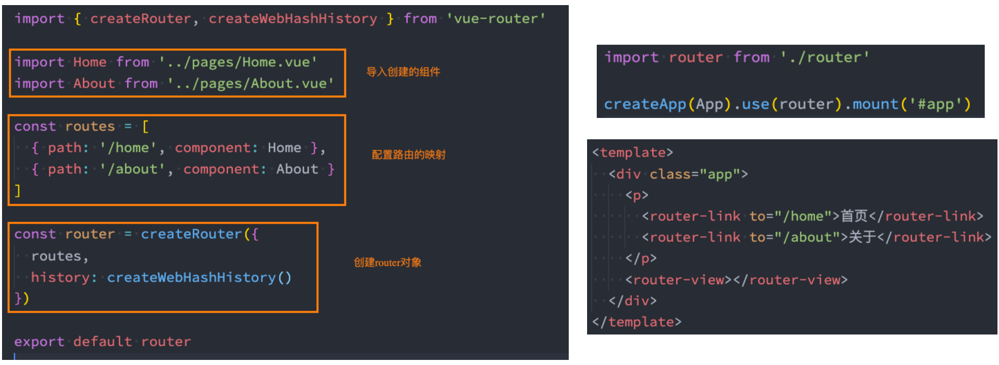
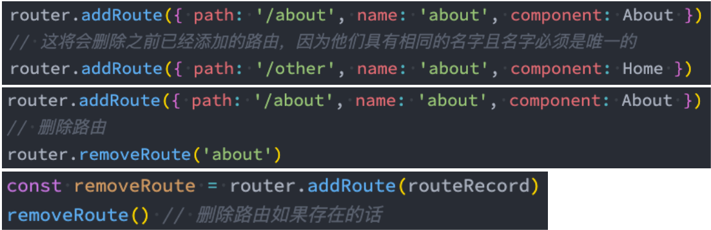
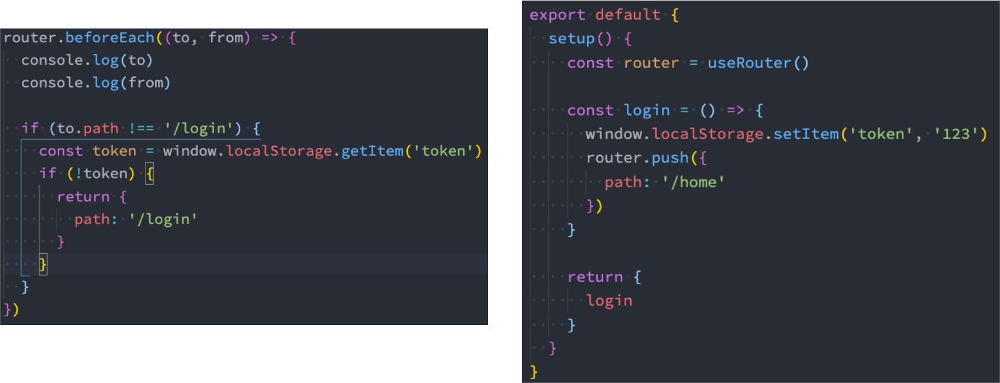

◼ **vue-router是基于路由和组件的**

​		 路由用于设定访问路径, 将路径和组件映射起来；

​		 在vue-router的单页面应用中, 页面的路径的改变就是组件的切换；

◼ **安装Vue Router：**

`npm install vue-router`

# 基本使用

 第一步：创建路由需要映射的组件（打算显示的页面）；

 第二步：通过createRouter创建路由对象，并且传入routes和history模式；

​		✓ 配置路由映射: 组件和路径映射关系的routes数组；

​		✓ 创建基于hash或者history的模式；

 第三步：使用app注册路由对象（use方法）；

 第四步：路由使用: 通过<router-link>和<router-view>；



# **路由的默认路径**

◼ **在routes中又配置了一个映射：**

​		 path配置的是根路径: /

​		 redirect是重定向, 也就是我们将根路径重定向到/home的路径下, 这样就可以得到我们想要的结果了

```js
const routes=[
    {path:'/',redirect:'/home'},
    {path:'/home',component:Home}
]
```

# **history模式**

```js
import {createRouter,createWebHistory} from 'vue-router'
const router=createRouter({
    routes,
    history:creatWebHistory()
})
```

# **router-link**

◼ **router-link事实上有很多属性可以配置：**

◼ **to属性：**

​		 是一个字符串，或者是一个对象

◼ **replace属性：**

​		 设置 replace 属性的话，当点击时，会调用 router.replace()，而不是 router.push()；

◼ **active-class属性：**

​		 设置激活a元素后应用的class，默认是router-link-active

◼ **exact-active-class属性：**

​		 链接精准激活时，应用于渲染的 <a> 的 class，默认是router-link-exact-active；

# **路由懒加载**

◼ **当打包构建应用时，JavaScript 包会变得非常大，影响页面加载：**

​		 如果我们能把不同路由对应的组件分割成不同的代码块，然后当路由被访问的时候才加载对应组件，这样就会更加高效；

​		 也可以提高首屏的渲染效率；

◼ **其实这里还是我们前面讲到过的webpack的分包知识，而Vue Router默认就支持动态来导入组件：**

​		 这是因为component可以传入一个组件，也可以接收一个函数，该函数 需要放回一个Promise；

​		 而import函数就是返回一个Promise；

```js
const routes=[
    {path:'/home',component:()=>import('../pages/Home.vue')},
    {path:'/about',component:()=>import('../pages/About.vue')}
]
```

# **路由的其他属性**

◼ name属性：路由记录独一无二的名称；

◼ meta属性：自定义的数据

```js
{
    path:'/about',
    name:'about-router',
    component:()=>import('../pages/About.vue'),
    meta:{
        name:'why',
        age:18
    }
}
```

# **动态路由**

◼ **很多时候我们需要将给定匹配模式的路由映射到同一个组件：**

​		 例如，我们可能有一个 User 组件，它应该对所有用户进行渲染，但是用户的ID是不同的；

​		 在Vue Router中，我们可以在路径中使用一个动态字段来实现，我们称之为 路径参数；

```js
{
    path:'/user/:id',
        component:()=>import('../pages/User.vue')
}
```

◼ **在router-link中进行如下跳转：**

`<router-link to="/user/123">用户：123</router-link>`

◼ **那么在User中如何获取到对应的值呢？**

​		 在template中，直接通过 $route.params获取值；

​			✓ 在created中，通过 this.$route.params获取值；

```vue
<template>
	<div>
        <h2>用户界面：{{$route.params.id}}</h2>
    </div>
</template>
```

​			✓ 在setup中，我们要使用 vue-router库给我们提供的一个hook useRoute；

​				➢ 该Hook会返回一个Route对象，对象中保存着当前路由相关的值；

```js
export default {
    created(){
        console.log(this.$route.params.id)
    },
    setup(){
        const route=useRoute()
        console.log(route)
        console.log(route.params.id)
    }
}
```

# **NotFound**

◼ 对于哪些没有匹配到的路由，我们通常会匹配到固定的某个页面

​		 比如NotFound的错误页面中，这个时候我们可编写一个动态路由用于匹配所有的页面；

```js
{
    path:'/:pathMatch(.*)',
        component:()=>import('../pages/NotFound.vue')
}
```

◼ 我们可以通过 $route.params.pathMatch获取到传入的参数：

```vue
<h2>
    <!--NotFound:user/hhh/123-->
    NotFound:{{$route.params.pathMatch}}
</h2>
```

# **匹配规则加\***

◼ **这里还有另外一种写法：**

​		 注意：我在/:pathMatch(.*)后面又加了一个 *；

```js
{
    path:'/:pathMatch(.*)*',
    component:()=>import('../pages/NotFound.vue')
}
```

◼ 它们的区别在于解析的时候，是否解析 /：

```js
//NotFound:["user","hhh","123"]
path:'/:pathMatch(.*)*'
//NotFound:user/hhh/123
path:'/:pathMatch(.*)'
```

# **路由的嵌套**

```js
{
    path:'/home',
    component:()=>import('../pages/Home.vue'),
    children:[
        {
            path:'',
            redirect:'/home/product'
        },
        {
            path:'product',
            component:()=>import('../pages/HomeProduct.vue')
        }
    ]
}
```

# **代码的页面跳转**

◼ 有时候我们希望通过代码来完成页面的跳转，比如点击的是一个按钮：

```js
jumpToProfile(){
    this.$router.push('/profile')
}
```

◼ 当然，我们也可以传入一个对象：

```js
jumpToProfile(){
    this.$router.push({
    	path:'/profile'
    })
}
```

◼ 如果是在setup中编写的代码，那么我们可以通过 useRouter 来获取：

```js
const router=useRouter()
const jumpToProfile=()=>{
    router.replace('/profile')
}
```

# **query方式的参数**

◼ 我们也可以通过query的方式来传递参数：

```js
jumpToProfile(){
    this.$router.push({
    	path:'/profile',
        query:{name:'why',age:18}
    })
}
```

◼ 在界面中通过 $route.query 来获取参数

`<h2> query: {{$route.query.name}} - {{$route.query.age}} </h2>`

# **动态添加路由**

◼ **某些情况下我们可能需要动态的来添加路由：**

​		 比如根据用户不同的权限，注册不同的路由；

​		 这个时候我们可以使用一个方法 addRoute；

◼ **如果我们是为route添加一个children路由，那么可以传入对应的name：**

```js
const homeVip={
    path:'vip',
    component:()=>import('../pages/Homevip.vue')
}

router.addRoute('home',homeVip)
```

◼ **删除路由有以下三种方式：**

​		 方式一：添加一个name相同的路由；

​		 方式二：通过removeRoute方法，传入路由的名称；

​		 方式三：通过addRoute方法的返回值回调；



◼ **路由的其他方法补充：**

​		 router.hasRoute()：检查路由是否存在。

​		 router.getRoutes()：获取一个包含所有路由记录的数组。

# **路由导航守卫**

◼ **vue-router 提供的导航守卫主要用来通过跳转或取消的方式守卫导航。**

```js
router.beforeEach((to,from)=>{
    console.log(to)
    console.log(from)
    return false
})
```

◼ **全局的前置守卫beforeEach是在导航触发时会被回调的：**

◼ **它有两个参数：**

​		 to：即将进入的路由Route对象；

​		 from：即将离开的路由Route对象；

◼ **它有返回值：**

​		 false：取消当前导航；

​		 不返回或者undefined：进行默认导航；

​		 返回一个路由地址：

​				✓ 可以是一个string类型的路径；

​				✓ 可以是一个对象，对象中包含path、query、params等信息；

◼ **可选的第三个参数：next（不推荐使用）**

​		 在Vue2中我们是通过next函数来决定如何进行跳转的；

​		 但是在Vue3中我们是通过返回值来控制的，不再推荐使用next函数，这是因为开发中很容易调用多次next；

## **登录守卫功能**

◼ 比如我们完成一个功能，只有登录后才能看到其他页面：



## **其他导航守卫**

◼ **Vue还提供了很多的其他守卫函数，目的都是在某一个时刻给予我们回调，让我们可以更好的控制程序的流程或者功能：**

​		 https://next.router.vuejs.org/zh/guide/advanced/navigation-guards.html

◼ **完整的导航解析流程**：

​		 导航被触发。

​		 在失活的组件里调用 beforeRouteLeave 守卫。

​		 调用全局的 beforeEach 守卫。

​		 在重用的组件里调用 beforeRouteUpdate 守卫(2.2+)。

​		 在路由配置里调用 beforeEnter。

​		 解析异步路由组件。

​		 在被激活的组件里调用 beforeRouteEnter。

​		 调用全局的 beforeResolve 守卫(2.5+)。

​		 导航被确认。

​		 调用全局的 afterEach 钩子。

​		 触发 DOM 更新。

​		 调用 beforeRouteEnter 守卫中传给 next 的回调函数，创建好的组件实例会作为回调函数的参数传入。