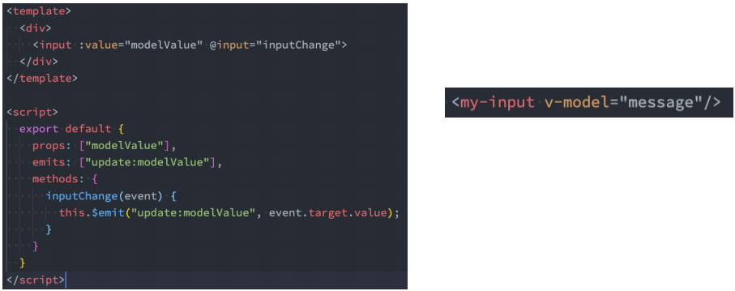

# **注册全局组件**

 全局组件需要使用我们全局创建的**app来注册组件**；

 **通过component方法传入组件名称、组件对象**即可注册一个全局组件了；

 之后，我们可以**在App组件的template中直接使用这个全局组件**：

```vue
<template id="my-cpn">
	<h2>我是组件标题</h2>
	<p>我是组件内容</p>
</template>

<script src="../js/vue.js"></script>
<script>
	const app=Vue.createApp(App)
    app.component("my-cpn",{
        template:"#my-cpn"
    })
    app.mount('#app')
</script>
```

```vue
<template id="my-app">
	<my-cpn></my-cpn>
</template>
```

# **注册局部组件**

 局部注册是在我们需要使用到的组件中，通过**components属性**选项来进行注册；

 比如之前的App组件中，我们有data、computed、methods等选项了，事实上还可以有一个components选项；

 该**components选项对应的是一个对象**，对象中的键值对是 **组件的名称: 组件对象**；

```js
const componentA={
	template:"#component-a",
	data(){
		return{
			title:"标题"
		}
	}
}

const App={
    template:'#my-app',
    components:{
        'conponent-a':ComponentA
    },
    data(){
        return{
            message:"Hello World"
        }
    }
}
Vue.createApp(App).mount('#app')
```

# **Vue CLI 安装和使用**

◼ **安装Vue CLI（目前最新的版本是v5.0.8）**

​		 我们是进行全局安装，这样在任何时候都可以通过vue的命令来创建项目；

​		==**npm install @vue/cli -g**==

◼ **升级Vue CLI：**

​		 如果是比较旧的版本，可以通过下面的命令来升级

​		==**npm update @vue/cli -g**==

◼ **通过Vue的命令来创建项目**

​		==**Vue create 项目的名称**==

# 组件通信

## **父子组件通信**

◼ **父子组件之间如何进行通信呢？**

​		 父组件传递给子组件：通过props属性；

​		 子组件传递给父组件：通过$emit触发事件；

### 父→子

◼ **什么是Props呢？**

​		 Props是你可以在组件上注册一些自定义的attribute；

​		 父组件给这些attribute赋值，子组件通过attribute的名称获取到对应的值；

◼ **Props有两种常见的用法：**

​		 方式一：**字符串数组，数组中的字符串就是attribute的名称**；

```vue
<show-message title="hhh" content="i'm hhh"></show-message>

<script>
	export default {
        props:["title","content"]
    }
</script>
```

​		 方式二：**对象类型**，对象类型我们可以**在指定attribute名称的同时，指定它需要传递的类型、是否是必须的、默认值等等**；

```vue
<script>
	export default {
        props:{
        	title:{
                type:String,
                required:true,
                default:"我是默认值"
            }
        }
    }
</script>
```

◼ **那么type的类型都可以是哪些呢？**

​		 String

​		 Number

​		 Boolean

​		 Array  （默认值必须是函数）

​		 Object  （默认值必须是函数）

​		 Date

​		 Function

​		 Symbol


◼ **Prop 的大小写命名(camelCase vs kebab-case)**

​		 HTML 中的 attribute 名是大小写不敏感的，所以浏览器会把所有大写字符解释为小写字符；

​		 这意味着当你使用 DOM 中的模板时，camelCase (驼峰命名法) 的 prop 名需要使用其等价的 kebab-case (短横线分隔命名) 命名；

◼ **非Prop的Attribute**

​		 当我们传递给一个组件某个属性，但是该属性并没有定义对应的props时，就称之为 非Prop的Attribute；

​		 常见的包括class、style、id属性等；

​		 当组件有单个根节点时，**非Prop的Attribute将自动添加到子组件根节点的Attribute中**

◼ 如果我们**不希望组件的根元素继承attribute**，可以在组件中设置 **inheritAttrs: false**：

​		 禁用attribute继承的常见情况是需要将attribute应用于根元素之外的其他元素；

​		 我们可以**通过 $attrs来访问所有的 非props的attribute**；

```vue
<div>
    我是组件
    <h2 :class="$attrs.class"></h2>
</div>
```

◼ **多个根节点的attribute**

​		 多个根节点的attribute如果没有显示的绑定，那么会报警告，我们必须手动的指定要绑定到哪一个属性上

### 子→父

 首先，我们需要**在子组件中定义好在某些情况下触发的事件名称**；

 其次，**在父组件中以v-on的方式传入要监听的事件名称，并且绑定到对应的方法中**；

 最后，在子组件中发生某个事件的时候，根据事件名称触发对应的事件；

 **emits选项可以是一个字符串数组或一个对象**


◼ **自定义事件的时候，我们也可以传递一些参数给父组件：**

​		 如果emits选项是一个字符串数组，每个字符串表示一个事件名称，那么组件可以触发这些自定义事件，但是不需要传递任何参数。如果emits选项是一个对象，那么对象的键是事件名称，值是参数数组。例如：

```js
emits: {
  'my-event': ['arg1', 'arg2']
}
```

​		 这表示组件可以触发名为"my-event"的自定义事件，并且该事件需要传递两个参数，分别是"arg1"和"arg2"。在组件中触发自定义事件时，可以使用$emit方法，并传递参数。例如：

```js
this.$emit('my-event', 'value1', 'value2');
```

​		 这将触发名为"my-event"的自定义事件，并传递两个参数"value1"和"value2"。在父组件中监听该事件时，可以使用v-on指令，并接收参数。例如：

```html
<my-component v-on:my-event="handleEvent"></my-component>
```

​		 这表示在父组件中监听名为"my-event"的自定义事件，并调用"handleEvent"方法处理事件。在"handleEvent"方法中，可以接收传递的参数。例如：

```js
methods: {
  handleEvent(arg1, arg2) {
    console.log(arg1, arg2);
  }
}
```

◼ **在vue3当中，我们可以对传递的参数进行验证：**

```js
emits:{
    addOne:null,
    addTen:function(payload){
        if(payload===10){
            return true
        }
        return false
    }
}
```

## 插槽

### **基本使用**

◼ **我们一个组件MySlotCpn.vue：该组件中有一个插槽，我们可以在插槽中放入需要显示的内容；**

◼ **我们在App.vue中使用它们：**

​		 我们可以插入普通的内容、html元素、组件，都可以是可以的；

```vue
<!--组件中-->
<template>
	<div>
        <h2>MySlotCpn开始</h2>
        <slot></slot>
        <h2>MySlotCpn结尾</h2>
    </h2>
    </div>
</template>
<!--App.vue中-->
<template>
	<div>
        <my-slot-cpn>
            <!--普通的内容-->
            Hello World
            <!--html元素-->
            <button>我是按钮</button>
            <!--组件元素-->
            <my-button></my-button>
    	</my-slot-cpn>
    </h2>
    </div>
</template>
```

### **具名插槽**

 具名插槽顾名思义就是给插槽起一个名字，<slot> 元素有一个特殊的 attribute：**name**；

 **一个不带 name 的slot，会带有隐含的名字 default**；


#### **动态插槽名**

 我们可以通过 v-slot:[dynamicSlotName]方式动态绑定一个名称

```vue
<!--App.vue中-->
<template>
	<div>
        <my-slot-cpn>
            <template v-slot:[name]><!--找App.vue中的data变量，不找组件-->
                <button> </button>
			</template>
    	</my-slot-cpn>
    </h2>
    </div>
</template>
```

#### **缩写**

 把参数之前的所有内容 (v-slot:) 替换为字符 #；

◼ 如果我们的插槽是默认插槽default，那么在使用的时候 v-slot:default="slotProps"可以简写为v-slot="slotProps"

◼ 并且如果我们的插槽只有默认插槽时，组件的标签可以被当做插槽的模板来使用，这样，我们就可以将 v-slot 直接用在组件上(即不用再套个<template>)

### **作用域插槽**

◼ 有时候我们希望插槽**可以访问到子组件中的内容**是非常重要的：

​		 当一个组件被用来渲染一个数组元素时，我们使用插槽，并且希望插槽中没有显示每项的内容；

​		 这个Vue给我们提供了作用域插槽；

◼ **我们来看下面的一个案例：**

​		 1.在App.vue中定义好数据

​		 2.传递给ShowNames组件中

​		 3.ShowNames组件中遍历names数据

​		 4.定义插槽的prop

​		 5.通过v-slot:default的方式获取到slot的props

​		 6.使用slotProps中的item和index


## 非父子组件通信

### 全局事件总线

◼ **Vue3从实例中移除了 $on、$off 和 $once 方法，所以我们如果希望继续使用全局事件总线，要通过第三方的库**：

​		 Vue3官方有推荐一些库，例如 mitt 或 tiny-emitter；

​		 这里我们主要讲解一下 hy-event-store 的使用；

◼ **首先，我们需要先安装这个库：**

`npm install hy-event-bus`

◼ **其次，我们可以封装一个工具eventbus.js：**

```js
import {HYEventBus} from 'hy-event-store'
const eventBus=new HYEventBus()
export default eventBus
```

◼ **在项目中可以使用它们：**

​		 我们在App.vue中监听事件；

​		 我们在Banner.vue中触发事件；


◼ 在某些情况下我们可能希望**取消掉之前注册的函数监听**：

```js
cancelListener(){
	eventBus.off("bannerClick",this.bannerClick)
}
```

### **Provide和Inject**

◼ **主要用于祖孙通信**

​		 父组件有一个 provide 选项来提供数据；

​		 子组件有一个 inject 选项来开始使用这些数据；

◼ 实际上，你可以将依赖注入看作是“**long range props”**，除了：

​		 父组件不需要知道哪些子组件使用它 provide 的 property

​		 子组件不需要知道 inject 的 property 来自哪里


◼ 如果Provide中提供的一些数据是**来自data**，那么我们可能会想要**通过this来获取**：

◼ **这个时候会报错：**

​		 **此时this指向的是当前组件实例，而非vue实例**


◼ **但是如果我们修改了this.names的内容，使用length的子组件不是响应式的**

​		 当我们修改了names之后，之前在provide中引入的 this.names.length 本身并不是响应式的；

◼ **那么怎么样可以让我们的数据变成响应式的呢？**

​		 非常的简单，我们可以使用响应式的一些API来完成这些功能，比如说computed函数；

​		 当然，这个computed是vue3的新特性，在后面我会专门讲解，这里大家可以先直接使用一下；

◼ **注意：我们在使用length的时候需要获取其中的value**

​		 这是因为computed返回的是一个ref对象，需要取出其中的value来使用；


# **$refs/**\$parent/$root

◼ 某些情况下，我们在组件中想要**直接获取到元素对象或者子组件实例**：

​		 在Vue开发中我们是不推荐进行DOM操作的；

​		 这个时候，我们可以给元素或者组件绑定一个ref的attribute属性；

◼ **组件实例有一个$refs属性：**

​		 它一个对象Object，持有注册过 ref attribute 的所有 DOM 元素和组件实例。

```js
//获取元素(class=title)
this.$refs.title
//获取组件实例
this.$refs.zujian
//父组件可以直接调用子组件的方法
this.$refs.zujian.zujianclick()
//获取组件实例的元素
this.$refs.zujian.$el
//若组件时多个根，拿到的会是第一个node节点
//推荐组件只有一个根
this.$refs.zujian.$el.nextElementSibling
```

◼ **我们可以通过$parent来访问父元素。**

◼ **HelloWorld.vue的实现：**

​		 这里我们也可以通过$root来实现，因为App是我们的根组件；

```js
visitParent() {
    console.log(this.$parent.message)
    console.log(this.$root.message)
}
```

◼ 注意：在Vue3中已经**移除了$children的属性**，所以不可以使用了

# **动态组件**

◼ **动态组件是使用component 组件，通过一个特殊的attribute is来实现：**

```vue
<template>
	<div>
        <button v-for="tab in tabs"
                :key="tab"
                :class="{active:currentTab===tab}"
                @click="tabClick(tab)">
            {{tab}}
    	</button>
        <!--动态组件-->
        <component :is="currentTab"></component>
    </div>
</template>
```

◼ **这个currentTab的值需要是什么内容呢？**

​		 全局注册：可以是通过component函数注册的组件；

​		 布局注册：在一个组件对象的components对象中注册的组件；

◼ **如果是动态组件我们可以给它们传值和监听事件吗？**

​		 也是一样的；

​		 只是我们需要将属性和监听事件放到component上来使用；

```vue
<component name="why"
           :age=18
           @pageClick="pageClick"
           :is="currentTab"/>
```

# **keep-alive**

上面动态组件中，在切换组件后，原来的组件会被销毁掉，再次回来时会重新创建组件；

◼ 但是，在开发中某些情况我们希望继续保持组件的状态，而不是销毁掉，这个时候我们就可以**使用一个内置组件：keep-alive**。

◼ **keep-alive有一些属性：**

​		 **include** - string | RegExp | Array。只有名称匹配的组件会被缓存；

​		 **exclude** - string | RegExp | Array。任何名称匹配的组件都不会被缓存；

​		 **max** - number | string。最多可以缓存多少组件实例，一旦达到这个数

字，那么缓存组件中最近没有被访问的实例会被销毁；

◼ **include 和 exclude prop 允许组件有条件地缓存：**

​		 二者都可以用逗号分隔字符串、正则表达式或一个数组来表示；

​		 **匹配首先检查组件自身的 name 选项**；

## **缓存组件的生命周期**

◼ 对于缓存的组件来说，再次进入时，我们是**不会执行created或者mounted等生命周期函数**的：

​		 但是有时候我们确实希望监听到何时重新进入到了组件，何时离开了组件；

​		 这个时候我们可以使用**activated 和 deactivated** 这两个生命周期钩子函数来监听

# **Webpack的代码分包**

◼ **默认的打包过程：**

​		 默认情况下，在构建整个组件树的过程中，因为组件和组件之间是通过模块化直接依赖的，那么webpack在打包时就会将组件模块打包到一起（比如一个app.js文件中）；

​		 这个时候随着项目的不断庞大，app.js文件的内容过大，会造成首屏的渲染速度变慢；

◼ **打包时，代码的分包：**

​		 所以，对于一些不需要立即使用的组件，我们可以单独对它们进行拆分，拆分成一些小的代码块chunk.js；

​		 这些chunk.js会在需要时从服务器加载下来，并且运行代码，显示对应的内容；

◼ **那么webpack中如何可以对代码进行分包呢？**


# **异步组件**

◼ 如果我们的项目过大了，对于**某些组件**我们希望**通过异步的方式来进行加载**（目的是可以对其进行分包处理），那么Vue中给我们提供了一个函数：**defineAsyncComponent**。

◼ **defineAsyncComponent接受两种类型的参数：**

​		 类型一：工厂函数，该工厂函数需要返回一个Promise对象；

​		 类型二：接受一个对象类型，对异步函数进行配置；

◼ **工厂函数类型一的写法：**


# **组件的v-model**

◼ **前面我们在nput中可以使用v-model来完成双向绑定：**

​		 这个时候往往会非常方便，因为v-model默认帮助我们完成了两件事；

​		 v-bind:value的数据绑定和@input的事件监听；

◼ 如果我们现在**封装了一个组件**，其他地方在使用这个组件时，是否也可以**使用v-model来同时完成这两个功能**呢？

​		 也是可以的，vue也支持在组件上使用v-model；

◼ **当我们在组件上使用的时候，等价于如下的操作：**

​		 我们会发现和input元素不同的只是属性的名称和事件触发的名称而已；

```vue
<zujian v-model="message"/>
<!--等价于-->
<zujian :model-value="message" @update:model-value="message=$event"></zujian>
```

◼ **那么，为了我们的组件可以正常的工作，这个组件内的 <input> 必须：**

​		 将其 value attribute 绑定到一个名叫 modelValue 的 prop 上；

​		 在其 input 事件被触发时，将新的值通过自定义的 update:modelValue 事件抛出；

◼ MyInput.vue的组件代码如下：



## **绑定多个属性**

◼ 我们现在通过v-model是直接绑定了一个属性，如果我们**希望绑定多个属性**呢？

​		 也就是我们希望在一个组件上使用多个v-model是否可以实现呢？

​		 我们知道，默认情况下的v-model其实是绑定了 modelValue 属性和 @update:modelValue的事件；

​		 如果我们希望绑定更多，可以给v-model传入一个参数，那么这个参数的名称就是我们绑定属性的名称；

◼ 注意：这里我是绑定了两个属性的

`<zujian v-model="m" v-model:title="t"`

◼ **v-model:title相当于做了两件事：**

​		 绑定了title属性；

​		 监听了 @update:title的事件；

```js
export default {
	props:["modelValue","title"],
	emits:["update:modelValue","update:title"],
	methods:{
		inputChange(event){
			this.$emit("update:modelValue",event.target)
		},
		input2Change(event){
			this.$emit("update:title",event.target)
		},
	}
}
```

# **Mixin**

◼ 目前我们是使用组件化的方式在开发整个Vue的应用程序，但是**组件和组件之间有时候会存在相同的代码逻辑**，我们希望对**相同**

**的代码逻辑进行抽取**。

◼ 在Vue2和Vue3中都支持的一种方式就是**使用Mixin来完成**：

​		 Mixin提供了一种非常灵活的方式，来分发Vue组件中的可复用功能；

​		 一个Mixin对象可以包含任何组件选项；

​		 当组件使用Mixin对象时，所有Mixin对象的选项将被 混合 进入该组件本身的选项中；


◼ **如果Mixin对象中的选项和组件对象中的选项发生了冲突，那么Vue会如何操作呢？**

​		 这里分成不同的情况来进行处理；

◼ **情况一：如果是data函数的返回值对象**

​		 返回值对象默认情况下会进行合并；

​		 如果data返回值对象的属性发生了冲突，那么会保留组件自身的数据；

◼ **情况二：如何生命周期钩子函数**

​		 生命周期的钩子函数会被合并到数组中，都会被调用；

◼ **情况三：值为对象的选项，例如 methods、components 和 directives，将被合并为同一个对象。**

​		 比如都有methods选项，并且都定义了方法，那么它们都会生效；

​		 但是如果对象的key相同，那么会取组件对象的键值对；

## **全局混入Mixin**

◼ **如果组件中的某些选项，是所有的组件都需要拥有的，那么这个时候我们可以使用全局的mixin：**

​		 全局的Mixin可以使用 应用app的方法 mixin 来完成注册；

​		 一旦注册，那么全局混入的选项将会影响每一个组件；

```js
const app=createApp(App);
app.mixin({
    created() {
        console.log("global mixin created")
    }
})
app.mount("#app")
```

