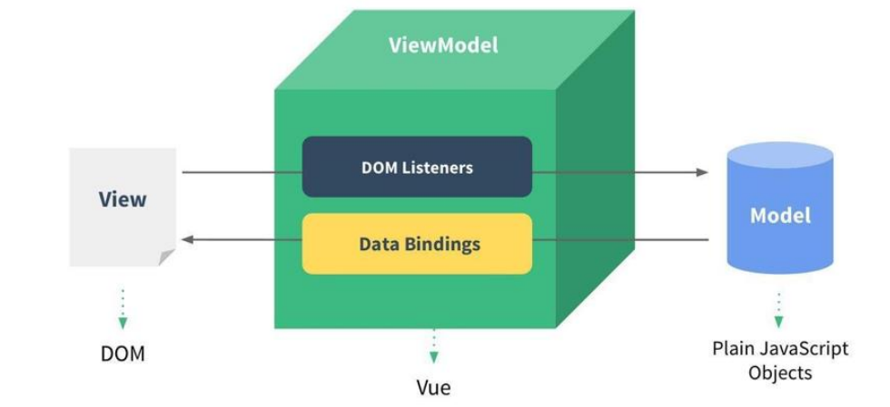

# Vue

◼ **Vue 是一套用于构建用户界面的渐进式 JavaScript框架。**

​		 全称是Vue.js或者Vuejs；

​		 它基于标准 HTML、CSS 和 JavaScript 构建，并提供了一套声明式的、组件化的编程模型；

​		 帮助你高效地开发用户界面，无论任务是简单还是复杂；

◼ **什么是渐进式框架呢？**

​		✓ 表示我们可以在项目中一点点来引入和使用Vue，而不一定需要全部使用Vue来开发整个项目；

## **声明式和命令式**

◼ 原生开发和Vue开发的模式和特点，我们会发现是完全不同的，这里其实涉及到**两种不同的编程范式**：

​		 命令式编程和声明式编程；

​		 命令式编程关注的是 “how to do”自己完成整个how的过程；

​		 声明式编程关注的是 “what to do”，由框架(机器)完成 “how”的过程；

◼ **在原生的实现过程中，我们是如何操作的呢？**

​		 我们每完成一个操作，都需要通过JavaScript编写一条代码，来给浏览器一个指令；

​		 这样的编写代码的过程，我们称之为命令式编程；

​		 在早期的原生JavaScript和jQuery开发的过程中，我们都是通过这种命令式的方式在编写代码的；

◼ **在Vue的实现过程中，我们是如何操作的呢？**

​		 我们会在createApp传入的对象中声明需要的内容，模板template、数据data、方法methods；

​		 这样的编写代码的过程，我们称之为是声明式编程；

​		 目前Vue、React、Angular、小程序的编程模式，我们称之为声明式编程；

## **MVVM模型**

◼ **通常情况下，我们也经常称Vue是一个MVVM的框架。**

​		 Vue官方其实有说明，Vue虽然并没有完全遵守MVVM的模型，但是整个设计是受到它的启发的。



# 模板语法

## Mustache双大括号语法

◼ 如果我们希望把数据显示到模板（template）中，使用最多的语法是 “Mustache”语法 (双大括号) 的文本插值。

​	     并且我们前端提到过，data返回的对象是有添加到Vue的响应式系统中； 

​		 当data中的数据发生改变时，对应的内容也会发生更新。 

​		 当然，Mustache中不仅仅可以是data中的属性，也可以是一个JavaScript的表达式。 

◼ 另外这种用法是错误的：

```html
<!--这是赋值语句，不是表达式-->
<h2>
    {{var name="Hello"}}
</h2>
<!--控制流的if语句也不支持，只可以用三元运算符-->
<h2>
    {{if (true) {return message}}}
</h2>
```

## v-once

◼ **v-once用于指定元素或者组件只渲染一次：** 

​		 当数据发生变化时，**元素或者组件以及其所有的子元素将视为静态内容**并且跳过； 

​		 该指令可以用于**性能优化**； 

◼ **如果是子节点，也是只会渲染一次：**

```html
<div v-once>
    <h2>
        当前计数:{{counter}}
    </h2>
    <button @click="increment">
        +1
    </button>
</div>
```

## v-text

◼ 用于更新元素的 textContent：

```vue
<span v-text="msg"></span>
<!--等价于-->
<span>{{msg}}</span>
```

## v-html

◼ **默认情况下，如果我们展示的内容本身是 html 的，那么vue并不会对其进行特殊的解析。** 

​		 如果我们希望这个内容被Vue可以解析出来，那么可以使用 v-html 来展示；

## v-pre

◼ v-pre用于跳过元素和它的子元素的编译过程，显示原始的Mustache标签： 

​		 跳过不需要编译的节点，加快编译的速度；

## v-cloak

◼ 这个指令保持在元素上直到关联组件实例结束编译。 

​		 和 CSS 规则如 [v-cloak] { display: none } 一起用时，这个指令可以隐藏未编译的 Mustache 标签直到组件实例准备完毕。

```vue
<style>
    [v-cloak] {
        display: none;
    }
</style>
<template>
    <div v-cloak>
        {{ msg }}
    </div>
</template>
```

## v-memo

◼ 这个指令接收一个固定长度的数组作为依赖值进行记忆比对，若数组中的每个值与上次渲染相同，则整个子树更新被跳过。

​		 案例：只有name改变的时候才改变所有信息：

```vue
<div v-memo="[name]">
    <div>姓名:name</div>
    <div>年龄:age</div>
    <div>身高:height</div>
</div>
```

## v-bind绑定属性

◼ 前端讲的一系列指令，主要是将值插入到模板内容中。 

◼ 但是，除了内容需要动态来决定外，某些**属性**我们也希望动态来绑定。 

​		 比如动态绑定a元素的href属性； 

​		 比如动态绑定img元素的src属性；

### 绑定class

#### 对象语法

我们可以传给 :class (v-bind:class 的简写) 一个对象，以动态地切换 class。

```js
<!--普通的绑定方式-->
<div :class="className">{{ message }}</div>
<!-- 对象绑定-->
<!--动态切换class是否加入：{类（变量）：boolean（true/false）} -->
<div class="why" :class="{nba:true,'james':true}"></div>
<!-- 绑定对象 -->
<div :class="classObj">hhh</div>
<!-- 从methods中获取 -->
<div :class="getClassObj()"></div>
```

#### 数组语法

我们可以把一个数组传给 :class，以应用一个 class 列表

```js
<div :class="['why',nba]">哈哈哈</div>
<div :class="['why',nba,isActive?'active':'']">呵呵</div>
<div :class="['why',nba,{'active':isActive}]"></div>
```

### 绑定style

◼ 我们可以利用v-bind:style来绑定一些CSS内联样式： 

​		 这次因为某些样式我们需要根据数据动态来决定； 

​		 比如某段文字的颜色，大小等等； 

◼ CSS property 名可以用**驼峰式** 或**短横线分隔** (记得用引号括起来) 来命名；

#### 对象语法

```js
<!-- 1.基本使用：传入一个对象，并且对象内容都是确定的 -->
<div :style="{color:'red',fontSize:'30px'}">{{message}}</div>
<!-- 2.变量数据：传入一个对象，值回来自于data -->
<div :style="{fontSize:size+'px'}">{{message}}</div>
<!-- 3.对象数据：直接在data中定义好对象在这里使用 -->
<div :style="styleObj">{{message}}</div>
```

#### 数组语法

`<div :style="[styleObj1,styleObj2]">{{message}}</div>`

### 动态绑定属性

◼ 在某些情况下，我们属性的名称可能也不是固定的： 

​		 前端我们无论绑定src、href、class、style，属性名称都是固定的； 

​		 如果**属性名称不是固定**的，我们可以使用 **:[属性名]=“值”** 的格式来定义； 

​		 这种绑定的方式，我们称之为动态绑定属性；

`<div :[name]="value">{{message}}</div>`

### 绑定一个对象

◼ 如果我们希望将一个对象的所有属性，绑定到元素上的所有属性，应该怎么做呢？ 

​		 非常简单，我们可以直接使用 v-bind 绑定一个 对象； 

## v-on绑定事件

### 基本使用

◼ 我们可以使用v-on来监听一下点击的事件： 

```js
<!-- 绑定一个表达式 -->
<button v-on:click="counter++"></button>
<!-- 绑定到一个methods方法中 -->
<button v-on:click="btnClick"></button>
```

◼ v-on:click可以写成@click，是它的语法糖写法

◼ 当然，我们也可以绑定其他的事件： 

`<div @mousemove="mouseMove">div区域</div>`

◼ 如果我们希望一个元素绑定多个事件，这个时候可以传入一个对象：

`<button v-on:"{click:btnClick,mousemove:mouseMove}"></button>`

### 参数传递

◼ 当通过methods中定义方法，以供@click调用时，需要注意参数问题： 

◼ 情况一：如果该方法不需要额外参数，那么方法后的()可以不添加。 

​		 但是注意：如果方法本身中有一个参数，那么会默认将原生事件event参数传递进去 

◼ 情况二：如果需要同时传入某个参数，同时需要event时，可以通过$event传入事件。

```js
<!--默认会把event对象传入-->
<button @click="btn4Click">按钮4</button>
<!--内联语句传入其他属性-->
<button @click="btn5Click($event,'why')">按钮5</button>

btn4Click(event) {
    console.log(event)
}
btn5Click(event,message) {
    console.log(event,message)
}
```

### v-on的修饰符

◼ v-on支持修饰符，修饰符相当于对事件进行了一些特殊的处理： 

​		 .stop - 调用 event.stopPropagation()。 

​		 .prevent - 调用 event.preventDefault()。 

​		 .capture - 添加事件侦听器时使用 capture 模式。 

​		 .self - 只当事件是从侦听器绑定的元素本身触发时才触发回调。 

​		 .{keyAlias} - 仅当事件是从特定键触发时才触发回调。 

​		 .once - 只触发一次回调。 

​		 .left - 只当点击鼠标左键时触发。 

​		 .right - 只当点击鼠标右键时触发。 

​		 .middle - 只当点击鼠标中键时触发。 

​		 .passive - { passive: true } 模式添加侦听器

## 条件渲染

#### v-if、v-else、v-else-if

◼ v-if、v-else、v-else-if用于根据条件来渲染某一块的内容： 

​		 这些内容只有在条件为true时，才会被渲染出来； 

​		 这三个指令与JavaScript的条件语句if、else、else if类似； 

◼ **v-if的渲染原理**： 

​		 v-if是惰性的； 

​		 当条件为false时，其判断的内容完全不会被渲染或者会被销毁掉； 

​		 当条件为true时，才会真正渲染条件块中的内容；

### template元素

◼ 因为v-if是一个指令，所以必须将其添加到一个元素上： 

​		 但是如果我们希望切换的是多个元素呢？ 

​		 此时我们渲染div，但是我们并不希望div这种元素被渲染； 

​		 这个时候，我们可以选择使用template； 

◼ **template元素可以当做不可见的包裹元素，并且在v-if上使用，但是最终template不会被渲染出来：** 

​		 有点类似于小程序中的block

### v-show

◼ v-show和v-if的用法看起来是一致的，也是根据一个条件决定是否显示元素或者组件

### v-show和v-if的区别

◼ 首先，在用法上的区别： 

​		 **v-show是不支持template；** 

​		 **v-show不可以和v-else一起使用；** 

◼ 其次，本质的区别： 

​		 **v-show元素无论是否需要显示到浏览器上，它的DOM实际都是有存在的，只是通过CSS的display属性来进行切换**； 

​		 **v-if当条件为false时，其对应的原生压根不会被渲染到DOM中**； 

◼ 开发中如何进行选择呢？ 

​		 如果我们的原生需要在显示和隐藏之间**频繁的切换，那么使用v-show**； 

​		 如果不会频繁的发生切换，那么使用v-if；

## v-for

◼ v-for的基本格式是 "item in 数组"： 

​		 数组通常是来自**data或者prop**，也可以是其他方式； 

​		 item是我们给每项元素起的一个别名，这个别名可以自定来定义； 

◼ 我们知道，在遍历一个数组的时候会经常需要拿到数组的索引： 

​		 如果我们需要索引，可以使用格式： "**(item, index) in 数组**"； 

​		 注意上面的顺序：数组元素项item是在前面的，索引项index是在后面的；

◼ v-for也支持遍历对象，并且支持有一二三个参数： 

​		 一个参数： "value in object"; 

​		 二个参数： "(value, key) in object"; 

​		 三个参数： "(value, key, index) in object"; 

◼ v-for同时也支持数字的遍历： 

​		 每一个item都是一个数字； 

◼ v-for也可以遍历其他可迭代对象(Iterable)

◼ 类似于v-if，你可以使用 template 元素来循环渲染一段包含多个元素的内容： 

​		 我们使用template来对多个元素进行包裹，而不是使用div来完成；

#### 数组更新检测

◼ Vue 将被侦听的数组的变更方法进行了包裹，所以它们也将会触发视图更新。 ◼ 这些被包裹过的方法包括： 

​		 push() 

​		 pop() 

​		 shift() 

​		 unshift() 

​		 splice() 

​		 sort() 

​		 reverse() 

◼ 替换数组的方法 

​		 上面的方法会直接修改原来的数组； 

​		 但是某些方法不会替换原来的数组，而是会生成新的数组，比如 filter()、concat() 和 slice()；

#### **key的作用**

◼ **在使用v-for进行列表渲染时，我们通常会给元素或者组件绑定一个key属性。**

◼ **这个key属性有什么作用呢？我们先来看一下官方的解释：**

​		 key属性主要用在Vue的虚拟DOM算法，在新旧nodes对比时辨识VNodes；

​		 如果不使用key，Vue会使用一种最大限度减少动态元素并且尽可能的尝试就地修改/复用相同类型元素的算法；

​		 而使用key时，它会基于key的变化重新排列元素顺序，并且会移除/销毁key不存在的元素；

##### **VNode**

 VNode的全称是Virtual Node，也就是虚拟节点；

 事实上，无论是组件还是元素，它们最终在Vue中表示出来的都是一个个VNode；

 **==VNode的本质是一个JavaScript的对象==**；

## **v-model**

 v-model指令可以在表单 input、textarea以及select元素上创建双向数据绑定；

 它会根据控件类型自动选取正确的方法来更新元素；

 尽管有些神奇，但 v-model **本质上不过是语法糖**，它负责监听用户的输入事件来更新数据，并在某种极端场景下进行一些特殊处理；

◼ **官方有说到，v-model的原理其实是背后有两个操作：**

​		 v-bind绑定value属性的值；

​		 v-on绑定input事件监听到函数中，函数会获取最新的值赋值到绑定的属性中；

```vue
<input v-model="search"/>
//等价于：
<input :value="search" @input="seaech=$event.target.value"/>
```

### **绑定textarea**

```vue
<div>
    <textarea v-model="article" cols="30" rows="10"></textarea>
    <h2>
        article当前的值是：{{article}}
    </h2>
</div>
```

### **绑定checkbox**

◼ **单个勾选框：**

​		 **v-model即为布尔值**。

​		 此时input的**value属性并不影响v-model的值**。

```vue
<div>
    <lable for="agree">
    	<input id="agree" type="checkbox" v-model="isAgree">同意
    </lable>
    <h2>
        isAgree的值：{{isAgree}}
    </h2>
</div>
```

◼ **多个复选框：**

​		 当是多个复选框时，因为可以选中多个，所以对应的**data中属性是一个数组**。

​		 当选中某一个时，就会将**input的value添加到数组中**。**(即必须有value值)**

```vue
<div>
    <lable for="basketball">
    	<input id="basketball" type="checkbox" value="basketball" v-model="hobbies">篮球
    </lable>
    <lable for="football">
    	<input id="football" type="checkbox" value="football" v-model="hobbies">足球
    </lable>
    <h2>
        hobbies的值：{{hobbies}}
    </h2>
</div>
```

### **绑定radio**

```vue
<div>
    <lable for="male">
    	<input id="male" type="radio" value="male" v-model="gender">男
    </lable>
    <lable for="female">
    	<input id="female" type="radio" value="female" v-model="gender">女
    </lable>
    <h2>
        gender的值：{{gender}}
    </h2>
</div>
```

### **绑定select**

◼ **单选：只能选中一个值**

​		 **v-model绑定的是一个值；**

​		 当我们选中option中的一个时，会将它对应的**value赋值到fruit中**；

```vue
<div>
    <select v-model="fruit">
        <option value="apple">苹果</option>
        <option value="orange">橘子</option>
        <option value="banana">香蕉</option>
    </select>
    <h2>
        fruit当前的值：{{fruit}}
    </h2>
</div>
```

◼ **多选：可以选中多个值**

​		 **v-model绑定的是一个数组**；

​		 当选中多个值时，就会将选中的**option对应的value添加到数组fruit中**；

```vue
<div>
    <select v-model="fruit" multiple size="3">
        <option value="apple">苹果</option>
        <option value="orange">橘子</option>
        <option value="banana">香蕉</option>
    </select>
    <h2>
        fruit当前的值：{{fruit}}
    </h2>
</div>
```

### **值绑定**

◼ **目前我们在前面的案例中大部分的值都是在template中固定好的：**

​		 比如gender的两个输入框值male、female；

​		 比如hobbies的三个输入框值basketball、football、tennis；

◼ 在真实开发中，我们的数据可能是来自服务器的，那么我们就可以先将值请求下来，绑定到data返回的对象中，再通过v-bind来进行值的绑定，这个过程就是**值绑定**。

​		 这里不再给出具体的做法，因为还是v-bind的使用过程。		

### **v-model修饰符** 

#### **lazy**

◼ **lazy修饰符是什么作用呢？**

​		 默认情况下，v-model在进行双向绑定时，绑定的是input事件，那么会在每次内容输入后就将最新的值和绑定的属性进行同步；

​		 如果我们在v-model后跟上lazy修饰符，那么会将绑定的事件切换为 change 事件，只有在提交时（比如回车）才会触发；

#### **number**

◼ **我们先来看一下v-model绑定后的值是什么类型的：**

​		 message总是string类型，即使在我们设置type为number也是string类型；

`<input type="number" v-model="message"/>`

◼ **如果我们希望转换为数字类型，那么可以使用.number 修饰符：**

``<input type="number" v-model.number="score"/>``

◼ **另外，在我们进行逻辑判断时，如果是一个string类型，在可以转化的情况下会进行隐式转换的：**

​		 下面的score在进行判断的过程中会进行隐式转化的；

```js
const score="100"
if(score>90){
	console.log("优秀")
}
console.log(typeof score)
```

#### **trim**

◼ **如果要自动过滤用户输入的守卫空白字符，可以给v-model添加** **trim 修饰符**