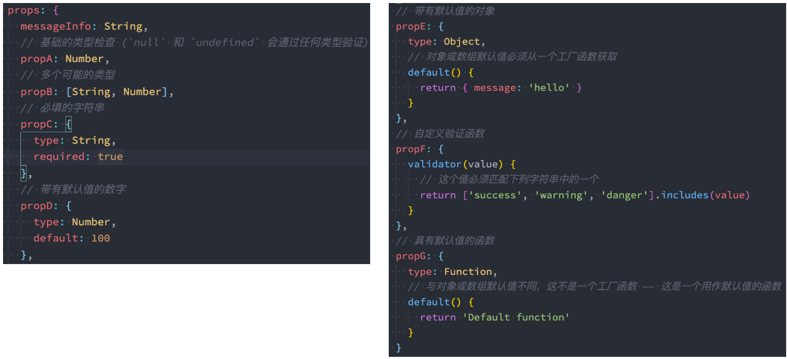
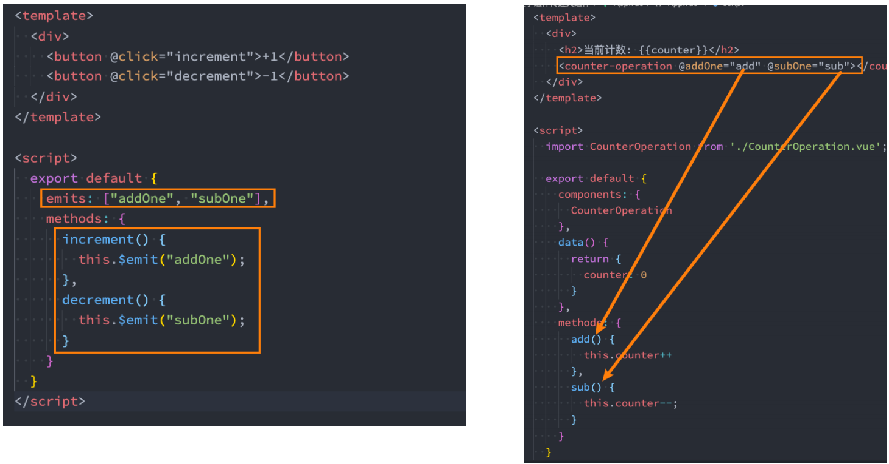

# **注册全局组件**

 全局组件需要使用我们全局创建的**app来注册组件**；

 **通过component方法传入组件名称、组件对象**即可注册一个全局组件了；

 之后，我们可以**在App组件的template中直接使用这个全局组件**：

```vue
<template id="my-cpn">
	<h2>我是组件标题</h2>
	<p>我是组件内容</p>
</template>

<script src="../js/vue.js"></script>
<script>
	const app=Vue.createApp(App)
    app.component("my-cpn",{
        template:"#my-cpn"
    })
    app.mount('#app')
</script>
```

```vue
<template id="my-app">
	<my-cpn></my-cpn>
</template>
```

# **注册局部组件**

 局部注册是在我们需要使用到的组件中，通过**components属性**选项来进行注册；

 比如之前的App组件中，我们有data、computed、methods等选项了，事实上还可以有一个components选项；

 该**components选项对应的是一个对象**，对象中的键值对是 **组件的名称: 组件对象**；

```js
const componentA={
	template:"#component-a",
	data(){
		return{
			title:"标题"
		}
	}
}

const App={
    template:'#my-app',
    components:{
        'conponent-a':ComponentA
    },
    data(){
        return{
            message:"Hello World"
        }
    }
}
Vue.createApp(App).mount('#app')
```

# **Vue CLI 安装和使用**

◼ **安装Vue CLI（目前最新的版本是v5.0.8）**

​		 我们是进行全局安装，这样在任何时候都可以通过vue的命令来创建项目；

​		==**npm install @vue/cli -g**==

◼ **升级Vue CLI：**

​		 如果是比较旧的版本，可以通过下面的命令来升级

​		==**npm update @vue/cli -g**==

◼ **通过Vue的命令来创建项目**

​		==**Vue create 项目的名称**==

# 组件通信

## **父子组件通信**

◼ **父子组件之间如何进行通信呢？**

​		 父组件传递给子组件：通过props属性；

​		 子组件传递给父组件：通过$emit触发事件；

### 父→子

◼ **什么是Props呢？**

​		 Props是你可以在组件上注册一些自定义的attribute；

​		 父组件给这些attribute赋值，子组件通过attribute的名称获取到对应的值；

◼ **Props有两种常见的用法：**

​		 方式一：**字符串数组，数组中的字符串就是attribute的名称**；

```vue
<show-message title="hhh" content="i'm hhh"></show-message>

<script>
	export default {
        props:["title","content"]
    }
</script>
```

​		 方式二：**对象类型**，对象类型我们可以**在指定attribute名称的同时，指定它需要传递的类型、是否是必须的、默认值等等**；

```vue
<script>
	export default {
        props:{
        	title:{
                type:String,
                required:true,
                default:"我是默认值"
            }
        }
    }
</script>
```

◼ **那么type的类型都可以是哪些呢？**

​		 String

​		 Number

​		 Boolean

​		 Array  （默认值必须是函数）

​		 Object  （默认值必须是函数）

​		 Date

​		 Function

​		 Symbol



◼ **Prop 的大小写命名(camelCase vs kebab-case)**

​		 HTML 中的 attribute 名是大小写不敏感的，所以浏览器会把所有大写字符解释为小写字符；

​		 这意味着当你使用 DOM 中的模板时，camelCase (驼峰命名法) 的 prop 名需要使用其等价的 kebab-case (短横线分隔命名) 命名；

◼ **非Prop的Attribute**

​		 当我们传递给一个组件某个属性，但是该属性并没有定义对应的props时，就称之为 非Prop的Attribute；

​		 常见的包括class、style、id属性等；

​		 当组件有单个根节点时，**非Prop的Attribute将自动添加到子组件根节点的Attribute中**

◼ 如果我们**不希望组件的根元素继承attribute**，可以在组件中设置 **inheritAttrs: false**：

​		 禁用attribute继承的常见情况是需要将attribute应用于根元素之外的其他元素；

​		 我们可以**通过 $attrs来访问所有的 非props的attribute**；

```vue
<div>
    我是组件
    <h2 :class="$attrs.class"></h2>
</div>
```

◼ **多个根节点的attribute**

​		 多个根节点的attribute如果没有显示的绑定，那么会报警告，我们必须手动的指定要绑定到哪一个属性上

### 子→父

 首先，我们需要**在子组件中定义好在某些情况下触发的事件名称**；

 其次，**在父组件中以v-on的方式传入要监听的事件名称，并且绑定到对应的方法中**；

 最后，在子组件中发生某个事件的时候，根据事件名称触发对应的事件；

 **emits选项可以是一个字符串数组或一个对象**



◼ **自定义事件的时候，我们也可以传递一些参数给父组件：**

​		 如果emits选项是一个字符串数组，每个字符串表示一个事件名称，那么组件可以触发这些自定义事件，但是不需要传递任何参数。如果emits选项是一个对象，那么对象的键是事件名称，值是参数数组。例如：

```js
emits: {
  'my-event': ['arg1', 'arg2']
}
```

​		 这表示组件可以触发名为"my-event"的自定义事件，并且该事件需要传递两个参数，分别是"arg1"和"arg2"。在组件中触发自定义事件时，可以使用$emit方法，并传递参数。例如：

```js
this.$emit('my-event', 'value1', 'value2');
```

​		 这将触发名为"my-event"的自定义事件，并传递两个参数"value1"和"value2"。在父组件中监听该事件时，可以使用v-on指令，并接收参数。例如：

```html
<my-component v-on:my-event="handleEvent"></my-component>
```

​		 这表示在父组件中监听名为"my-event"的自定义事件，并调用"handleEvent"方法处理事件。在"handleEvent"方法中，可以接收传递的参数。例如：

```js
methods: {
  handleEvent(arg1, arg2) {
    console.log(arg1, arg2);
  }
}
```

◼ **在vue3当中，我们可以对传递的参数进行验证：**

```js
emits:{
    addOne:null,
    addTen:function(payload){
        if(payload===10){
            return true
        }
        return false
    }
}
```

