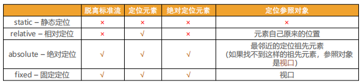

# 标准流

◼ **默认情况下，元素都是按照normal flow标准流、常规流、正常流、文档流【document flow】）进行排布**

​		 从左到右、从上到下按顺序摆放好

​		 默认情况下，互相之间不存在层叠现象

◼ **在标准流中，可以使用margin、padding对元素进行定位**

​		 其中margin还可以设置负数

◼ **比较明显的缺点是**

​		 设置一个元素的margin或者padding，通常会影响到标准流中其他元素的定位效果

​		 不便于实现元素层叠的效果

◼ **如果我们希望一个元素可以跳出标准量,单独的对某个元素进行定位呢?**

​		 我们可以通过position属性来进行设置;

# 定位

◼ **默认值:** 

​		 static：默认值, 静态定位

◼ **使用下面的值, 可以让元素变成 定位元素(positioned element)**

​		 relative：相对定位

​		 absolute：绝对定位

​		 fixed：固定定位

​		 sticky：粘性定位

## 静态定位-static

◼ **position属性的默认值**

​		 元素按照normal flow布局

​		 left 、right、top、bottom没有任何作用

## 相对定位-relative

◼ **元素按照normal flow布局**

◼ **可以通过left、right、top、bottom进行定位**

​		 定位参照对象是元素自己原来的位置

◼ **left、right、top、bottom用来设置元素的具体位置，对元素的作用如下图所示**

◼ **相对定位的应用场景**

​		 在不影响其他元素位置的前提下，对当前元素位置进行微调

## 固定定位-fixed

◼ **元素脱离normal flow**

◼ **可以通过left、right、top、bottom进行定位**

◼ **定位参照对象是视口**

◼ **当画布滚动时，固定不动**

### **画布 和 视口**

◼ **视口（Viewport）**

​		 文档的可视区域

◼ **画布（Canvas）**

​		 用于渲染文档的区域

​		 文档内容超出视口范围，可以通过滚动查看

◼ **宽高对比**

​		 画布 >= 视口

## **绝对定位 - absolute**

◼ **元素脱离normal flow（脱离标准流、脱标）**

◼ **可以通过left、right、top、bottom进行定位**

​		 定位参照对象是最邻近的定位祖先元素

​		 如果找不到这样的祖先元素，参照对象是视口

◼ **定位元素（positioned element）**

​		 position值不为static的元素

​		 也就是position值为relative、absolute、fixed的元素

## **绝对、固定定位的特点**（绝对定位元素）

◼ **可以随意设置宽高**

◼ **宽高默认由内容决定**

◼ **不再受标准流的约束**

​		 不再严格按照从上到下、从左到右排布

​		 不再严格区分块级(block)、行内级(inline)，行内块级(inline-block)的很多特性都会消失

◼ **不再给父元素汇报宽高数据**（父元素没有设置宽高就消失，不再被子元素撑起来）

◼ **脱标元素内部默认还是按照标准流布局**

◼ **对于绝对定位元素来说**

​		 定位参照对象的宽度 = left + right + margin-left + margin-right + 绝对定位元素的实际占用宽度

> 大盒子width=小盒子width+left+right+margin-left+margin-right
>
> ​                          (默认auto)  （    默   	 认   	 均 	   为   	   0    ）

​		 定位参照对象的高度 = top + bottom + margin-top + margin-bottom + 绝对定位元素的实际占用高度

◼ **如果希望绝对定位元素的宽高和定位参照对象一样，可以给绝对定位元素设置以下属性**

​		 left: 0、right: 0、top: 0、bottom: 0、margin:0

◼ **如果希望绝对定位元素在定位参照对象中居中显示，可以给绝对定位元素设置以下属性**

​		 left: 0、right: 0、top: 0、bottom: 0、margin: auto

​		 另外，还得设置具体的宽高值（宽高小于定位参照对象的宽高）

### auto是什么？

◼ **auto -> 交给浏览器你来出来**

◼ **width: auto;**

​		◼ 1.行内非替换元素 -> width: 包裹内容

​		◼ 2.块级元素 ->width: 包含块的宽度

​		◼ 3.绝对定位元素 -> width: 包裹内容

## **粘性定位 - sticky**

​		 可以看做是相对定位和固定(绝对)定位的结合体

​		 它允许被定位的元素表现得像相对定位一样，直到它滚动到某个阈值点;

​		 当达到这个阈值点时, 就会变成固定(绝对)定位

◼ sticky是**相对于最近的滚动祖先**，包含滚动视口

## 对比



## z-index

◼ **z-index属性用来设置定位元素的层叠顺序（仅对定位元素有效）**

​		 取值可以是正整数、负整数、0

◼ **比较原则**

​		 如果是兄弟关系

​			✓ z-index越大，层叠在越上面

​			✓ z-index相等，写在后面的那个元素层叠在上面

​		 如果不是兄弟关系

​			✓ 各自从元素自己以及祖先元素中，找出最邻近的2个定位元素进行比较

​			✓ 而且这2个定位元素必须有设置z-index的具体数值

# 浮动

◼ **绝对定位、浮动都会让元素脱离标准流，以达到灵活布局的效果**

◼ **可以通过float属性让元素产生浮动效果，float的常用取值**

​		 none：不浮动，默认值

​		 left：向左浮动

​		 right：向右浮动

## 浮动规则

◼ **元素一旦浮动后, 脱离标准流**

​		 朝着向左或向右方向移动，直到自己的边界紧贴着包含块（一般是父元素）或者其他浮动元素的边界为止

​		 定位元素会层叠在浮动元素上面

◼ **如果元素是向左（右）浮动，浮动元素的左（右）边界不能超出包含块的左（右）边界**（即content内，不能碰到pendding）

◼ **浮动元素之间不能层叠**

​		 如果一个元素浮动，另一个浮动元素已经在那个位置了，后浮动的元素将紧贴着前一个浮动元素（左浮找左浮，右浮找右浮）

​		 如果水平方向剩余的空间不够显示浮动元素，浮动元素将向下移动，直到有充足的空间为止

◼ **浮动元素不能与行内级内容层叠，行内级内容将会被浮动元素推出**

​		 比如行内级元素、inline-block元素、块级元素的文字内容

◼ **行内级元素、inline-block元素浮动后，其顶部将与所在行的顶部对齐**

## 高度塌陷

◼ **由于浮动元素脱离了标准流，变成了脱标元素，所以不再向父元素汇报高度**

​		 父元素计算总高度时，就不会计算浮动子元素的高度，导致了高度坍塌的问题

◼ **解决父元素高度坍塌问题的过程，一般叫做清浮动**

◼ **清浮动的目的是**

​		 让父元素计算总高度的时候，把浮动子元素的高度算进去

### clear

◼ **clear属性是做什么的呢?**

​		 clear 属性可以指定一个元素是否必须移动(清除浮动后)到在它之前的浮动元素下面;

◼ **clear的常用取值**

​		 left：要求元素的顶部低于之前生成的所有左浮动元素的底部

​		 right：要求元素的顶部低于之前生成的所有右浮动元素的底部

​		 both：要求元素的顶部低于之前生成的所有浮动元素的底部

​		 none：默认值，无特殊要求

◼ **那么我们可以利用这个特性来清除浮动**

### 清除浮动方法

◼ **方法一: 给父元素设置固定高度**

​		 扩展性不好（不推荐）

◼ **方法二: 在父元素最后增加一个空的块级子元素，并且让它设置clear: both**

​		 会增加很多无意义的空标签，维护麻烦

​		 违反了结构与样式分离的原则（不推荐）

◼ **方法三: 给父元素添加一个伪元素**

​		 推荐;

​		 编写好后可以轻松实现清除浮动;

# Flex

◼ **当flex container中的子元素变成了flex item时, 具备一下特点:**

​		 flex item的布局将受flex container属性的设置来进行控制和布局;

​		 flex item不再严格区分块级元素和行内级元素;

​		 flex item默认情况下是包裹内容的, 但是可以设置宽度和高度;

◼ **设置 display 属性为 flex 或者 inline-flex 可以成为 flex container**

​		 flex： flex container 以 block-level 形式存在

​		 inline-flex： flex container 以 inline-level 形式存在

## flex container属性

### **flex-flow**

​	    flex-direction 和 flex-wrap 的简写。

### **flex-direction**

​		items排布方向。

​		 **row（默认值）、row-reverse、column、column-reverse**

### **flex-wrap**

​		是否换行。

​		 **nowrap**（默认）：单行

​		 **wrap**：多行

​		 **wrap-reverse**：多行（对比 wrap，cross start 与 cross end 相反）

### **justify-content**

​		items在主轴的对齐方式。

​		 **flex-start**（默认值）：与 main start 对齐

​		 **flex-end**：与 main end 对齐

​		 **center**：居中对齐

​		 **space-between**：

​			✓ flex items 之间的距离相等

​			✓ 与 main start、main end两端对齐

​		 **space-around**：

​			✓ flex items 之间的距离相等

​			✓ flex items 与 main start、main end 之间的距离是 flex items 之间距离的一半

​		 **space-evenly**：

​			✓ flex items 之间的距离相等

​			✓ flex items 与 main start、main end 之间的距离 等于 flex items 之间的距离

### **align-items**

​		items在侧轴的对齐方式。

​		 **normal**：在弹性布局中，效果和stretch一样

​		 **stretch**：当 flex items 在 cross axis 方向的 size 为 auto 时，会

自动拉伸至填充 flex container

​		 **flex-start**：与 cross start 对齐

​		 **flex-end**：与 cross end 对齐

​		 **center**：居中对齐

​		 **baseline**：与基准线对齐

### **align-content**

​		决定了多行 flex items 在 cross axis 上的对齐方式，用法与 justify-content 类似。

​		 **stretch**（默认值）：与 align-items 的 stretch 类似

​		 **flex-start**：与 cross start 对齐

​		 **flex-end**：与 cross end 对齐

​		 **center**：居中对齐

​		 **space-between**：

​			✓ flex items 之间的距离相等

​			✓ 与 cross start、cross end两端对齐

​		 **space-around**：

​			✓ flex items 之间的距离相等

​			✓ flex items 与 cross start、cross end 之间的距离是 flex items 之间距离的一半

​		 **space-evenly**：

​			✓ flex items 之间的距离相等

​			✓ flex items 与 cross start、cross end 之间的距离 等于 flex items 之间的距离

## flex items属性

### flex-grow

​		flex-grow 决定了 flex items 如何扩展(拉伸/成长)

​			 可以设置任意非负数字（正小数、正整数、0），默认值是 0

​			 当 flex container 在 main axis 方向上有剩余 size 时，flex-grow 属性才会有效

​		◼ 如果所有 flex items 的 flex-grow 总和 sum 超过 1，每个 flex item 扩展的 size 为  flex container 的剩余 size * flex-grow / sum

​		◼ **flex items 扩展后的最终 size 不能超过 max-width\max-height**

### flex-basis

​		用来设置 flex items 在 main axis 方向上的 base size

​		 auto（默认值）、具体的宽度数值（100px）

用途：

 盒子里有一个很长的单词一行装不下，用width会隐藏掉；用flex-basis可以自动撑开把单词显示出来。注意：同时使用width和flex-basis时二者会同时生效，不会被覆盖。

​		◼ **决定 flex items 最终 base size 的因素，从优先级高到低**

​			 max-width\max-height\min-width\min-height

​			 flex-basis

​			 width\height

​			 内容本身的 size

### flex-shrink

​		决定了 flex items 如何收缩(缩小)

​		 可以设置任意非负数字（正小数、正整数、0），**默认值是 1**

​		 当 flex items 在 main axis 方向上超过了 flex container 的 size，flex-shrink 属性才会有效

​		如果所有 flex items 的 flex-shrink 总和超过 1，每个 flex item 收缩的 size为  flex items 超出 flex container 的 size * 收缩比例 / 所有 flex items 的收缩比例之和

​		◼ **flex items 收缩后的最终 size 不能小于 min-width\min-height**

### order

​		order 决定了 flex items 的排布顺序。

​			 可以设置任意整数（正整数、负整数、0），值越小就越排在前面

​			 默认值是 0

### align-self

 	   items 可以通过 align-self 覆盖 flex container 设置的 align-items

​			 **auto**（默认值）：遵从 flex container 的 align-items 设置

​			 **stretch、flex-start、flex-end、center、baseline**，效果跟 align-items 一致

### flex

◼ **flex 是 flex-grow || flex-shrink || flex-basis 的简写,flex 属性可以指定1个，2个或3个值。**

◼ **单值语法: 值必须为以下其中之一:**

​		 一个无单位数(<number>): 它会被当作<flex-grow>的值。

​		 一个有效的宽度(width)值: 它会被当作 <flex-basis>的值。

​		 关键字none，auto或initial.

◼ **双值语法: 第一个值必须为一个无单位数，并且它会被当作 <flex-grow> 的值。**

​		 第二个值必须为以下之一：

​				✓ 一个无单位数：它会被当作 <flex-shrink> 的值。

​				✓ 一个有效的宽度值: 它会被当作 <flex-basis> 的值。

◼ **三值语法:**

​		 第一个值必须为一个无单位数，并且它会被当作 <flex-grow> 的值。

​		 第二个值必须为一个无单位数，并且它会被当作 <flex-shrink> 的值。

​		 第三个值必须为一个有效的宽度值， 并且它会被当作 <flex-basis> 的值

## flex布局常见问题

justify-content最后一行布局问题，可以在后面加上列数-2的<span>元素

# 水平居中方案汇总

1. **行内级元素**

   设置父元素的`text-align:center`;

2. **块级元素**

   在有宽度的条件下，设置当前块级元素的`margin:0 auto`;

3. **绝对定位**

   在有宽度的条件下，设置当前元素的`left:0;right:0;margin:0 auto`;

4. **flex**

   `justify-content:center`;

# 垂直居中方案汇总

1. **绝对定位**

   元素有高度情况下，`top:0;bottom:0;margin:auto 0;`

2. **flex**

   `align-content:center`

3. **位移**

   ```css
   position:relative;
   top:50%;
   transform:translate(0,-50%);
   ```

   细节：不用相对定位用margin-top:50%可以吗？

   ​    不可以。==**margin-top的百分比相对于父元素的宽度**==

4. 