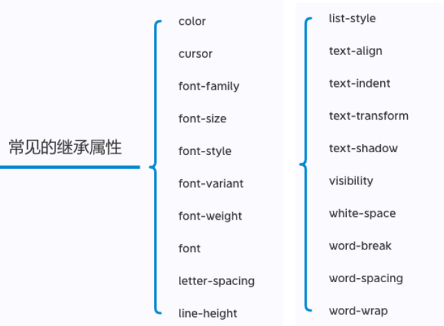
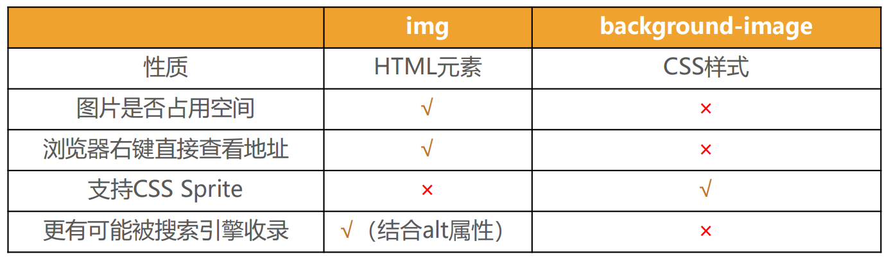

### URL格式

[协议类型]：// [用户信息] @[服务器地址]：[端口号]/[文件路径] [文件名]？[查询]#[片段ID]

> 片端id：定位用，如跳转某一章节

https://john.doe@www.example.com:123/forum/question/?tag=networking&order=newest#top

### 和URI区别

URI：统一资源**标志**符，用于标识Web技术使用的逻辑或物理资源

URL：统一资源**定位**符，俗称网络地址，相当于网络中的门牌号

URL是URI的子集

## 浏览器渲染流程


DOM树会等待CSS解析完成，一起生成渲染树（Render Tree）

# 文本

## text-decoration

用于设置文字的装饰线

◼ text-decoration有如下常见取值:

​     none：无任何装饰线

​       ✓ 可以去除a元素默认的下划线

​     underline：下划线

​     overline：上划线

​     line-through：中划线（删除线）

◼ a元素有下划线的本质是被添加了text-decoration属性

## text-transform

用于设置文字的大小写转换

◼ text-transform有几个常见的值:

​      capitalize：(使…首字母大写, 资本化的意思)将每个单词的首字符变为大写

​      uppercase：(大写字母)将每个单词的所有字符变为大写

​      lowercase：(小写字母)将每个单词的所有字符变为小写

​      none：没有任何影响

◼ 实际开发中用JavaScript代码转化的更多

## text-indent

用于设置第一行内容的缩进

◼ text-indent: 2em; 刚好是缩进2个文字

## text-align（重要）

**定义行内内容（例如文字）如何相对它的块父元素对齐**

常用的值：

​      left：左对齐

​      right：右对齐

​      center：水平正中间显示

​      justify：两端对齐

## letter-spacing、word-spacing

分别用于设置字母、单词之间的间距

默认是0，可以设置为负数

# 字体

## font-size

决定文字的大小

◼ 常用的设置

​       具体数值+单位

​               ✓ 比如100px

​               ✓ 也可以使用em单位(不推荐)：1em代表100%，2em代表200%，0.5em代表50%

​       百分比

​               ✓ 基于父元素的font-size计算，比如50%表示等于父元素font-size的一半

## font-family

用于设置文字的字体名称

​       可以设置1个或者多个字体名称;

​       浏览器会选择列表中第一个该计算机上有安装的字体

​       或者是通过 @font-face 指定的可以直接下载的字体

## font-weight

用于设置文字的粗细（重量）

常见的取值:

​      ◼ 100 | 200 | 300 | 400 | 500 | 600 | 700 | 800 | 900 ：每一个数字表示一个重量

​      ◼ normal：等于400 

​      ◼ bold：等于700

​      ◼ strong、b、h1~h6等标签的font-weight默认就是bold

## font-style

用于设置文字的常规、斜体显示

​      ◼ normal：常规显示

​      ◼ italic(斜体)：用字体的斜体显示(通常会有专门的字体)

​      ◼ oblique(倾斜)：文本倾斜显示(仅仅是让文字倾斜)

## font-variant

可以影响小写字母的显示形式

可以设置的值如下

​       normal：常规显示

​       small-caps：将小写字母替换为缩小过的大写字母

## line-height（重要）

用于设置文本的行高

◼ 行高可以先简单理解为**一行文字所占据的高度**

◼ 行高的严格定义是：两行文字基线（baseline）之间的间距

◼ 基线（baseline）：与小写字母x最底部对齐的线

**注意区分height和line-height的区别**

​       height：元素的整体高度

​       line-height：元素中每一行文字所占据的高度

◼ 应用实例：假设div中只有一行文字，如何让这行文字在div内部垂直居中

​       让line-height等同于height

## font

是一个缩写属性

 font-style font-variant font-weight font-size/line-height font-family

◼ 规则:

​      font-style、font-variant、font-weight可以随意调换顺序，也可以省略

​      /line-height可以省略，如果不省略，必须跟在font-size后面

​      font-size、font-family不可以调换顺序，不可以省略

# 选择器

## 简单选择器

 元素选择器（type selectors）, 使用元素的名称;

 类选择器（class selectors）, 使用 .类名 ;

 id选择器（id selectors）, 使用 #id;

## 属性选择器

◼ 拥有某一个属性 [att]

◼ 属性等于某个值[att=val]

```css
[title=box] {
    color:red;
}
```

◼ 其他了解的(不用记)

​      [attr*=val]: 属性值包含某一个值val;

​      [attr^=val]: 属性值以val开头;

​      [attr$=val]: 属性值以val结尾;

​      [attr|=val]: 属性值等于val或者以val开头后面紧跟连接符-;

​      [attr~=val]: 属性值包含val, 如果有其他值必须以空格和val分割;

## 后代选择器

◼ **后代选择器一: 所有的后代(直接/间接的后代)**

​      选择器之间以空格分割

◼ **后代选择器二: 直接子代选择器(必须是直接自带)**

​      选择器之间以 > 分割;

## 兄弟选择器

◼ **兄弟选择器一:相邻兄弟选择器**

​      使用符号 + 连接

◼ **兄弟选择器二: 普遍兄弟选择器 ~**

​      使用符号 ~ 连接

## 选择器组-交集选择器

◼ **交集选择器: 需要同时符合两个选择器条件(两个选择器紧密连接)**

​      在开发中通常为了精准的选择某一个元素;

◼ **并集选择器: 符合一个选择器条件即可(两个选择器以,号分割)**

​      在开发中通常为了给多个元素设置相同的样式;

## 伪类

常见的伪类有：

◼ **1.动态伪类**

​      :link、:visited、:hover、:active、:focus

◼ **2.目标伪类**

​      :target

◼ **3.语言伪类**（language pseudo-classes）

​      :lang( )

◼ **4.元素状态伪类**

​      :enabled、:disabled、:checked

◼ **5.结构伪类**

​      :nth-child( )、:nth-last-child( )、:nth-of-type( )、:nth-last

of-type( )

​      :first-child、:last-child、:first-of-type、:last-of-type

​      :root、:only-child、:only-of-type、:empty

◼ **6.否定伪类**

​      :not()

### 动态伪类

◼ **使用举例**

​      a:link 未访问的链接

​      a:visited 已访问的链接

​      a:hover 鼠标挪动到链接上(重要)

​      a:active 激活的链接（鼠标在链接上长按住未松开）

◼ **使用注意**

​      :hover必须放在:link和:visited后面才能完全生效

​      :active必须放在:hover后面才能完全生效

​      所以建议的编写顺序是 :link、:visited、:hover、:active

◼ **除了a元素，:hover、:active也能用在其他元素上**

◼ :focus指当前**拥有输入焦点的元素**（能接收键盘输入）

​      文本输入框一聚焦后，背景就会变红色

◼ 因为链接a元素可以**被键盘的Tab键选中聚焦**，**所以:focus也适用于a元素**

◼ **动态伪类编写顺序建议为**

​      :link、:visited、:focus、:hover、:active

◼ **直接给a元素设置样式，相当于给a元素的所有动态伪类都设置了**

​      相当于a:link、a:visited、a:hover、a:active、a:focus的color都是red

## 伪元素

◼ **常用的伪元素有**

​      :first-line、::first-line

​      :first-letter、::first-letter 

​      :before、::before

​      :after、::after

◼ 为了区分伪元素和伪类，建议伪元素使用2个冒号，比如::first-line

◼ ::first-line可以针对首行文本设置属性

◼ ::first-letter可以针对首字母设置属性

◼ **::before和::after**用来在一个元素的内容之前或之后插入其他内容（可以是文字、图片)

​     == 常通过 content 属性来为一个元素添加修饰性的内容，**即使没内容也不要省略content**==

```css
.box::before {
    content:"123";/*content:url()  content:""*/
    color:red;
}
```

# 继承

CSS的某些属性具有继承性

​       如果一个属性具备继承性, 那么在该元素上设置后, 它的后代元素都可以继承这个属性;

​       当然, 如果后代元素自己有设置该属性, 那么优先使用后代元素自己的属性(不管继承过来的属性权重多高)

==**继承过来的是计算值，不是设置值**==

常见的继承属性



强制继承：`无继承属性的属性:inherit`

# 层叠

对于一个元素来说, 相同一个属性我们可以通过不同的选择器给它进行多次设置， 那么属性会被一层层覆盖上去， 但是最终只有一个会生效。

◼ **那么多个样式属性覆盖上去, 哪一个会生效呢?**

​       判断一: 选择器的权重, 权重大的生效, 根据权重可以判断出优先级;

​       判断二: 先后顺序, 权重相同时, 后面设置的生效;

◼ **按照经验，为了方便比较CSS属性的优先级，可以给CSS属性所处的环境定义一个权值（权重）**

​       !important：10000

​       内联样式：1000

​       id选择器：100

​       类选择器、属性选择器、伪类：10

​       元素选择器、伪元素：1

​       通配符：0

# display

◼ **CSS中有个display属性，能修改元素的显示类型，有4个常用值**

​      ** block：让元素显示为块级元素**

​                    独占父元素的一行

​                    可以随意设置宽高

​                    高度默认由内容决定

​      ** inline：让元素显示为行内级元素**

​                    跟其他行内级元素在同一行显示;

​                    不可以随意设置宽高;

​                    宽高都由内容决定;

​      ** inline-block：让元素同时具备行内级、块级元素的特征**

​                    跟其他行内级元素在同一行显示

​                    可以随意设置宽高

​                    可以这样理解

​                          ✓ 对外来说，它是一个行内级元素

​                          ✓ 对内来说，它是一个块级元素

​      ** none：隐藏元素**

◼ 事实上display还有其他的值, 比如flex, 后续会专门学习

、<video>、<iframe>等元素**==实则为行内可替换元素，不是行内块元素，但也可以设置宽高==**

## 编写HTML时的注意事项

◼ **块级元素、inline-block元素**

​         一般情况下，可以包含其他任何元素（比如块级元素、行内级元素、inline-block元素）

​        == 特殊情况，p元素不能包含其他块级元素==

◼ **行内级元素（比如a、span、strong等）**

​         一般情况下，只能包含行内级元素

## 元素隐藏方法

◼ **方法一: display设置为none**

​         元素不显示出来, 并且也不占据位置, 不占据任何空间(和不存在一样);

◼ **方法二: visibility设置为hidden**

​         设置为hidden, 虽然元素不可见, 但是会占据元素应该占据的空间;

​         默认为visible, 元素是可见的;

◼ **方法三: rgba设置颜色, 将a的值设置为0**

​         rgba的a设置的是alpha值, 可以设置透明度, 不影响子元素;

◼ **方法四: opacity设置透明度, 设置为0**

​         设置整个元素的透明度, 会影响所有的子元素

# overflow

◼ **overflow用于控制内容溢出时的行为**

​     visible：溢出的内容照样可见

​     hidden：溢出的内容直接裁剪

​     scroll：溢出的内容被裁剪，但可以通过滚动机制查看

​            会一直显示滚动条区域，滚动条区域占用的空间属于width、height

​     auto：自动根据内容是否溢出来决定是否提供滚动机制

# 盒子模型

## 内容

◼ **设置内容是通过宽度和高度设置的:**

​       宽度设置: width

​       高度设置: height

◼ 注意: 对于行内级非替换元素来说, 设置宽高是无效的!

◼ **另外我们还可以设置如下属性:**

​       min-width：最小宽度，无论内容多少，宽度都大于或等于min-width

​       max-width：最大宽度，无论内容多少，宽度都小于或等于max-width

​       移动端适配时, 可以设置最大宽度和最小宽度;

◼ **下面两个属性不常用:**

​       min-height：最小高度，无论内容多少，高度都大于或等于min-height

​       max-height：最大高度，无论内容多少，高度都小于或等于max-height

## 内边距

◼ **padding属性用于设置盒子的内边距, 通常用于设置边框和内容之间的间距;**

◼ **padding包括四个方向, 所以有如下的取值:**

​       padding-top：上内边距

​       padding-right：右内边距

​       padding-bottom：下内边距

​       padding-left：左内边距

◼ **padding单独编写是一个缩写属性：**

​       padding-top、padding-right、padding-bottom、padding-left的简写属性

​       padding缩写属性是从零点钟方向开始, 沿着顺时针转动的, 也就是上右下左;

## 边框

◼ **边框相对于content/padding/margin来说特殊一些:**

​      边框具备宽度width;

​      边框具备样式style;

​      边框具备颜色color;

◼ **边框宽度**

​      border-top-width、border-right-width、border-bottom-width、border-left-width

​      border-width是上面4个属性的简写属性

◼ **边框颜色**

​      border-top-color、border-right-color、border-bottom-color、border-left-color

​      border-color是上面4个属性的简写属性

◼ **边框样式**

​      border-top-style、border-right-style、border-bottom-style、border-left-style

​      border-style是上面4个属性的简写属性

### **border-radius**

◼ **border-radius用于设置盒子的圆角**

◼ **border-radius常见的值:**

​      数值: 通常用来设置小的圆角, 比如6px;

​      百分比: 通常用来设置一定的弧度或者圆形;

◼ **border-radius事实上是一个缩写属性:**

​      将这四个属性 border-top-left-radius、border-top-right-radius、border-bottom-right-radius，和 border-bottom

​     left-radius 简写为一个属性。

​      开发中比较少见一个个圆角设置;

◼ 如果一个元素是正方形, 设置border-radius大于或等于50%时，就会变成一个圆

## 外边距

◼ **margin属性用于设置盒子的外边距, 通常用于元素和元素之间的间距**

◼ **margin包括四个方向, 所以有如下的取值:**

​       margin-top：上内边距

​       margin-right：右内边距

​       margin-bottom：下内边距

​       margin-left：左内边距

◼ **margin单独编写是一个缩写属性：**

​      margin-top、margin-right、margin-bottom、margin-left的简写属性

​      margin缩写属性是从零点钟方向开始, 沿着顺时针转动的, 也就是上右下左;

### 上下margin的传递

◼ **margin-top传递**

​       如果块级元素的顶部线和父元素的顶部线重叠，那么这个块级元素的margin-top值会传递给父元素

◼ **margin-bottom传递**

​       如果块级元素的底部线和父元素的底部线重写，并且父元素的高度是auto，那么这个块级元素的margin-bottom值会传递给父元素

◼ **如何防止出现传递问题？**

​       给父元素设置padding-top\padding-bottom

​       给父元素设置border

​       触发BFC: 设置overflow为auto

◼ **建议**

​      **== margin一般是用来设置兄弟元素之间的间距==**

​      **== padding一般是用来设置父子元素之间的间距==**

### 上下margin的折叠

◼ **垂直方向上相邻的2个margin（margin-top、margin-bottom）有可能会合并为1个margin，这种现象叫做折叠**

◼ **水平方向上的margin（margin-left、margin-right）永远不会collapse**

◼ **折叠后最终值的计算规则**

​        两个值进行比较，取较大的值

◼ **如何防止margin collapse？**

​        只设置其中一个元素的margin

◼ **两个兄弟块级元素之间上下margin的折叠**

◼ **父子块级元素之间上下margin的折叠**

## 外轮廓

◼ **outline表示元素的****外轮廓**

​        不占用空间

​        默认显示在border的外面

◼ **outline相关属性有**

​        outline-width: 外轮廓的宽度

​        outline-style：取值跟border的样式一样，比如solid、dotted等

​        outline-color: 外轮廓的颜色

​        outline：outline-width、outline-style、outline-color的简写属性，跟border用法类似

◼ **应用实例**

​        去除a元素、input元素的focus轮廓效果

## 盒子阴影

◼ **box-shadow属性可以设置一个或者多个阴影**

​		 每个阴影用<shadow>表示

​		 多个阴影之间用逗号,隔开，从前到后叠加

◼ **<shadow>的常见格式如下**

​		 第1个<length>：offset-x, 水平方向的偏移，正数往右偏移

​		 第2个<length>：offset-y, 垂直方向的偏移，正数往下偏移

​		 第3个<length>：blur-radius, 模糊半径

​		 第4个<length>：spread-radius, 延伸半径

​		 <color>：阴影的颜色，如果没有设置，就跟随color属性的颜色

​		 inset：外框阴影变成内框阴影

◼ 我们可以通过一个网站测试盒子的阴影:

​	 https://html-css-js.com/css/generator/box-shadow/

## 文字阴影

◼ **text-shadow用法类似于box-shadow，用于给文字添加阴影效果**

◼ **<shadow>的常见格式如下**

​		 相当于box-shadow, 它没有spread-radius的值;

◼ **我们可以通过一个网站测试文字的阴影:**

​	 https://html-css-js.com/css/generator/box-shadow/

## **行内非替换元素的注意事项**

◼ **以下属性对行内级非替换元素不起作用**

​		 width、height、margin-top、margin-bottom

◼ **以下属性对行内级非替换元素的效果比较特殊**

​		 padding-top、padding-bottom、上下方向的border（都可以撑开，但不会占实际空间）

## **box-sizing**

◼ **box-sizing用来设置盒子模型中宽高的行为**

◼ **content-box**

​		 padding、border都布置在width、height外边

​		◼ 元素的实际占用宽度 = border + padding + width

​		◼ 元素的实际占用高度 = border + padding + height

◼ **border-box**

​		 padding、border都布置在width、height里边

​		◼ 元素的实际占用宽度 = width

​		◼ 元素的实际占用高度 = height 

## **元素的水平居中方案**

◼ **在一些需求中，需要元素在父元素中水平居中显示（父元素一般都是块级元素、inline-block）**

◼ **行内级元素(包括inline-block元素)**

​		 水平居中：在父元素中设置text-align: center

◼ **块级元素**

​		 水平居中：margin: 0 auto

# 背景设置

## **background-image**

◼ **background-image用于设置元素的背景图片**

​		 会盖在(不是覆盖)background-color的上面

◼ **如果设置了多张图片**

​		 设置的第一张图片将显示在最上面，其他图片按顺序层叠在下面

◼ **注意：如果设置了背景图片后，元素没有具体的宽高，背景图片是不会显示出来的**

## **background-repeat**

◼ **background-repeat用于设置背景图片是否要平铺**

◼ **常见的设值有**

​		 repeat：平铺

​		 no-repeat：不平铺

​		 repeat-x：只在水平方向平铺

​		 repeat-y：只在垂直平方向平铺

## **background-size**

◼ **background-size用于设置背景图片的大小**

​		 auto：默认值, 以背景图本身大小显示

​		 cover：缩放背景图，以完全覆盖铺满元素,可能背景图片部分看不见

​		 contain：缩放背景图，宽度或者高度铺满元素，但是图片保持宽高比

​		 <percentage>：百分比，相对于背景区（background positioning area）

​		 length：具体的大小，比如100px

## **background-position**

◼ **background-position用于设置背景图片在水平、垂直方向上的具体位置**

​		 可以设置具体的数值 比如 20px 30px;

​		 水平方向还可以设值：left、center、right

​		 垂直方向还可以设值：top、center、bottom

​		 如果只设置了1个方向，另一个方向默认是center

## **background-attachment**

◼ **background-attachment决定背景图像的位置是在视口内固定，或者随着包含它的区块滚动。**

◼ **可以设置以下3个值**

​		 scroll：此关键属性值表示背景相对于元素本身固定， 而不是随着它的内容滚动

​		 local：此关键属性值表示背景相对于元素的内容固定。如果一个元素拥有滚动机制，背景将会随着元素的内容滚动.

​		 fixed：此关键属性值表示背景相对于视口固定。即使一个元素拥有滚动机制，背景也不会随着元素的内容滚动。

## **background**

◼ **background是一系列背景相关属性的简写属性**

◼ background-size可以省略，如果不省略，background-size必须紧跟在background-position的后面

◼ 其他属性也都可以省略，而且顺序任意

## **background-image和img对比**



 img，作为网页内容的重要组成部分，比如广告图片、LOGO图片、文章配图、产品图片

 background-image，可有可无。有，能让网页更加美观。无，也不影响用户获取完整的网页内容信息

# 列表

## 有序列表

◼ **ol（ordered list）**

​		 有序列表，直接子元素只能是li

◼ **li（list item）**

​		 列表中的每一项

## 无序列表

◼ **ul（unordered list）**

​		 无序列表，直接子元素只能是li

◼ **li（list item）**

​		 列表中的每一项

## 定义列表

◼ **dl（definition list）**

​		 定义列表，直接子元素只能是dt、dd

◼ **dt（definition term）**

​		 term是项的意思, 列表中每一项的项目名

◼ **dd（definition description）**

​		 列表中每一项的具体描述，是对 dt 的描述、解释、补充

​		 一个dt后面一般紧跟着1个或者多个dd

# 表格

 border-collapse CSS 属性是用来决定表格的边框是分开的还是合并的。

◼ **thead**

​		 表格的表头

◼ **tbody**

​		 表格的主体

◼ **tfoot**

​		 表格的页脚

◼ **caption**

​		 表格的标题

◼ **th**

​		 表格的表头单元格

## 单元格合并

 **跨列合并**: 使用colspan

​		✓ 在最左边的单元格写上colspan属性, 并且省略掉合并的td;

 **跨行合并**: 使用rowspan

​		✓ 在最上面的单元格协商rowspan属性, 并且省略掉后面tr中的td;

# 表单

◼ **form**

​		 表单, 一般情况下，其他表单相关元素都是它的后代元素

◼ **input**

​		 单行文本输入框、单选框、复选框、按钮等元素

◼ **textarea**

​		 多行文本框

◼ **select、option**

​		 下拉选择框

◼ **button**

​		 按钮

◼ **label**

​		 表单元素的标题

## input

◼ **type：input的类型**

​		 text：文本输入框（明文输入）

​		 password：文本输入框（密文输入）

​		 radio：单选框

​		 checkbox：复选框

​		 button：按钮

​		 reset：重置

​		 submit：提交表单数据给服务器

​		 file：文件上传

◼ **readonly**：只读

◼ **disabled**：禁用

◼ **checked**：默认被选中

​		 只有当type为radio或checkbox时可用

◼ **autofocus**：当页面加载时，自动聚焦

◼ **name**：名字

​		 在提交数据给服务器时，可用于区分数据类型

◼ **value**：取值

### **input和label的关系**

◼ **label元素一般跟input配合使用，用来表示input的标题**

◼ labe可以跟某个input绑定，点击label就可以激活对应的input变成选中

### radio

◼ **我们可以将type类型设置为radio变成单选框:**

​		 name值相同的radio才具备单选功能

### checkbox

◼ **我们可以将type类型设置为checkbox变成多选框:**

​		 属于同一种类型的checkbox，name值要保持一致

### textarea

◼ **textarea的常用属性:**

​		 cols：列数

​		 rows：行数

◼ **缩放的CSS设置**

​		 禁止缩放：resize: none;

​		 水平缩放：resize: horizontal;

​		 垂直缩放：resize: vertical;

​		 水平垂直缩放：resize: both;

## 表单按钮

◼ **表单可以实现按钮效果:**

​		 普通按钮（type=button）：使用value属性设置按钮文字

​		 重置按钮（type=reset）：重置它所属form的所有表单元素（包括input、textarea、select）

​		 提交按钮（type=submit）：提交它所属form的表单数据给服务器（包括input、textarea、select）

## **select和option的使用**

◼ **option是select的子元素，一个option代表一个选项**

◼ **select常用属性**

​		 multiple：可以多选

​		 size：显示多少项

◼ **option常用属性**

​		 selected：默认被选中

## form常见属性

◼ **form通常作为表单元素的父元素:**

​		 form可以将整个表单作为一个整体来进行操作;

​		 比如对整个表单进行重置;

​		 比如对整个表单的数据进行提交;

◼ **form常见的属性如下:**

​		◼ action

​				 用于提交表单数据的请求URL

​		◼ method

​				 请求方法（get和post），默认是get

​		◼ target

​				 在什么地方打开URL（参考a元素的target）

# 结构伪类

## **:nth-child**

◼ **:nth-child(1)**

​		 是父元素中的第1个子元素

◼ **:nth-child(2n)**

​		 n代表任意正整数和0

​		 是父元素中的第偶数个子元素（第2、4、6、8......个）

​		 跟:nth-child(even)同义

◼ **:nth-child(2n + 1)**

​		 n代表任意正整数和0

​		 是父元素中的第奇数个子元素（第1、3、5、7......个）

​		 跟:nth-child(odd)同义

◼ **nth-child(-n + 2)**

​		 代表前2个子元素

## **:nth-last-child( )**

◼ **:nth-last-child()的语法跟:nth-child()类似，不同点是:nth-last-child()从最后一个子元素开始往前计数**

​		 :nth-last-child(1)，代表倒数第一个子元素

​		 :nth-last-child(-n + 2)，代表最后2个子元素

◼ :**nth-of-type()用法跟:nth-child()类似**

​		 不同点是:nth-of-type()计数时只计算同种类型的元素

◼ **:nth-last-of-type()用法跟:nth-of-type()类似**

​		 不同点是:nth-last-of-type()从最后一个这种类型的子元素开始往前计数

## **:nth-of-type( )、:nth-last-of-type( )**

◼ **其他常见的伪类(了解):** 

​		 :first-child，等同于:nth-child(1)

​		 :last-child，等同于:nth-last-child(1)

​		 :first-of-type，等同于:nth-of-type(1)

​		 :last-of-type，等同于:nth-last-of-type(1)

​		 :only-child，是父元素中唯一的子元素

​		 :only-of-type，是父元素中唯一的这种类型的子元素

◼ **下面的伪类偶尔会使用:**

​		 :root，根元素，就是HTML元素

​		 :empty代表里面完全空白的元素

## **否定伪类**

◼ **:not()的格式是:not(x)**

​		 x是一个简单选择器

​		 元素选择器、通用选择器、属性选择器、类选择器、id选择器、伪类（除否定伪类）

◼ **:not(x)表示除x以外的元素**

# 精灵图

◼ **精灵图如何使用呢?**

​		 精灵图的原理是通过只显示图片的很小一部分来展示的;

​		 **通常使用背景:**

​				✓ 1.设置对应元素的宽度和高度

​				✓ 2.设置精灵图作为背景图片

​				✓ 3.调整背景图片的位置来展示

◼ **如何获取精灵图的位置**

​		 http://www.spritecow.com/

# cusor

◼ **cursor可以设置鼠标指针（光标）在元素上面时的显示样式**

◼ **cursor常见的设值有**

​		 auto：浏览器根据上下文决定指针的显示样式，比如根据文本和非文本切换指针样式

​		 default：由操作系统决定，一般就是一个小箭头

​		 pointer：一只小手，鼠标指针挪动到链接上面默认就是这个样式

​		 text：一条竖线，鼠标指针挪动到文本输入框上面默认就是这个样式

​		 none：没有任何指针显示在元素上面