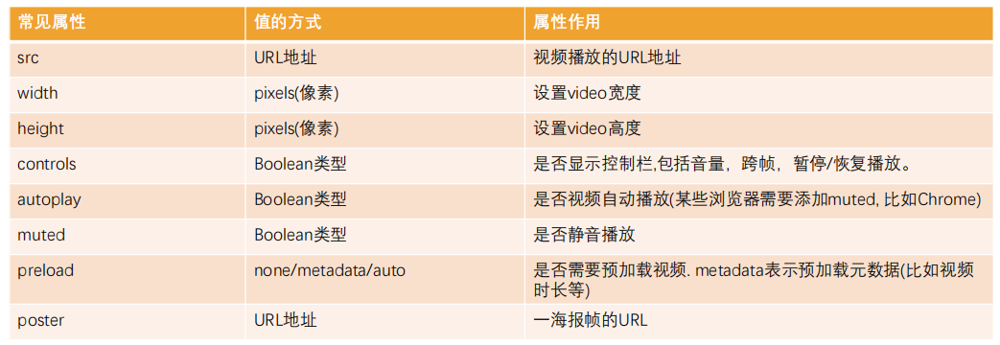
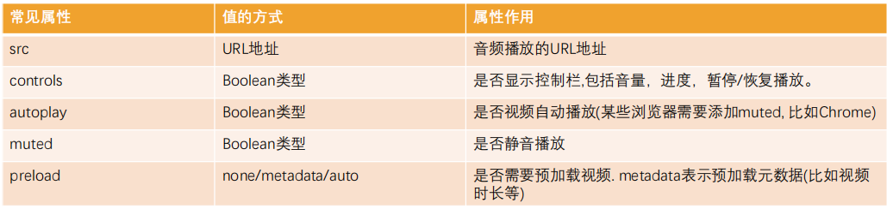
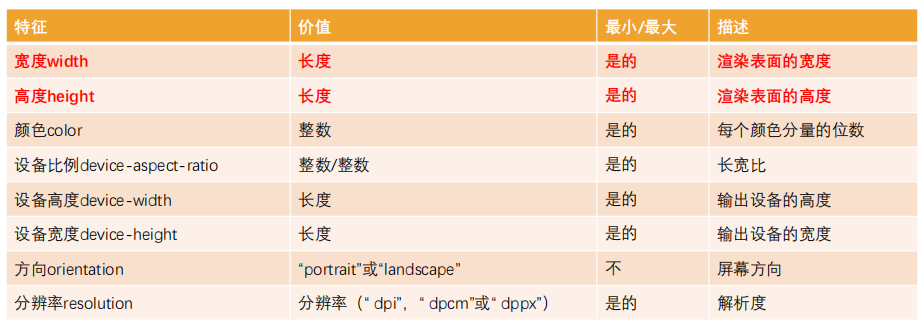
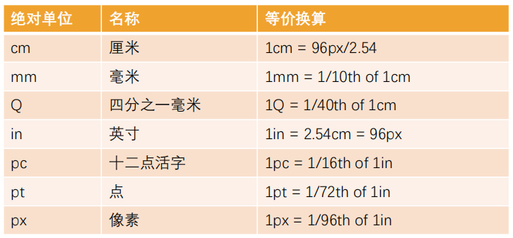
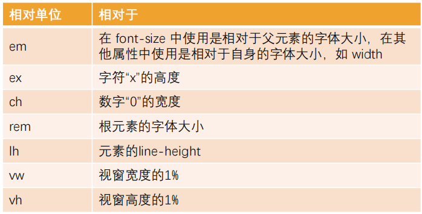
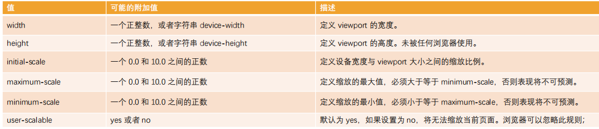

# **CSS编写顺序的思路**

◼ 1.先确定盒子本身是如何布局

​	 * position: absolute

​	 * float: left/right

​	 * display: flex

◼ 2.盒子的特性和可见性

​	 * display: block/inline-block/inline/none

​	 * visibility/opacity

◼ 3.盒子模型

​	 * width/height

​	 * box-sizing

​	 * margin/border/padding/content

​	 * box-shadow/text-shadow

◼ 4.内部的文本文字

​	 * font/text

◼ 5.background

​	 background-image/size/position/color

◼ 6.其他

​	 transform/transition/overflow/white-space

# **meta元素**

◼ **meta元素用于定义元数据：**

​	 在之前讲解head的时候说过，head中用于定义元数据；

​	 比如标题title、样式style、link外部资源等；

​	 meta用于定义那些不能使用其他定元相关（meta-related）元素定义的任何元数据信息；

◼ **meta 元素定义的元数据的类型包括以下几种：**

​	 如果设置了 charset 属性，meta 元素是一个字符集声明，告诉文档使用哪种字符编码。

​	 如果设置了 http-equiv 属性，meta 元素则是编译指令。

​	 如果设置了 name 属性，meta 元素提供的是文档级别（document-level）的元数据，应用于整个页面。

## **http-equiv属性**

- 如果设置了 [`http-equiv`](https://developer.mozilla.org/zh-CN/docs/Web/HTML/Element/meta#http-equiv) 属性，`<meta>` 元素则是编译指令，提供的信息与类似命名的 HTTP 头部相同。

## **name属性**

◼ **name属性的值非常多，具体的内容可以查看文档：**

 https://developer.mozilla.org/zh-CN/docs/Web/HTML/Element/meta/name

◼ **介绍几个常用的：**

​	◼ robots：爬虫、协作搜寻器，或者 “机器人”，对此页面的处理行为，或者说，应当遵守的规则。

​	◼ author：文档作者的名字。

​	◼ Copyright：版权声明；

​	◼ description：一段简短而精确的、对页面内容的描述。

​			 一些浏览器，比如 Firefox 和 Opera，将其用作书签的默认描述。

​	◼ keywords：与页面内容相关的关键词，使用逗号分隔。某些搜索引擎会进行收录

# HTML5新增

## **HTML5新增语义化的元素**

 <header>：头部元素

 <nav>：导航元素

 <section>：定义文档某个区域的元素

 <article>：内容元素

 <aside>：侧边栏元素

 <footer>：尾部元素

## **video**



◼ **在<video>元素中间的内容，是针对浏览器不支持此元素时候的降级处理。**

​	 内容一：通过<source>元素指定更多视频格式的源

​	 内容二：通过p/div等元素指定在浏览器不支持video元素的情况, 显示的内容

```html
<video src="../video/fcrs.mp4" controls width="500">
	<source src="./video/fcrs.webm">
    <p>你的浏览器不支持video元素！</p>
</video>
```

## audio



兼容操作同<video>

## input

◼ **HTML5对input元素也进行了扩展，在之前我们已经学习过的其中几个属性也是HTML5的特性：**

​		 placeholder：输入框的占位文字

​		 multiple：多个值

​		 autofocus：最多输入的内容

◼ **另外对于input的type值也有很多扩展：**

​		 date

​		 time

​		 number

​		 tel

​		 color

​		 email

​		 等等…367626323

◼ **查看MDN文档:**

 https://developer.mozilla.org/zh-CN/docs/Web/HTML/Element/Input

## **全局属性 data-\***

◼ **在HTML5中, 新增一种全局属性的格式 data-\*, 用于自定义数据属性:**

​	 data设置的属性可以在JavaScript的DOM操作中通过dataset轻松获取到；

​	 通常用于HTML和JavaScript数据之间的传递；

```javascript
<div class="box" data-age="18" data-name="sunako"></div>

<script>
    const boxEl=document.querySelector(".box")
	consle.log(boxEl.dataset)
</script>
```

◼ 在小程序中, 就是通过data-来传递数据的, 所以该全局属性必须要掌握.

# CSS属性

## **white-space**

◼ **white-space用于设置空白处理和换行规则**

​	◼ normal：合并所有连续的空白，允许单词超屏时自动换行

​	◼ nowrap：合并所有连续的空白，不允许单词超屏时自动换行

​	◼ pre：阻止合并所有连续的空白，不允许单词超屏时自动换行

​	◼ pre-wrap：阻止合并所有连续的空白，允许单词超屏时自动换行

​	◼ pre-line：合并所有连续的空白（但保留换行），允许单词超屏时自动换行

## **text-overflow**

◼ **text-overflow通常用来设置文字溢出时的行为**

​		 clip：溢出的内容直接裁剪掉（字符可能会显示不完整）

​		 ellipsis：溢出那行的结尾处用省略号表示

◼ text-overflow生效的前提是overflow不为visible

# CSS函数

## var

◼ **CSS中可以自定义属性**

​		 属性名需要以两个减号（--）开始;

​		 属性值则可以是任何有效的CSS值;

```css
div {
    --why-color:red;
}
```

◼ **我们可以通过var函数来使用:**

```css
span {
    color:var(--why-color)
}
```

◼ **规则集定义的选择器, 是自定义属性的可见作用域(只在选择器内部有效)**

​		 所以推荐将自定义属性定义在html中，也可以使用 :root 选择器;

## calc

◼ **calc() 函数允许在声明 CSS 属性值时执行一些计算。**

​		 计算支持加减乘除的运算；

​				✓ + 和 - 运算符的两边必须要有空白字符。

​		 通常用来设置一些元素的尺寸或者位置；

## blur

◼ **blur() 函数将高斯模糊应用于输出图片或者元素;**

​		 blur(radius)

​		 radius, 模糊的半径, 用于定义高斯函数的偏差值, 偏差值越大, 图片越模糊;

◼ **通常会和两个属性一起使用：**

​		 filter: 将模糊或颜色偏移等图形效果应用于元素;

​		 backdrop-filter: 为元素后面的区域添加模糊或者其他效果。使用时为了看到效果，必须使元素或其背景至少部分透明

## **gradient**

◼ **<gradient> 是一种<image>CSS数据类型的子类型，用于表现两种或多种颜色的过渡转变。**

​		 CSS的<image>数据类型描述的是2D图形；

​		 比如background-image、list-style-image、border-image、content等；

​		 <image>常见的方式是通过url来引入一个图片资源；

​		 它也可以通过CSS的<gradient> 函数来设置颜色的渐变；

◼ **<gradient>常见的函数实现有下面几种：**

​		 linear-gradient()：创建一个表示两种或多种颜色线性渐变的图片；

​		 radial-gradient()：创建了一个图像，该图像是由从原点发出的两种或者多种颜色之间的逐步过渡组成；

​		 repeating-linear-gradient()：创建一个由重复线性渐变组成的<image>；

​		 repeating-radial-gradient()：创建一个重复的原点触发渐变组成的<image>；

# BFC

## FC

◼ **FC的全称是Formatting Context，元素在标准流里面都是属于一个FC的**

◼ **块级元素的布局属于Block Formatting Context（BFC）**

​	 也就是block level box都是在BFC中布局的；

◼ **行内级元素的布局属于Inline Formatting Context（IFC）**

​	 而inline level box都是在IFC中布局的；

## BFC

◼ **MDN上有整理出在哪些具体的情况下会创建BFC：**

 **根元素**（<html>）

 **浮动元素**（元素的 float 不是 none）

 **绝对定位元素**（元素的 position 为 absolute 或 fixed）

 **行内块元素**（元素的 display 为 inline-block）

 **表格单元格**（元素的 display 为 table-cell，HTML表格单元格默认为该值），表格标题（元素的 display 为 table-caption，HTML表格标题默认为该值）

 **匿名表格单元格元素**（元素的 display 为 table、table-row、 table-row-group、table-header-group、table-footer-group（分别是HTML table、

row、tbody、thead、tfoot 的默认属性）或 inline-table）

 **overflow 计算值**(Computed)不为 visible 的块元素

 **弹性元素**（display 为 flex 或 inline-flex 元素的直接子元素）

 **网格元素**（display 为 grid 或 inline-grid 元素的直接子元素）

 **display 值为 flow-root 的元素**

## BFC作用

 在BFC中，box会在垂直方向上一个挨着一个的排布；

 垂直方向的间距由margin属性决定；

 在同一个BFC中，相邻两个box之间的margin会折叠（collapse）；

 在BFC中，每个元素的左边缘是紧挨着包含块的左边缘的；

◼ **那么这个东西有什么用呢？**

​		 解决margin的折叠问题；

​		 解决浮动高度塌陷问题；

### 解决margin折叠

```css
<div class="contain">
        <div class="box1"></div>
        <div class="box2"></div>
</div>

.contain{
     overflow: scroll  /*  创建BFC */
}
.box1{
     margin-bottom: 10px;
}
.box2{
     margin-top: 10px;
}
```

不要在box里创建BFC，那样只是box里元素有了新的BFC，box元素依旧在html的BFC里

### 解决浮动高度塌陷问题

**==不能解决绝对定位元素的高度塌陷问题！==**

◼ **事实上，BFC解决高度塌陷需要满足两个条件：**

​		 浮动元素的父元素触发BFC，形成独立的BFC

​		 浮动元素的父元素的高度是auto的

◼ **BFC的高度是auto的情况下，是如下方法计算高度的**

​		 1.如果只有inline-level，是行高的顶部和底部的距离；

​		 2.如果有block-level，是由最底层的块上边缘和最底层块盒子的下边缘之间的距离

​		 3.==如果有绝对定位元素，将被忽略；==

​		 4.如果有浮动元素，那么会增加高度以包括这些浮动元素的下边缘

# 媒体查询

◼ 媒体查询是一种提供给开发者针对不同设备需求进行定制化开发的一个接口。

◼ 你可以根据设备的类型（比如屏幕设备、打印机设备）或者特定的特性（比如屏幕的宽度）来修改你的页面。

◼ **媒体查询的使用方式主要有三种：**

​		 方式一：通过@media和@import使用不同的CSS规则（常用）；

```css
<style>
	@import url(./mini.css)(max-width:600px);
</style>
```

​		 方式二：使用media属性为<style>, <link>, <source>和其他HTML元素指定特定的媒体类型；

`<link rel="stylesheet" media="(max-width:600px)" href="./mini.css">`

​		 方式三：使用Window.matchMedia() 和MediaQueryList.addListener() 方法来测试和监控媒体状态；

◼ 比较常用的是通过@media来使用不同的CSS规则，目前掌握这个即可；

## **媒体类型**

◼ **在使用媒体查询时，你必须指定要使用的媒体类型。**

 媒体类型是可选的，并且会（隐式地）应用 all 类型。

◼ **常见的媒体类型值如下：**

​		 all：适用于所有设备。

​		 print：适用于在打印预览模式下在屏幕上查看的分页材料和文档。

​		 screen（掌握）：主要用于屏幕。

​		 speech：主要用于语音合成器。

◼ **被废弃的媒体类型：**

​		 CSS2.1 和 Media Queries 3 定义了一些额外的媒体类型(tty, tv, 		projection, handheld, braille, embossed, 以及 aural)；

​		 但是他们在Media Queries 4 中已经被废弃，并且不应该被使用；

​		 aural类型被替换为具有相似效果的speech

## **媒体特性**

◼ 媒体特性（Media features）描述了 浏览器、输出设备，或是预览环境的具体特征；

​		 通常会将媒体特性描述为一个表达式；

​		 每条媒体特性表达式都必须用括号括起来；



## **逻辑操作符**

◼ **媒体查询的表达式最终会获得一个Boolean值，也就是真（true）或者假（false）。**

​		 如果结果为真（true），那么就会生效；

​		 如果结果为假（false），那么就不会生效；

◼ **如果有多个条件，我们可以通过逻辑操作符联合复杂的媒体查询：**

​		 and：and 操作符用于将多个媒体查询规则组合成单条媒体查询

​		 not：not运算符用于否定媒体查询，如果不满足这个条件则返回true，否则返回false。

​		 only：only运算符仅在整个查询匹配时才用于应用样式。

​		 , (逗号)：逗号用于将多个媒体查询合并为一个规则。

 比如下面的媒体查询，表示：屏幕宽度大于500，小于700的时候，body背景颜色为红色；

```css
@media screen and (min-width:500px) and (max-width:700px){
    body{
        background-color:#f00;
    }
}
```

# CSS单位

## **绝对单位**

◼ **绝对单位：**

​		 它们与其他任何东西都没有关系，通常被认为总是相同的大小。

​		 这些值中的大多数在用于打印时比用于屏幕输出时更有用，例如，我们通常不会在屏幕上使用cm。

​		 惟一一个您经常使用的值，就是px(像素)。

## **相对单位**

◼ **相对长度单位**

​		 相对长度单位相对于其他一些东西；

​		 比如父元素的字体大小，或者视图端口的大小；

​		 使用相对单位的好处是，经过一些仔细的规划，您可以使文本或其他元素的大小与页面上的其他内容相对应；



# Less

◼ **Less语法一：Less是兼容CSS的**

​		 所以我们可以在Less文件中编写所有的CSS代码；

​		 只是将css的扩展名改成了.less结尾而已；

◼ **Less语法二：变量**

​		@变量名: 变量值;

◼ **Less语法三：嵌套**

​		特殊符号：& 表示当前选择器的父级

◼ **Less语法四：运算**

​		在Less中，算术运算符可以对任何数字、颜色或变量进行运算。

​		算术运算符在加、减或比较之前会进行单位换算，计算的结果以最左侧操作数的单位类型为准

​		如果单位换算无效或失去意义，则忽略单位

```less
.box {
    height:100px+10%;
    background-color:#ff0000+#00ff00;
}
```

◼ **Less语法五：混合**

​		在原来的CSS编写过程中，多个选择器中可能会有大量相同的代码

​		我们希望可以将这些代码进行抽取到一个独立的地方，任何选择器都可以进行复用；

​		在less中提供了混入（Mixins）来帮助我们完成这样的操作；

​		混合（Mixin）是一种将一组属性从一个规则集（或混入）到另一个规则集的方法

```less
.bordered {
    border-top:2px soild #f00;
    border-bottom:2px dotted #0f0;
}

.box {
    height:100px;
    background-color:orange;
    
    .bordered()
}
```

​		混入也可以传入变量（传参）

```less
.bordered (@borderWidth:2px){
    border-top:@borderWidth soild #f00;
}
.box {
    .bordered(10px)  //不传参按默认值2px渲染
}
```

◼ **Less语法六：映射**

​		通过[key]来拿属性value

​		混入和映射结合：混入也可以当做一个自定义函数来使用

```less
.colors(){
    primaryColor:#f00;
    secondColor:#0f0;
}
.box {
    color:.colors[primaryColor]
}
```

◼ **Less语法七：继承**

​		 和mixins作用类似，用于复用代码；

​		 和mixins相比，继承代码最终会转化成并集选择器；

```less
.bordered {
    border-bottom:10px;
}
.box {
    &:extend(.bordered);
}
//会转换为
.bordered,
.box{
    border-bottom:10px;
}
```

◼ **Less语法八：内置函数**

​		 内置函数手册：https://less.bootcss.com/functions/

```less
.box {
    color:color(red);//将red转成RGB的值
    width:convert(100px,"in");//单位的转换
    font-size:ceil(18.5px);//数学函数
}
```

◼ **Less语法九：作用域**

​		 在查找一个变量时，首先在本地查找变量和混入（mixins）；

​		 如果找不到，则从“父”级作用域继承；

◼ **Less语法十：注释**

​		 在Less中，块注释和行注释都可以使用；

◼ **Less语法十一：导入**

​		 导入的方式和CSS的用法是一致的；

​		 导入一个 .less 文件，此文件中的所有变量就可以全部使用了；

​		 如果导入的文件是 .less 扩展名，则可以将扩展名省略掉；

# 视口

**在PC端的页面中，我们是不需要对视口进行区分，因为我们的布局视口和视觉视口是同一个**

在移动端，我们可以将视口划分为三种情况：

## 布局视口

◼ **默认情况下，一个在PC端的网页在移动端会如何显示呢？**

​		 第一，它会按照宽度为980px来布局一个页面的盒子和内容；

​		 第二，为了显示可以完整的显示在页面中，对整个页面进行缩小；

◼ **我们相对于980px布局的这个视口，称之为布局视口**

​		 布局视口的默认宽度是980px；

## 视觉视口

 如果默认情况下，我们按照980px显示内容，那么右侧有一部分区域就会无法显示，所以手机端浏览器会默认对页面进行缩放以显示到用户的可见区域中

 那么显示在可见区域的这个视口，就是视觉视口

## 理想视口

 默认情况下的layout viewport并不适合我们进行布局；

 我们可以对layout viewport进行宽度和缩放的设置，以满足正常在一个移动端窗口的布局；

 这个时候可以设置meta中的viewport；



# 移动端适配方案

## rem+动态html的font-size

◼ rem单位是相对于html元素的font-size来设置的，那么如果我们需要在不同的屏幕下有不同的尺寸，可以动态的修改html的

◼ 这样在开发中，我们只需要考虑两个问题：

​		 问题一：针对不同的屏幕，设置html不同的font-size；

​		 问题二：将原来要设置的尺寸，转化成rem单位；

### **font-size尺寸**

==font-size尺寸一般=视口宽度10%==

◼ **方案一：媒体查询**

​		 可以通过媒体查询来设置不同尺寸范围内的屏幕html的font-size尺寸；

​		 缺点：

​				✓ 1.我们需要针对不同的屏幕编写大量的媒体查询；

​				✓ 2.如果动态改变尺寸，不会实时的进行更新；

◼ **方案二：编写js代码**

​		 如果希望实时改变屏幕尺寸时，font-size也可以实时更改，可以通过js代码；

​		 方法：

​				✓ 1.根据html的宽度计算出font-size的大小，并且设置到html上；

​				✓ 2.监听页面的实时改变，并且重新设置font-size的大小到html上；

◼ **方案三：lib-flexible库**

​		 事实上，lib-flexible库做的事情是相同的，你也可以直接引入它

### **rem的单位换算**

◼ **方案一：手动换算**

​		 比如有一个在375px屏幕上，100px宽度和高度的盒子；

​		 我们需要将100px转成对应的rem值；

​		 100/37.5=2.6667，其他也是相同的方法计算即可；

◼ **方案二：less/scss函数**

```less
.pxToRem(@px) {
    result:(@px/@htmlFontSize)*1rem
}
.box{
    width:.pxToRem(100)[result];
    font-size:.pxToRem(18)[result];
}
```

◼ **方案三：postcss-pxtorem**

​		 目前在前端的工程化开发中，我们可以借助于webpack的工具来完成自动的转化；

◼ **方案四：VSCode插件**

​		 px to rem 的插件，在编写时自动转化；

## vw和vh

### **vw和rem的对比**

◼ **rem事实上是作为一种过渡的方案，它利用的也是vw的思想。**

​		 前面不管是我们自己编写的js，还是flexible的源码；

​		 都是将1rem等同于设计稿的1/10，在利用1rem计算相对于整个屏幕的尺寸大小；

​		 那么我们来思考，1vw不是刚好等于屏幕的1/100吗？

​		 而且相对于rem还更加有优势；

◼ **vw相比于rem的优势：**

​		 优势一：不需要去计算html的font-size大小，也不需要给html设置这样一个font-size；

​		 优势二：不会因为设置html的font-size大小，而必须给body再设置一个font-size，防止继承；

​		 优势三：因为不依赖font-size的尺寸，所以不用担心某些原因html的font-size尺寸被篡改，页面尺寸混乱；

​		 优势四：vw相比于rem更加语义化，1vw刚才是1/100的viewport的大小;

​		 优势五：可以具备rem之前所有的优点；

◼ **vw我们只面临一个问题，将尺寸换算成vw的单位即可；**

◼ **所以，目前相比于rem，更加推荐大家使用vw**

### **vw的单位换算**

◼ **方案一：手动换算**

​		 比如有一个在375px屏幕上，100px宽度和高度的盒子；

​		 我们需要将100px转成对应的vw值；

​		 100/3.75=26.667，其他也是相同的方法计算即可；

◼ **方案二：less/scss函数**

```less
@vwUnit:3.75;
.pxToVw(@px) {
    result:(@px/@vwUnit)*1vw
}
.box{
    width:.pxToVw(100)[result];
    font-size:.pxToVw(18)[result];
}
```

◼ **方案三：postcss-px-to-viewport-8-plugin**

​		 和rem一样，在前端的工程化开发中，我们可以借助于webpack的工具来完成自动的转化；

◼ **方案四：VSCode插件**

​		 px to vw 的插件，在编写时自动转化；