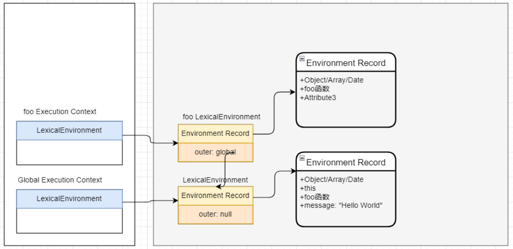
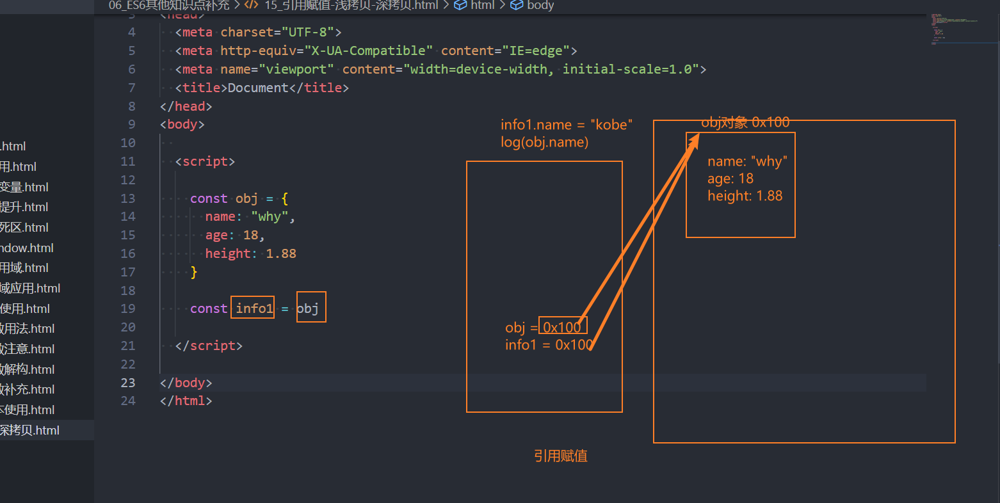
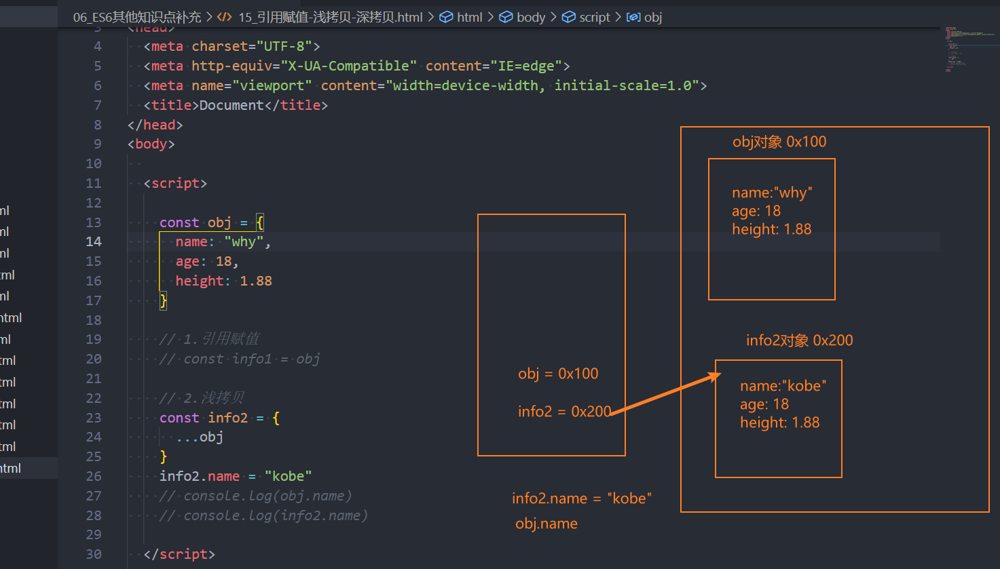
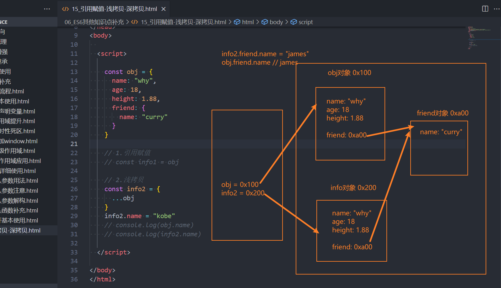
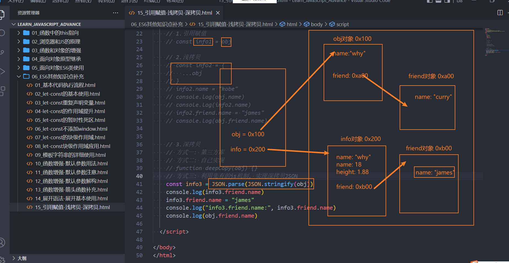

# 字面量的增强

属性增强、方法增强、计算属性名

```js
var name="why"
var key="address"+"city"

var obj={
    //1.属性增强
    name,   //同name:name
    //2.方法增强
    running(){
        console.log("running~") //同running:function(){...}
    }, 
    //3.计算属性名
    [key]:"广州"   //同"addresscity":"广州"
}
```

# 数组与对象解构

## 数组解构

```js
var names=["abc","cba",undefined,"nba"]
//1.基本使用
   //var name1=names[0]
   //var name2=names[1]
   //var name3=names[2]
var [name1,name2,name3]=names

//2.顺序问题，严格依照顺序，中间跳过也要留空
var [name1, ,name3]=names

//3.剩余解构为数组
var [name1,name2,...newNames]=names

//4.解构的默认值
var [name1,name2,name3="default"]=names
```

## 对象解构

```js
var obj={name:"why",age:18,height:1.88}
//1.基本使用
    //var name=obj.name
    //var age=obj.age
    //var height=obj.height
   var {name,age,height}=obj

//2.顺序问题，没有顺序，依照key解构
var {height,name,age}=obj

//3.对变量进行重命名
var {height:wHeight,name:wNAme,age:wAge}=obj

//4.默认值
var {height:wHeight,name:wNAme,age:wAge,address:wAddress="中国"}=obj

//5.剩余的解构为对象
var {name,age,...newObj}=obj
```

# **新的ECMA代码执行描述**

◼ **在执行学习JavaScript代码执行过程中，我们学习了很多ECMA文档的术语：**

​		 执行上下文栈：Execution Context Stack，用于执行上下文的栈结构；

​		 执行上下文：Execution Context，代码在执行之前会先创建对应的执行上下文；

​		 变量对象：Variable Object，上下文关联的VO对象，用于记录函数和变量声明；

​		 全局对象：Global Object，全局执行上下文关联的VO对象；

​		 激活对象：Activation Object，函数执行上下文关联的VO对象；

​		 作用域链：scope chain，作用域链，用于关联指向上下文的变量查找；

◼ **在新的ECMA代码执行描述中（ES5以及之上），对于代码的执行流程描述改成了另外的一些词汇：**

​		 基本思路是相同的，只是对于一些词汇的描述发生了改变；

​		 执行上下文栈和执行上下文也是相同的；

## **词法环境**

◼ **词法环境是一种规范类型，用于在词法嵌套结构中定义关联的变量、函数等标识符；**

​		 一个词法环境是由环境记录（Environment Record）和一个外部词法环境（outer Lexical Environment）组成；

​		 一个词法环境经常用于关联一个函数声明、代码块语句、try-catch语句，当它们的代码被执行时，词法环境被创建出来；

◼ **也就是在ES5之后，执行一个代码，通常会关联对应的词法环境；**

​		 执行上下文会关联两个词法环境：词法环境（Lexical Environments）和变量环境（Variable Environments）

### **LexicalEnvironment和VariableEnvironment**

◼ LexicalEnvironment用于处理let、const声明的标识符

◼ VariableEnvironment用于处理var和function声明的标识符

## **环境记录**

◼ **在这个规范中有两种主要的环境记录值:声明式环境记录和对象环境记录。**

​		 声明式环境记录：声明性环境记录用于定义ECMAScript语言语法元素的效果，如函数声明、变量声明和直接将标识符绑定与ECMAScript语言值关联起来的Catch子句。

​		 对象式环境记录：对象环境记录用于定义ECMAScript元素的效果，例如WithStatement，它将标识符绑定与某些对象的属性关联起来。



# let/const

◼ **let关键字：**

​		 从直观的角度来说，let和var是没有太大的区别的，都是用于声明一个变量；

◼ **const关键字：**

​		 const关键字是constant的单词的缩写，表示常量、衡量的意思；

​		 它表示保存的数据一旦被赋值，就不能被修改；

​		 但是如果赋值的是引用类型，那么可以通过引用找到对应的对象，修改对象的内容；比如可以修改其属性（如果它是一个对象）或元素（如果它是一个数组）

◼ 注意：

​		 另外let、const不允许重复声明变量；

## **暂时性死区 (TDZ)**

◼ **我们知道，在let、const定义的标识符真正执行到声明的代码之前，是不能被访问的**

​		 从块作用域的顶部一直到变量声明完成之前，这个变量处在暂时性死区（TDZ，temporal dead zone）

◼ 使用术语 “temporal” 是因为区域取决于执行顺序（时间），而不是编写代码的位置；

```js
function foo(){
    console.log(message)
}
let message="HW"
foo()
```

**let/const有没有作用域提升呢？**

◼ **在执行上下文的词法环境创建出来的时候，变量事实上已经被创建了，只是这个变量是不能被访问的。**

​		 那么变量已经有了，但是不能被访问，是不是一种作用域的提升呢？

◼ **事实上维基百科并没有对作用域提升有严格的概念解释，那么我们自己从字面量上理解；**

​		 **作用域提升：**在声明变量的作用域中，如果这个变量可以在声明之前被访问，那么我们可以称之为作用域提升；

​		 在这里，它虽然被创建出来了，但是不能被访问，我认为不能称之为作用域提升；

◼ 所以我的观点是let、const没有进行作用域提升，但是会在解析阶段被创建出来。

**使用 let 或 const 声明的变量会被存储在词法环境中，使用 var 声明的变量一样直接添加到全局对象（例如 window）上。**

## 块级作用域

ES5时，只有两个作用域：**全局作用域和函数作用域**

ES6中新增了**块级作用域**，并且通过let、const、function、class声明的标识符是具备块级作用域的限制的：

```js
 {
    let foo="foo"
    function bar(){
        console.log("bar")
    }
    class Person{}
 }
 console.log(foo) //报错
 bar() //可以访问
 var p=new Person() //报错
```

◼ 但是我们会发现**函数拥有块级作用域，但是外面依然是可以访问的**：

​		 这是因为**引擎会对函数的声明进行特殊的处理，允许像var那样进行提升**；

# 模板字符串

◼ **ES6允许我们使用字符串模板来嵌入JS的变量或者表达式来进行拼接：**

​		 首先，我们会使用 **``** 符号来编写字符串，称之为模板字符串；

​		 其次，在模板字符串中，我们可以通过 **${expression}** 来嵌入动态的内容；

## 标签模板字符串

◼ **我们一起来看一个普通的JavaScript的函数：**

```js
function foo(...args){
	console.log(args)
}
foo("Hello World")
```

◼ **如果我们使用标签模板字符串，并且在调用的时候插入其他的变量：**

​		 模板字符串被拆分了；

​		 第一个元素是数组，是被模块字符串拆分的字符串组合；

​		 后面的元素是一个个模块字符串传入的内容；

```js
const name="why"
const age=18
//[ [ 'Hello','World',''] ,'why',18]
foo`Hello ${name} World ${age}`
```

# 函数的默认参数

◼ **而在ES6中，我们允许给函数一个默认值：**

```js
function foo(x=20,y=30){
    console.log(x,y)
}
foo(50,100) //50 100
foo() //20 30
```

◼ **默认值也可以和解构一起来使用：**

```js
//写法一：
function foo({name,age}={name:"why",age:18}){
    console.log(name,age)
}
//写法二：
function foo({name:"why",age:18}={}){
    console.log(name,age)
}
```

◼ **带默认值的参数通常会将其放到最后（在很多语言中，如果不放到最后其实会报错的）**

◼ **带默认值的参数会改变函数的length的个数，默认值以及后面的参数都不计算在length之内**

# **函数的剩余参数**

◼ **ES6中引用了rest parameter，可以将不定数量的参数放入到一个数组中：**

​		 如果最后一个参数是 ... 为前缀的，那么它会将剩余的参数放到该参数中，并且作为**一个数组**；

◼ **那么剩余参数和arguments有什么区别呢？**

​		 剩余参数只包含那些没有对应形参的实参，而 arguments 对象包含了传给函数的所有实参；

​		 arguments对象不是一个真正的数组，而rest参数是一个真正的数组，可以进行数组的所有操作；

​		 arguments是早期的ECMAScript中为了方便去获取所有的参数提供的一个数据结构，而rest参数是ES6中提供并且希望以此来替代arguments的；

◼ **注意：剩余参数必须放到最后一个位置，否则会报错**

# 展开语法

**展开运算符其实是一种浅拷贝**

◼ **展开语法的场景：**

​		 在字符串使用；

​		 在函数调用时使用；

​		 在数组构造时使用；

​		 在构建对象字面量时（不是任何对象都可以，因为对象默认不可迭代【可迭代对象：数组/String/arguments】）

```js
const names=["abc","cba","fsa"]
const str="Hello"

function foo(name1,name2,...args){
    console.log(name1,name2,args)
}

foo(...names)
foo(...str)

//在构建对象字面量时
const obj={
    name:"why",
    age:18
}
//foo(...obj) //绝对不行
const info={
    ...obj,
    address="London"
}
console.log(info)
```

# 深浅拷贝和引用赋值

## **引用赋值**



## **浅拷贝**



## 深拷贝



# **数值的表示**

◼ 在ES6中规范了二进制和八进制的写法：

```js
const num1=0b100
const num2=0o100
const num3=0x100
```

◼ 另外在ES2021新增特性：数字过长时，可以使用_作为连接符

```js
const num4=100_00_0_000_0000
```

# Symbol

Symbol是ES6中新增的一个基本数据类型，翻译为符号。

◼ Symbol就是为了解决**对象属性名冲突**，用来**生成一个独一无二的值**。

​		 Symbol值是**通过Symbol函数来生成**的，生成后可以作为属性名；

​		 也就是在ES6中，==对象的属性名可以使用**字符串**，也可以使用**Symbol值**；==（用其他也会先转成字符串再当属性名）

◼ **Symbol即使多次创建值，它们也是不同的：**Symbol函数执行后每次创建出来的值都是独一无二的；

◼ **我们也可以在创建Symbol值的时候传入一个描述description**：这个是ES2019（ES10）新增的特性；

```js
 const s1=Symbol("abc")
 const s2=Symbol("fvd")

 const obj={}

 //1.写法一：属性名赋值
 obj[s1]="abc"
 obj[s2]="fvd"
 //2.写法二：Object.defineProperty
 Object.defineProperty(obj,s1,{
    enumerable:true,
    value:"abc"
 })
 //3.写法三：定义字面量时直接使用
 const info={
    [s1]:"abc",
    [s2]:"fvd"
 }
```

```js
 //获取Symbol对应的key
 console.log(Object.keys(obj))  //这样是获取不到Symbol的，只能获取普通值的key
 console.log(Object.getOwnPropertySymbols(obj))
```

◼ **如果就是想创建相同的Symbol应该怎么做呢？**

​		 可以使用**Symbol.for**方法来做到这一点；

​		 并且可以通过**Symbol.keyFor**方法来获取对应的key；

```js
const s1=Symbol.for("abc")
const s2=Symbol.for("abc")

console.log(s1===s2)//true
const key=Symbol.keyFor(s1)
console.log(key)//abc
const s2=Symbol.for(key)
console.log(s2===s3)//true
```

# Set

◼ **Set是一个新增的数据结构，可以用来保存数据，类似于数组，但是和数组的区别是元素不能重复。**

​		 创建Set我们需要通过Set构造函数（暂时没有字面量创建的方式）：

◼ 我们可以发现Set中存放的元素是不会重复的，那么Set有一个非常常用的功能就是**给数组去重**。

```js
const arr=[10,20,10,44,78,44]
const set=new Set(arr)
const newAry1=[...set]
const newAry2=Array.from(set)
console.log(newAry1,newAry2) //[10, 20, 44, 78][10, 20, 44, 78]
```

## Set常见方法

◼ **Set常见的属性：**

​		 size：返回Set中元素的个数；

◼ **Set常用的方法：**

​		 add(value)：添加某个元素，返回Set对象本身；

​		 delete(value)：从set中删除和这个值相等的元素，返回boolean类型；

​		 has(value)：判断set中是否存在某个元素，返回boolean类型；

​		 clear()：清空set中所有的元素，没有返回值；

​		 forEach(callback, [, thisArg])：通过forEach遍历set；

◼ **另外Set是支持for of的遍历的。**

## WeakSet

◼ **和Set类似的另外一个数据结构称之为WeakSet，也是内部元素不能重复的数据结构。**

◼ **那么和Set有什么区别呢？**

​		 区别一：WeakSet中只能存放对象类型，不能存放基本数据类型；

​		 区别二：WeakSet对元素的引用是弱引用，如果没有其他引用对某个对象进行引用，那么GC可以对该对象进行回收；

◼ **WeakSet常见的方法：**

​		 add(value)：添加某个元素，返回WeakSet对象本身；

​		 delete(value)：从WeakSet中删除和这个值相等的元素，返回boolean类型；

​		 has(value)：判断WeakSet中是否存在某个元素，返回boolean类型；

◼ **注意：WeakSet不能遍历**

​		 因为WeakSet只是对对象的弱引用，如果我们遍历获取到其中的元素，那么有可能造成对象不能正常的销毁。

​		 所以存储到WeakSet中的对象是没办法获取的；

### **WeakSet的应用**

```js
const pwset=new WeakSet()
 class Person{
    constructor(){
        pwset.add(this)
    }
    running(){
        if(!pwset.has(this)) throw new Error("不可用其他对象调用running方法")
        console.log("runnning",this)
    }
 }
```

# Map

◼ **另外一个新增的数据结构是Map，用于存储映射关系。**

◼ **之前使用对象来存储映射关系，他们有什么区别？**

​		 事实上我们对象存储映射关系只能用字符串（ES6新增了Symbol）作为属性名（key）；

​		 某些情况下我们可能希望通过其他类型作为key，比如对象，这个时候会自动将对象转成字符串来作为key；

◼ **那么我们就可以使用Map：**

```js
 const obj1={name:"why"}
 const obj2={age:18}

 const map=new Map()
 map.set(obj1,"abc")
 map.set(obj2,"cba")
 console.log(map.get(obj1))
 console.log(map.get(obj2))

 const map2=new Map([
    [obj1,"abc"],
    [obj2,"cba"],
    [obj1,"nba"],
 ])
 console.log(map.get(obj1)) //nba
 console.log(map.get(obj2)) //cba
```

## **Map的常用方法**

◼ **Map常见的属性：**

​		 size：返回Map中元素的个数；

◼ **Map常见的方法：**

​		 set(key, value)：在Map中添加key、value，并且返回整个Map对象；

​		 get(key)：根据key获取Map中的value；

​		 has(key)：判断是否包括某一个key，返回Boolean类型；

​		 delete(key)：根据key删除一个键值对，返回Boolean类型；

​		 clear()：清空所有的元素；

​		 forEach(callback, [, thisArg])：通过forEach遍历Map；

◼ **Map也可以通过for of进行遍历。**

## **WeakMap**

◼ **和Map类型的另外一个数据结构称之为WeakMap，也是以键值对的形式存在的。**

◼ 那么和Map有什么区别呢？

​		 区别一：WeakMap的key只能使用对象，不接受其他的类型作为key；

​		 区别二：WeakMap的key对对象想的引用是弱引用，如果没有其他引用引用这个对象，那么GC可以回收该对象；

◼ **WeakMap常见的方法有四个：**

​			 set(key, value)：在Map中添加key、value，并且返回整个Map对象；

​		 get(key)：根据key获取Map中的value；

​		 has(key)：判断是否包括某一个key，返回Boolean类型；

​		 delete(key)：根据key删除一个键值对，返回Boolean类型；

◼ **注意：WeakMap也是不能遍历的**

​		 没有forEach方法，也不支持通过for of的方式进行遍历；

### **WeakMap的应用**

见vue3响应式源码