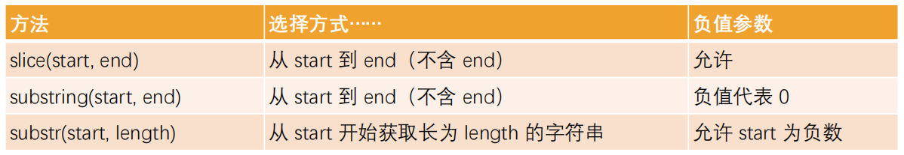

# 数据类型

◼ **JavaScript 中有八种基本的数据类型（前七种为基本数据类型，也称为原始类型，而 object 为复杂数据类型，也称为引用类型）。**

​	 number 用于任何类型的数字：整数或浮点数。

​	 string 用于字符串：一个字符串可以包含 0 个或多个字符，所以没有单独的单字符类型。

​	 boolean 用于 true 和 false。

​	 undefined 用于未定义的值 —— 只有一个 undefined 值的独立类型。

​	 object 用于更复杂的数据结构。

​	 null 用于未知的值 —— 只有一个 null 值的独立类型。

​	 symbol 用于唯一的标识符。

​	 bigint 用于任意长度的整数。

# 对象

## 对象的遍历

◼ **对象的遍历（迭代）：表示获取对象中所有的属性和方法。**

​		 Object.keys() 方法会返回一个由一个给定对象的自身可枚举属性组成的数组；

◼ **遍历方式一：普通for循环**

```js
var infoKeys=Object.keys(info);
for(var i=0;i<infoKeys.length;i++){
    var key=infoKeys[i];
    var value=info[key];
    console.log(`key:${key},value:${value}`)
}
```

◼ **遍历方式二：for in 遍历方法**

```js
for(var key in info){
    var value=info[key];
    console.log(`key:${key},value:${value}`)
}
```

## 创建对象

### 工厂函数

```js
function createPerson(name,age,height) { 
    var p=new Object();
    p.name=name;
    p.age=age;
    p.height=height;
    p.eat=function(){
        console.log(this.name+"吃糖")
    }
    return p;
 }
```

◼ 工厂方法创建对象有一个比较大的问题：

​		我们在打印对象时，**对象的类型都是Object类型**，这些对象应该有一个他们共同的类型

​		**每次调用工厂函数都会创建一个新的对象**，这样造成了资源的浪费

### 构造函数

◼ **在JavaScript中，构造函数就是类的扮演者：**

​		 比如系统默认给我们提供的Date就是一个构造函数，也可以看成是一个类；

​		 在ES5之前，我们都是**通过function来声明一个构造函数（类）的，之后通过new关键字来对其进行调用**；

​		 在ES6之后，JavaScript可以像别的语言一样，**通过class来声明一个类**；

​		 构造函数也是一个普通的函数，从表现形式来说，和千千万万个普通的函数没有任何区别；

​		 那么如果这么一个普通的函数被使用new操作符来调用了，那么这个函数就称之为是一个构造函数；

◼ **如果一个函数被使用new操作符调用了，那么它会执行如下操作：**

​		 1. 在内存中创建一个新的对象（空对象）；

​		 2. 这个对象内部的[[prototype]]属性会被赋值为该构造函数的prototype属性

​		 3. 构造函数内部的this，会指向创建出来的新对象；

​		 4. 执行函数的内部代码（函数体代码）；

​		 5. 如果构造函数没有返回非空对象，则返回创建出来的新对象；

```js
function Person(name,age,height) { 
    this.name=name;
    this.age=age;
    this.height=height;
    this.eat=function(){
        console.log(this.name+"吃糖")
    }
 }
```

这个构造函数可以确保我们的对象是有Person的类型的（实际是constructor的属性）

# JS内置类

JavaScript的原始类型并非对象类型，所以从理论上来说，它们是没有办法获取属性或者调用方法的。但为了可以使其可以获取属性和调用方法，对其封装了对应的包装类型。

**常见的包装类型有：String、Number、Boolean、Symbol、BigInt类型**

◼ 默认情况，当调用一个原始类型的属性或者方法时，会进行如下操作：

​		 根据原始值，创建一个原始类型对应的包装类型对象；

​		 调用对应的属性或者方法，返回一个新的值；

​		 创建的包装类对象被销毁；

​		 通常JavaScript引擎会进行很多的优化，它可以跳过创建包装类的过程在内部直接完成属性的获取或者方法的调用。

◼ **我们也可以自己来创建一个包装类的对象：**

​		 name1是字面量（literal）的创建方式，name2是new创建对象的方式；

```js
 var name1="why";
 var name2=new String("why");
 console.log(typeof name1);  //string
 console.log(typeof name2);  //object
 console.log(name1 === name2);  //false
```

◼ 注意事项：null、undefined没有任何的方法，也没有对应的“对象包装类”；

## Number类

◼ **Number属性补充：**

​		 Number.MAX_SAFE_INTEGER：JavaScript 中最大的安全整数 (2^53 - 1)；

​		 Number.MIN_SAFE_INTEGER：JavaScript 中最小的安全整数 -(2^53 - 1)

◼ **Number实例方法补充：**

​		 **toString(base)，将数字转成字符串，并且按照base进制进行转化**

​			✓ base 的范围可以从 2 到 36，默认情况下是 10；

​			✓ 注意：如果是直接对一个数字操作，需要使用..运算符；

```js
console.log(123..toString());
```

​		 **toFixed(digits)，格式化一个数字，保留digits位的小数**；

​			✓ digits的范围是0到20（包含）之间；

```js
var pi=3.1415926535;
console.log(pi.toFixed(2));  //四舍五入保留两位
```

◼ **Number类方法补充：**

​		 **Number.parseInt(string[, radix])，将字符串解析成整数，也有对应的全局方法parseInt；**

​		 **Number. parseFloat(string)，将字符串解析成浮点数，也有对应的全局方法parseFloat；**

```js
let num1=123.321;
console.log(Number.parseInt(num1));  //直接截，不会四舍五入
console.log(Number.parseFloat(num1));
//也可以去掉Number，这是用的Window对象上的方法
console.log(parseInt(num1));
console.log(parseFloat(num1));
```

◼ **更多Number的知识，可以查看MDN文档：**

 https://developer.mozilla.org/zh-CN/docs/Web/JavaScript/Reference/Global_Objects/Number

## Math对象

◼在除了Number类可以对数字进行处理之外，JavaScript还提供了一个Math对象。

 **Math是一个内置对象（不是一个构造函数）**，它拥有一些数学常数属性和数学函数方法

◼ **Math常见的属性：**

​		 Math.PI：圆周率，约等于 3.14159；

◼ **Math常见的方法：**

​		 Math.floor：向下舍入取整

​		 Math.ceil：向上舍入取整

​		 Math.round：四舍五入取整

​		 Math.random：生成0~1的随机数（包含0，不包含1）

​		 Math.pow(x, y)：返回x的y次幂

◼ **Math中还有很多其他数学相关的方法，可以查看MDN文档：**

https://developer.mozilla.org/zh-CN/docs/Web/JavaScript/Reference/Global_Objects/Math

## String类

###  **String常见的属性**

​		 length：获取字符串的长度；

### **访问字符串的字符**

​		 方法一：通过字符串的索引 str[0]

​		 方法二：通过str.charAt(pos)方法

​		 它们的区别是索引的方式没有找到会返回undefined，而charAt没有找到会返回空字符串；

### **字符串的遍历**

​		 方式一：普通for循环

```js
let str = "hello";
for (let i = 0; i < str.length; i++) {
  console.log(str.charAt(i));
}
```

​		 方式二：for..of遍历

```js
let str = "hello";
for (let char of str) {
  console.log(char);
}
```

### 修改字符串

◼ **字符串的不可变性：**

​		 字符串在定义后是不可以修改的，所以下面的操作是没有任何意义的；

```js
var message="Hello World";
message[1]="A";
console.log(message)
```

◼ **所以，在我们改变很多字符串的操作中，都是生成了一个新的字符串；**

​		 比如改变字符串大小的两个方法

​		 toLowerCase()：将所有的字符转成小写；

​		 toUpperCase() ：将所有的字符转成大写；

### 查找字符串

**◼ 查找字符串位置 str.indexOf(searchValue [,fromIndex])**

​		 从fromIndex开始，查找searchValue的索引；

​		 如果没有找到，那么返回-1；

​		 有一个相似的方法，叫lastIndexOf，从最后开始查找（用的较少）

`console.log(message.indexOf("name",18))`

**◼ 是否包含字符串 str.includes(searchString [,position])**

​		 从position位置开始查找searchString， 根据情况返回 true 或 false

​		 这是ES6新增的方法；

`console.log(message.includes("why"))`

### 开头和结尾

**◼ 是否以xxx开头 str.startsWith(searchString [,position])**

​		 从position位置开始，判断字符串是否以searchString开头；

​		 这是ES6新增的方法，下面的方法也一样；

**◼是否以xxx结尾 str.endsWith(searchString [,length])** 

​		 在length长度内，判断字符串是否以searchString结尾；

### 获取子字符串



负参：字符串长度加上负参值

### 其它方法

**◼ 替换字符串 str.replace(regexp|substr,newSubStr|function)**

​		 查找到对应的字符串，并且使用新的字符串进行替代；

​		 这里也可以传入一个正则表达式来查找，也可以传入一个函数来替换；

**◼ 拼接字符串 str.concat(str2,[,...strN])**

​		join()方法是一个用于将数组元素连接成一个字符串的方法

**◼ 删除首位空格 str.trim()**

**◼ 字符串分割 str.split([separator[,limit]])**

​		 separator：以什么字符串进行分割，也可以是一个正则表达式；

​		 limit：限制返回片段的数量；

◼ **更多的字符串的补充内容，可以查看MDN的文档：**

https://developer.mozilla.org/zh-CN/docs/Web/JavaScript/Reference/Global_Objects/String

# 数组

**==数组是一种特殊的对象类型==**

## 基本操作

◼ **访问数组中的元素：**

​		 通过中括号[]访问

​		 arr.at(i)：

​			✓ 如果 i >= 0，则与 arr[i] 完全相同。

​			✓ 对于 i 为负数的情况，它则从数组的尾部向前数。

```js
console.log(arr[0]);
console.log(arr.at(-1))
```

◼ **修改数组中的元素**

```js
arr[0]="coderwhy"
```

◼ **在数组的尾端添加或删除元素：**

​		 push 在末端添加元素.

​		 pop 从末端取出一个元素.

◼ **在数组的首端添加或删除元素**

​		 shift 取出队列首端的一个元素，整个数组元素向前前移动；

​		 unshift 在首端添加元素，整个其他数组元素向后移动

**push/pop 方法运行的比较快，而 shift/unshift 比较慢。**

## splice

◼ **arr.splice方法可以说是处理数组的利器，它可以做所有事情：添加，删除和替换元素。**

◼ **arr.splice(start[,deleteCount[ ,item1 [ ,item2 [ ,...]]]])**

​		 从start位置开始，处理数组中的元素；

​		 deleteCount：要删除元素的个数，如果为0或者负数表示不删除；

​		 item1, item2, ...：在添加元素时，需要添加的元素；

```js
//删除一个元素
arr.splice(1,1);
//新增两个元素
arr.splice(1,0,"abc","cba");
//替换两个元素
arr.splice(1,2,"ko","ok");
```

==◼ **注意：这个方法会修改原数组**==

## length

◼ **length属性用于获取数组的长度：**

​		 当我们修改数组的时候，length 属性会自动更新。

◼ **length 属性的另一个有意思的点是它是可写的。**

​		 如果我们手动增加一个大于默认length的数值，那么会增加数组的长度。

​		 但是如果我们减少它，数组就会被截断。

◼ **所以，清空数组最简单的方法就是：arr.length = 0;。**

## 数组的遍历

◼ **普通for循环遍历：**

```js
for(let i=0;i<arr.length;i++){
    console.log(arr[i])
}
```

◼ **for..in 遍历，获取到索引值：**

```js
for (const index in arr) {
    console.log(arr[index])
}
```

◼ **for..of 遍历，获取到每一个元素：**

```js
for (const item of arr) {
    console.log(item)
}
```

## **slice、cancat、 join**

◼ **arr.slice ([begin[,end]])：用于对数组进行截取（类似于字符串的slice方法）。**

​		 包含begin元素，但是不包含end元素；

`console.log(arr.slice(2,3))`

◼ **arr.concat方法：创建一个新数组，其中包含来自于其他数组和其他项的值。**

`console.log(arr.concat(["abc","cba],"nba))`

◼ **arr.join([separator])：将一个数组的所有元素连接成一个字符串并返回这个字符串。**

`console.log(arr.join("-"))`

## 查找元素

◼ **arr.indexOf(searchElement[,fromIndex])： 查找某个元素的索引**

​		 从fromIndex开始查找，如果找到返回对应的索引，没有找到返回-1；

​		 也有对应的从最后位置开始查找的 lastIndexOf 方法

◼ **arr.includes(valueToFind[,fromIndex])：判断数组是否包含某个元素**

​		 从索引 from 开始搜索 item，如果找到则返回 true（如果没找到，则返回 false）。

◼ **find 和 findIndex** **直接查找元素或者元素的索引（ES6之后新增的语法）**

```js
var stu=students.find(function(item,index,arr){
    return item.id === 100;
})
```

## 数组的排序

◼ **sort方法也是一个高阶函数，用于对数组进行排序，并且生成一个排序后的==新数组==：**

​		 如果 compareFunction(a, b) 小于 0 ，那么 a 会被排列到 b 前面；

​		 如果 compareFunction(a, b) 等于 0 ， a 和 b 的相对位置不变；

​		 如果 compareFunction(a, b) 大于 0 ， b 会被排列到 a 前面；

​		 也就是说，谁小谁排在前面；

```js
var newStus = students.sort(function (item1, item2) {
  return item2.age - item1.age;
})
```

◼ **reverse() 方法将数组中元素的位置颠倒，并返回该数组。**

## 其它高阶方法

◼ **arr.forEach**

​		 遍历数组，并且让数组中每一个元素都执行一次对应的方法；

◼ **arr.map**

​		 map() 方法创建一个新数组；

​		 这个新数组由原数组中的每个元素都调用一次提供的函数后的返回值组成；

◼ **arr.filter**

​		 filter() 方法创建一个新数组；

​		 新数组中只包含每个元素调用函数返回为true的元素；

◼ **arr.reduce**

​		 用于计算数组中所有元素的总和；

```js
/**
 *  accumulator：累加器，存储累加后的结果。
    currentValue：当前正在处理的元素。
    currentIndex（可选）：当前元素在数组中的索引。
    array（可选）：正在处理的原始数组。
    initialValue（可选）：累加器的初始值。如果没有指定，则将使用数组中的第一个元素作为初始值。
 */
array.reduce(function (accumulator, currentValue, currentIndex, array) {
  // 在此处编写要执行的操作
}, initialValue)

//示例
const numbers = [1, 2, 3, 4, 5];

const doubledSum = numbers.reduce(function(accumulator, currentValue) {
  return accumulator + (currentValue * 2);
}, 0);

console.log(doubledSum); // Output: 30
```

# Date对象

 Date的构造函数有如下用法：

```js
//创建Date对象
var date1=new Date();//当前RFC 2822标准时间
var date1=new Date(1000);//传入毫秒数，表示从1970-01-01 00：00：00 UTC经过的毫秒数
var date1=new Date("2022-08-08");//new Date(year,monthIndex[,day[,hours[,min[,seconds[,milliseconds]]]]])
var date1=new Date(2022,08,08,08,08,08,08);
```

◼ 日期的表示方式有两种：RFC 2822 标准或者 ISO 8601 标准。

◼ **默认打印的时间格式是RFC 2822标准的：**

```js
new Date();
//Fri May 13 2022 17：14：52 GMT+0800
```

◼ **我们也可以将其转化成ISO 8601标准的：**

```js
new Date().toISOString()
//'2022-05-13T09:15:51.507Z'
```

​		 YYYY：年份，0000 ~ 9999

​		 MM：月份，01 ~ 12

​		 DD：日，01 ~ 31

​		 T：分隔日期和时间，没有特殊含义，可以省略

​		 HH：小时，00 ~ 24

​		 mm：分钟，00 ~ 59

​		 ss：秒，00 ~ 59

​		 .sss：毫秒

​		 Z：时区

◼ **我们可以从Date对象中获取各种详细的信息：**

​		 getFullYear()：获取年份（4 位数）；

​		 getMonth()：获取月份，从 0 到 11；

​		 getDate()：获取当月的具体日期，从 1 到 31（方法名字有点迷）；

​		 getHours()：获取小时；

​		 getMinutes()：获取分钟；

​		 getSeconds()：获取秒钟；

​		 getMilliseconds()：获取毫秒；

◼ **获取某周中的星期几：**

​		 getDay()：获取一周中的第几天，从 0（星期日）到 6（星期六）；

◼ **Date也有对应的设置方法：**

​		 setFullYear(year, [month], [date])

​		 setMonth(month, [date])

​		 setDate(date)

​		 setHours(hour, [min], [sec], [ms])

​		 setMinutes(min, [sec], [ms])

​		 setSeconds(sec, [ms])

​		 setMilliseconds(ms)

​		 setTime(milliseconds)

◼ **了解：我们可以设置超范围的数值，它会自动校准。**

## Unix时间戳

◼ 它是一个整数值，表示自1970年1月1日00:00:00 UTC以来的毫秒数。

◼ 在JavaScript中，我们有多种方法可以获取这个时间戳：

​		 方式一：new Date().getTime()

​		 方式二：new Date().valueOf()

​		 方式三：+new Date()

​		 方式四：Date.now()

## Date.parse方法

**◼可以从一个字符串中读取日期，并且输出对应的Unix时间戳。**

◼ **Date.parse(str) ：**

​		 作用等同于 new Date(dateString).getTime() 操作；

​		 需要符合 RFC2822 或 ISO 8601 日期格式的字符串；

​				✓ 比如YYYY-MM-DDTHH:mm:ss.sssZ

​		 其他格式也许也支持，但结果不能保证一定正常；

​		 如果输入的格式不能被解析，那么会返回NaN；

```js
var time1=Date.parse("2022-08-08T08:08:08.666Z")
console.log(time1)
```

