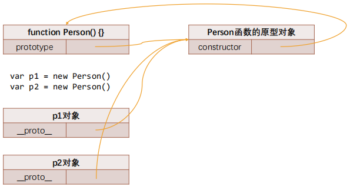

# ES5中实现继承

## 对象的原型

◼ **JavaScript当中每个对象都有一个特殊的内置属性 [[prototype]]，这个特殊的对象可以指向另外一个对象。**

◼ **那么这个对象有什么用呢？**

​		 当我们通过引用对象的属性key来获取一个value时，它会触发 [[Get]]的操作；

​		 这个操作会首先检查该对象是否有对应的属性，如果有的话就使用它；

​		 ==如果对象中没有改属性，那么会访问对象[[prototype]]内置属性指向的对象上的属性==；

◼ **获取的方式有两种：**

​		 方式一：通过对象的 **\__proto__**属性可以获取到（但是这个是早期浏览器自己添加的，存在一定的兼容性问题）；

​		 方式二：通过 **Object.getPrototypeOf** 方法可以获取到；

## 函数的原型

◼ **那么我们知道上面的东西对于我们的构造函数创建对象来说有什么用呢？**

​		 它的意义是非常重大的，接下来我们继续来探讨；

◼ **这里我们又要引入一个新的概念：所有的函数都有一个prototype的属性（注意：不是__proto__）**

◼是不是因为函数是一个对象，所以它有prototype的属性呢？

​		 不是的，因为它是一个函数，才有了这个特殊的属性；

​		 而不是它是一个对象，所以有这个特殊的属性；

### new操作符

◼ **我们前面讲过new关键字的步骤如下：**

​		 1.在内存中创建一个新的对象（空对象）；

​		 2.==这个对象内部的[[prototype]]属性会被赋值为该构造函数的prototype属性==；

◼ 那么也就意味着我们通过Person构造函数创建出来的所有对象的[[prototype]]属性都指向Person.prototype：



Person构造函数的原型对象里有一个默认属性**constructor**，又指回Person函数

## 重写原型对象

◼ 如果我们需要在原型上添加过多的属性，通常我们会重写整个原型对象：

```js
function Person() {  }
Person.prototype={
  name:"why",
  age:18,
  eating:function(){
    console.log(this.name+"eating~~")
  }
}
```

◼ 前面我们说过, 每创建一个函数, 就会同时创建它的prototype对象, 这个对象也会自动获取constructor属性；

​		 而我们这里相当于给prototype重新赋值了一个对象, 那么这个新对象的constructor属性, 会指向Object构造函数, 而不是Person构造函数了

◼ 如果希望constructor指向Person，那么可以手动添加：

`constructor:Person`

◼ 上面的方式虽然可以, 但是也会造成constructor的[[Enumerable]]特性被设置了true.

​		 默认情况下, 原生的constructor属性是不可枚举的.

​		 如果希望解决这个问题, 就可以使用我们前面介绍的Object.defineProperty()函数了

```js
Object.defineProperty(Person.prototype,"constructor",{
    enumerable:false,
    value:Person
})
```

## 原型链

从一个对象上获取属性，如果在当前对象中没有获取到就会去它的原型上面获取

var obj{}也就是var obj=new Object()，所以，**obj.\__proto\_\_是Object显式原型，obj.\_\_proto\_\_proto__是null**

即：==**原型链最顶层的原型对象就是Object的原型对象，再往上则是null**==

### 通过原型链实现继承（方法继承）

 目前stu的原型是p对象，而p对象的原型是Person默认的原型，里面包含running等函数；

 注意：步骤4和步骤5不可以调整顺序，否则会有问题

```js
//1.定义父类构造器
function Person(){
  this.name="why"
}
//2.父类原型上添加内容
Person.prototype.running=function () {
  console.log(this.name+"running~")
}
//3.定义子类构造函数
function Students() { 
  this.sno=111
}
//4.创建父类对象，并且作为子类的原型对象
var p=new Person()
Students.prototype=p
//5.在子类原型上添加内容
Students.prototype.studying=function () { 
  console.log(this.name+"studying")
}
```


#### **原型链继承的弊端**

◼ **但是目前有一个很大的弊端：某些属性其实是保存在p对象上的；**

​		 第一，我们通过直接打印对象是看不到这个属性的；

​		 第二，这个属性会被多个对象共享，如果这个对象是一个引用类型，那么就会造成问题；

​		 第三，不能给Person传递参数（让每个stu有自己的属性），因为这个对象是一次性创建的（没办法定制化）；

### 借用构造函数继承（属性继承）

◼ **借用继承的做法非常简单：在子类型构造函数的内部调用父类型构造函数.**

​		 因为函数可以在任意的时刻被调用；

​		 因此通过apply()和call()方法也可以在新创建的对象上执行构造函数；

```js
function Student(name,age,sno){
    Person.call(this,name,age) //意为父类中this全指向子类
    this.sno=sno
}
```

#### **组合借用继承的问题**

 组合继承最大的问题就是无论在什么情况下，都会**调用两次父类构造函数**。

​		✓ 一次在创建子类原型的时候；`var p=new Person("why",18)`

​		✓ 另一次在子类构造函数内部(也就是每次创建子类实例的时候)；`Person.call(this,name,age)`

 另外，**所有的子类实例事实上会拥有两份父类的属性**

​		✓ 一份在当前的实例自己里面(也就是person本身的)，另一份在子类对应的原型对象中(也就是person.__proto__里面)；即`var p=new Person("why",18)`导致p有自己的name和age，stu1创建时也可能会有自己的name和age。

​		✓ 当然，这两份属性我们无需担心访问出现问题，因为默认一定是访问实例本身这一部分的；

### **寄生组合式继承**（方法继承）

通过上述方法尝试，可以发现ES5实现继承需要以下几点：

**1.必须创建出来一个对象**

**2.这个对象的隐式原型必须指向父类的显式原型**

**3.将这个对象赋值给子类的显式原型**

这时可以尝试寄生组合式继承：

```js
//之前的做法
 var p=new Person()
 Students.prototype=p;

 //方案一：
 var obj={}
 //obj._proto_=Person.prototype
 Object.setPrototypeOf(obj,Person.prototype)
 Students.prototype=obj

 //方案二：
 function F(){}
 F.prototype=Person.prototype
 Students.prototype=new F()

 //方案三：
 var obj=Object.create(Person.prototype)//create可以直接将隐式原型绑在某处
 Students.prototype=obj

 //最终方案（排除_proto_和create方法兼容性）
 function createObject(o){
  function F(){}
  F.prototype=o
  return new F()
 }
 function inherit(Subtype,SuperType) {
  Subtype.prototype=createObject(SuperType.prototype)
  Object.defineProperty(Subtype.prototype,"constructor",{
    enumerable:false,
    configurable:true,
    writable:true,
    value:Subtype
  })
 }
```

## ES5继承示例

```js
 function Person(name,age,height){
  this.name=name
  this.age=age
  this.height=height
 }

 Person.prototype.running=function() {
  console.log("running~")
 }

 function Students(name,age,height,sno,score){
  Person.call(this,name,age,height)   //借用继承父类构造属性，不写重复代码
  this.sno=sno
  this.score=score
 }

 inherit(Students,Person)  //见寄生组合式继承中inherit方法
 Students.prototype.studying=function(){
  console.log("studying~")
 }

 var stu1=new Students("why",18,1.88,111,100)
 var stu1=new Students("code",13,1.78,121,90)
```

# 原型链关系


实例对象都拥有隐式原型\_proto_指向构造函数的显式原型对象

函数都拥有显式原型prototype指向自己的显式原型对象和隐式原型\_proto_指向Function的显式原型对象（函数也是对象）

原型对象都拥有隐式原型\_proto_和constructor

函数其实都是Function的实例对象

原型对象默认创建时`var obj={}`，隐式原型均指向Object的显式原型

Object即是Function的父类，Function则是Object对应的构造函数（Function创建了Object）

# ES6中实现继承

## class定义类

`class Person{}`或者`var Person=class{}`

### 类的构造函数

◼ 如果我们希望在创建对象的时候给类传递一些参数，这个时候应该如何做呢？

​		 每个类都可以有一个自己的构造函数（方法），这个方法的名称是固定的constructor；

​		 当我们通过new操作符，操作一个类的时候会调用这个类的构造函数constructor；

​		 每个类只能有一个构造函数，如果包含多个构造函数，那么会抛出异常；

◼ 当我们通过new关键字操作类的时候，会调用这个constructor函数，并且执行如下操作：

​		 1.在内存中创建一个新的对象（空对象）；

​		 2.这个对象内部的[[prototype]]属性会被赋值为该类的prototype属性；

​		 3.构造函数内部的this，会指向创建出来的新对象；

​		 4.执行构造函数的内部代码（函数体代码）；

​		 5.如果构造函数没有返回非空对象，则返回创建出来的新对象；

### **类的实例方法**

◼ 在上面我们定义的属性都是直接放到了this上，也就意味着它是放到了创建出来的新对象中：

​		 在前面我们说过对于实例的方法，我们是希望放到原型上的，这样可以被多个实例来共享；

​		 这个时候我们可以直接在类中定义

```js
class Person{
    constructor(name,age){
        this._name=name
        this._age=age
    }
   
    running(){
        console.log(this.name+"running~")
    }
}
```

### **类的访问器方法**

◼ 我们之前讲对象的属性描述符时有讲过对象可以添加setter和getter函数的，那么类也是可以的：

```js
class Person{
    constructor(name){
        this._name=name
    }
   
    set name(newName){
        this._name=newName
    }
    
    get name(){
        return this._name
    }
}
```

### 类的静态方法

◼ 静态方法通常用于定义直接使用类来执行的方法，不需要有类的实例，使用static关键字来定义：

```js
class Person{
    constructor(age){
        this._age=age
    }
   
    static create(){
        return new Person(Math.floor(Math.random()*100))
    }
}
```

写在原型上的方法是实例方法，必须由实例调用。直接写在类上的方法是静态方法，也叫类方法，用类调用。

`Person.prototype.running=function(){}`

`Person.randomPerson=function(){}`

### **super关键字**

◼ 我们会发现在上面的代码中我使用了一个super关键字，这个super关键字有不同的使用方式：

​		 注意：在子（派生）类的构造函数中使用this或者返回默认对象之前，必须先通过super调用父类的构造函数！

​		 super的使用位置有三个：子类的构造函数、实例方法、静态方法；

```js
class Animal{
    constructor(age){
        this._age=age
    }
    running(){
        console.log(this._name+"running~")
    }
    static create(){
        return new Person(Math.floor(Math.random()*100))
    }
}

class Dog extends Animal{
    constructor(age,height){
        super(age)   //一定写在前面，否则报错
        this._height=height
    }
    running(){
        console.log("四条腿")
        super.running()
    }
}
```

### **继承内置类**

◼ 我们也可以让我们的类继承自内置类，比如Array：

```js
class HYArray extends Array{
    lastItem(){
        return this[this.length-1]
    }
}
var array=new HYArray(10,20,30)
console.log(array.lastItem())
```

# 了解mixin类的混入

==js中，只能单继承（只有一个父类），不能多继承==

这时，可以利用mixin做以下操作实现多继承：

```js
 function mixinAnimal(BaseClass){
  return class extends BaseClass{
    running(){
      console.log("running~")
    }
  }
 }

 function mixinRunner(BaseClass){
  return class extends BaseClass{
    flying(){
      console.log("flying~")
    }
  }
 }

 class Bird{
  eating(){
    console.log("eating~")
  }
 }

 var NewBird=mixinRunner(mixinAnimal(Bird))
 var bird=new NewBird()
 bird.flying()
 bird.running()
 bird.eating()
```

# JS中的多态

◼ 面向对象的三大特性：封装、继承、多态。

​		 前面两个我们都已经详细解析过了，接下来我们讨论一下JavaScript的多态。

◼ JavaScript有多态吗？

​		 维基百科对多态的定义：**多态**（英语：polymorphism）指为不同数据类型的实体提供统一的接口，或使用一个单一的符号

来表示多个不同的类型。

​		 非常的抽象，个人的总结：不同的数据类型进行同一个操作，表现出不同的行为，就是多态的体现。

◼ 那么从上面的定义来看，JavaScript是一定存在多态的。

```js
function sum(a,b){
    console.log(a+b)
}

sum(10,20)
sum("abc","cba")
```

