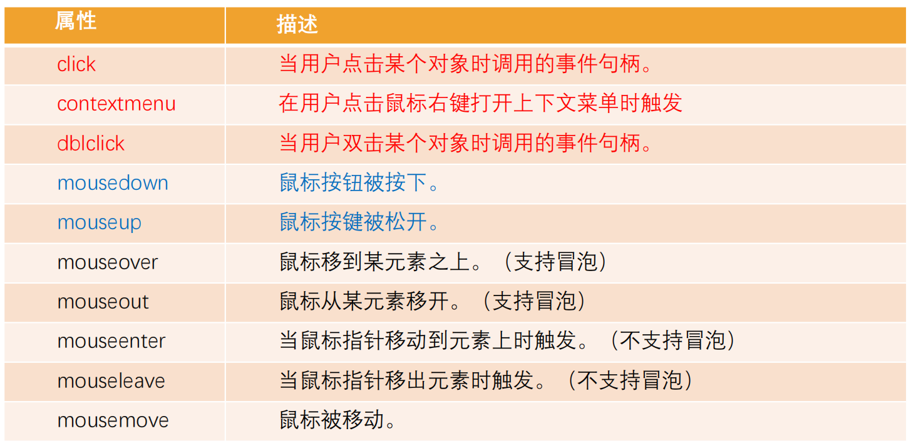
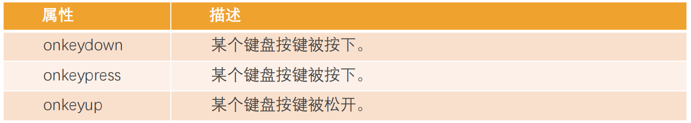
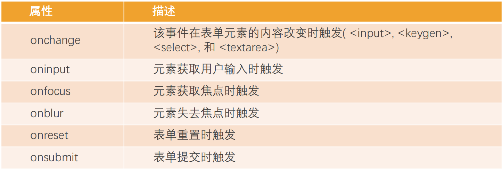

 事件监听方式一：在script中直接监听（很少使用）；

 事件监听方式二：DOM属性，通过元素的on来监听事件；

 事件监听方式三：通过EventTarget中的addEventListener来监听；

```js
<div id="box" onclick="alert('点击1')"></div>
    <script>
        box.onclick=function(){
            alert("点击2")
        }
        box.addEventListener("click",function(){
            console.log("点击3")
        })
    </script>
```

# **常见的事件列表**

◼ **鼠标事件：**

​		 click —— 当鼠标点击一个元素时（触摸屏设备会在点击时生成）。

​		 mouseover / mouseout —— 当鼠标指针移入/离开一个元素时。

​		 mousedown / mouseup —— 当在元素上按下/释放鼠标按钮时。

​		 mousemove —— 当鼠标移动时。

◼ **键盘事件：**

​		 keydown 和 keyup —— 当按下和松开一个按键时。

◼ **表单（form）元素事件：**

​		 submit —— 当访问者提交了一个 <form> 时。

​		 focus —— 当访问者聚焦于一个元素时，例如聚焦于一个 <input>。

◼ **Document 事件：**

​		 DOMContentLoaded —— 当 HTML 的加载和处理均完成，DOM 被完全构建完成时。

◼ **CSS 事件：**

​		 transitionend —— 当一个 CSS 动画完成时。

# **事件流**

## **事件冒泡和事件捕获**

◼ 我们会发现默认情况下事件是从最内层的span向外依次传递的顺序**，**这个顺序我们称之为事件冒泡（Event Bubble）

◼ 事实上，还有另外一种监听事件流的方式就是从外层到内层（body -> span），这种称之为事件捕获（Event Capture）

◼ **为什么会产生两种不同的处理流呢？**

​		 这是因为早期浏览器开发时，不管是IE还是Netscape公司都发现了这个问题;

​		 但是他们采用了完全相反的事件流来对事件进行了传递；

​		 IE采用了事件冒泡的方式，Netscape采用了事件捕获的方式；

◼ **如果我们都监听，那么会按照如下顺序来执行：**

◼ 捕获阶段（Capturing phase）：

​	 事件（从 Window）向下走近元素。

◼ 目标阶段（Target phase）：

​	 事件到达目标元素。

◼ 冒泡阶段（Bubbling phase）：

​	 事件从元素上开始冒泡。

◼ **事实上，我们可以通过event对象来获取当前的阶段：**

​	 eventPhase

◼ 开发中通常会使用事件冒泡，所以事件捕获了解即可。

# **事件对象**

◼ **当一个事件发生时，就会有和这个事件相关的很多信息：**

​		 比如事件的类型是什么，你点击的是哪一个元素，点击的位置是哪里等等相关的信息；

​		 那么这些信息会被封装到一个Event对象中，这个对象由浏览器创建，称之为event对象；

​		 该对象给我们提供了想要的一些属性，以及可以通过该对象进行某些操作；

◼ **如何获取这个event对象呢？**

​		 event对象会在传入的事件处理（event handler）函数回调时，被系统传入；

​		 我们可以在回调函数中拿到这个event对象；

```js
spanEl.onclick=function(event){
    console.log("事件对象",event)
}
spanEl.addEventListener=("click",function(event){
    console.log("事件对象",event)
})
```


## **event常见的属性和方法**

◼ **常见的属性：**

​		 type：事件的类型；

​		 **target：当前事件发生的元素（会保持不变）；**

​		 **currentTarget：当前处理事件的元素（事件绑定的元素，this指向它）；**

​		 eventPhase：事件所处的阶段；

​		 offsetX、offsetY：事件发生在元素内的位置；

​		 clientX、clientY：事件发生在客户端内的位置；

​		 pageX、pageY：事件发生在客户端相对于document的位置；

​		 screenX、screenY：事件发生相对于屏幕的位置；

◼ **常见的方法：**

​		 preventDefault：取消事件的默认行为；

​		 stopPropagation：阻止事件的进一步传递（冒泡或者捕获都可以阻止）；

## **事件处理中的this**

◼ **在函数中，我们也可以通过this来获取当前的发生元素**

```js
boxEl.addEventListener("click",function(event){
    console.log( this===event.currentTarget) //true
})
```

这是因为在浏览器内部，调用event handler(事件处理程序)是绑定到当前的currentTarget(指前正在处理该事件的元素)上的

### this、target、currentTarget

1. this关键字：在事件处理程序中，this通常是指当前正在处理该事件的元素，即事件的currentTarget属性值。例如，在一个按钮的点击事件处理程序中，this指向该按钮元素本身。
2. target属性：事件的target属性指向最初触发该事件的那个元素。例如，在一个按钮的点击事件处理程序中，event.target指向被点击的按钮元素本身。
3. currentTarget属性：事件的currentTarget属性指向当前正在处理该事件的元素，即事件流经过的当前元素。例如，在一个按钮的点击事件处理程序中，event.currentTarget指向包含该按钮的父元素（如果有的话）。

# EventTarget类

EventTarget 是一个**接口**，它是 DOM 中的基础类型之一。它定义了可以接收和处理事件的对象所需实现的方法和属性。在**浏览器中，几乎所有的 DOM 节点都实现了 EventTarget 接口**，包括 window 和 document 对象。

◼ **EventTarget常见的方法：**

​		 **addEventListener**：注册某个事件类型以及事件处理函数；

​		 **removeEventListener**：移除某个事件类型以及事件处理函数；

​		 **dispatchEvent**：派发某个事件类型到EventTarget上；

```js
boxEl.addEventListener("click",function(){
    window.dispatchEvent(new Event("coderwhy"))
})
window.addEventListener("coderwhy",function(event){
    console.log("监听到coderwhy事件：",event)
})
```

# **事件委托**

◼ 事件冒泡在某种情况下可以帮助我们实现强大的事件处理模式 – 事件委托模式（也是一种设计模式）

◼ **那么这个模式是怎么样的呢？**

​		 因为当子元素被点击时，父元素可以通过冒泡可以监听到子元素的点击；

​		 并且可以通过event.target获取到当前监听的元素；

◼ **案例：一个ul中存放多个li，点击某一个li会变成红色**

​		 方案一：监听每一个li的点击，并且做出相应；

​		 方案二：在ul中监听点击，并且通过event.target拿到对应的li进行处理；

​			✓ 因为这种方案并不需要遍历后给每一个li上添加事件监听，所以它更加高效

```js
<script>
      var ul = document.querySelector('ul')
      var ac=null
      ul.addEventListener('click', function (event) {
        if(ac){
            ac.classList.remove("active")
        }
        event.target.classList.add('active')
        ac=event.target
      }) 
</script>
```

## 事件委托的标记

◼ 某些事件委托可能**需要对具体的子组件进行区分**，这个时候我们可以使用**data-***对其进行标记：

◼ **比如多个按钮的点击，区分点击了哪一个按钮：**

```html
<div class="btn-list">
      <button data-action="new">新建</button>
      <button data-action="search">搜索</button>
</div>

<script>
      var btnListEl = document.querySelector('.btn-list')
      btnListEl.addEventListener('click', function (event) {
        switch (action) {
          case 'new':
            console.log('点击了新建~')
            break
          case 'search':
            console.log('点击了搜索~')
            break
        }
      })
</script>
```

# **常见的鼠标事件**



◼ **mouseenter和mouseleave**

​		 不支持冒泡

​		 进入子元素依然属于在该元素内，没有任何反应

◼ **mouseover和mouseout**

​		 支持冒泡

​		 进入元素的子元素时

​				✓ 先调用父元素的mouseout

​				✓ 再调用子元素的mouseover

​				✓ 因为支持冒泡，所以会将mouseover传递到父元素中

# **常见的键盘事件**



◼ **事件的执行顺序是 onkeydown、onkeypress、onkeyup**

​		 down事件先发生；

​		 press发生在文本被输入；

​		 up发生在文本输入完成；

◼ **我们可以通过key和code来区分按下的键：**

​		 code：“按键代码”（"KeyA"，"ArrowLeft" 等），特定于键盘上按键的物理位置。

​		 key：字符（"A"，"a" 等），对于非字符（non-character）的按键，通常具有与 code 相同的值。）

# **常见的表单事件**



# **文档加载事件**

◼ **DOMContentLoaded**：浏览器已完全加载 HTML，并构建了 DOM 树，但像  和样式表之类的外部资源可能尚未加载完成。

◼ **load**：浏览器不仅加载完成了 HTML，还加载完成了所有外部资源：图片，样式等。

# **window定时器方法**

◼ **目前有两种方式可以实现：**

​		 setTimeout 允许我们将函数推迟到一段时间间隔之后再执行。

​		 setInterval  允许我们重复运行一个函数，从一段时间间隔之后开始运行，之后以该时间间隔连续重复运行该函数。

◼ **并且通常情况下有提供对应的取消方法：**

​		 clearTimeout：取消setTimeout的定时器；

​		 clearInterval： 取消setInterval的定时器；

◼ **大多数运行环境都有内置的调度程序，并且提供了这些方法：**

​		 目前来讲，所有浏览器以及 Node.js 都支持这两个方法；

​    	 所以我们后续学习Node的时候，也可以在Node中使用它们；

## **setTimeout**

◼ **setTimeout的语法如下：**

`let timerId = setTimeout(func|code,[delay],[arg1],[arg2],...)`

​		 func|code：想要执行的函数或代码字符串。

​				➢ 一般传入的都是函数，由于某些历史原因，支持传入代码字符串，但是不建议这样做；

​		 delay：执行前的延时，以毫秒为单位（1000 毫秒 = 1 秒），默认值是 0；

​		 arg1，arg2…：要传入被执行函数（或代码字符串）的参数列表；

◼ **clearTimeout方法：**

​		 setTimeout 在调用时会返回一个“定时器标识符（timer identifier）”，我们可以使用它来取消执行。

```js
var timerID=setTimeout(function(name,age){
    console.log("定时器",name,age)
},2000,"why",18);

clearTimeout(timerID)
```

## **setInterval**

◼ **setInterval** **方法和** **setTimeout** **的语法相同：**

`let timerId = setInterval(func|code,[delay],[arg1],[arg2],...)`

​		 所有参数的意义也是相同的；

​		 不过与 setTimeout 只执行一次不同，setInterval 是每间隔给定的时间周期性执行；

◼ **clearInterval方法：**

​		 setInterval也会返回一个“定时器标识符（timer identifier）”，我们可以通过clearInterval来取消这个定时器。