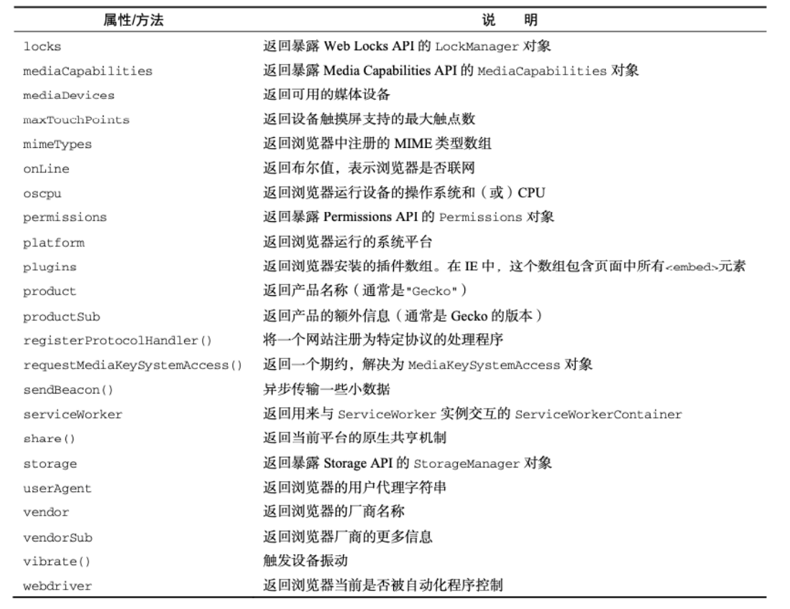
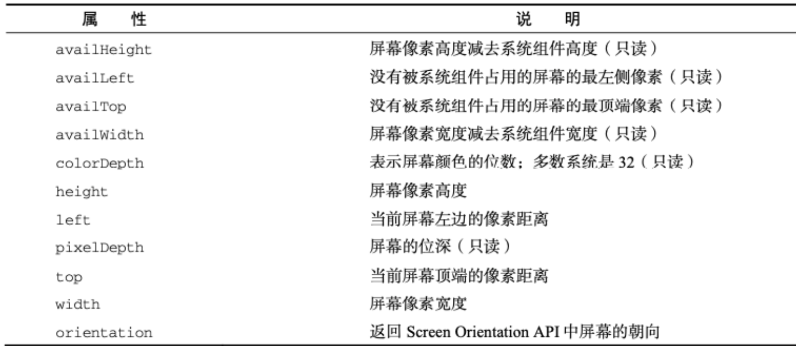
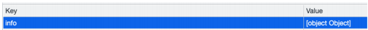

**◼ BOM：浏览器对象模型**

​		 简称 BOM，由浏览器提供的用于处理文档（document）之外的所有内容的其他对象；

​		 比如navigator、location、history等对象；

◼ JavaScript有一个非常重要的运行环境就是浏览器

​		 而且浏览器本身又作为一个应用程序需要对其本身进行操作；

​		 所以通常浏览器会有对应的对象模型（BOM，Browser Object Model）；

​		 我们可以将BOM看成是连接JavaScript脚本与浏览器窗口的桥梁；

◼ BOM主要包括一下的对象模型：

​		 window：包括全局属性、方法，控制浏览器窗口相关的属性、方法；

​		 location：浏览器连接到的对象的位置（URL）；

​		 history：操作浏览器的历史；

​		 navigator：用户代理（浏览器）的状态和标识（很少用到）；

​		 screen：屏幕窗口信息（很少用到）；

# window对象

◼ **window对象在浏览器中可以从两个视角来看待：**

​		 视角一：全局对象。

​				✓ 我们知道ECMAScript其实是有一个全局对象的，这个全局对象在Node中是global；

​				✓ 在浏览器中就是window对象；

​		 视角二：浏览器窗口对象。

​				✓ 作为浏览器窗口时，提供了对浏览器操作的相关的API；

◼ **当然，这两个视角存在大量重叠的地方，所以不需要刻意去区分它们：**

​		 事实上对于浏览器和Node中全局对象名称不一样的情况，目前已经指定了对应的标准，称之为globalThis，并且大多数现代浏览器都支持它；

​		 放在window对象上的所有属性都可以被访问；

​		 使用var定义的变量会被添加到window对象中；

​		 window默认给我们提供了全局的函数和类：setTimeout、Math、Date、Object等；

## 作用

◼ **事实上window对象上肩负的重担是非常大的：**

​		 第一：包含大量的属性，localStorage、console、location、history、screenX、scrollX等等（大概60+个属性）；

​		 第二：包含大量的方法，alert、close、scrollTo、open等等（大概40+个方法）；

​		 第三：包含大量的事件，focus、blur、load、hashchange等等（大概30+个事件）；

​		 第四：包含从EventTarget继承过来的方法，addEventListener、removeEventListener、dispatchEvent方法；

◼ **那么这些大量的属性、方法、事件在哪里查看呢？**

​		 MDN文档：https://developer.mozilla.org/zh-CN/docs/Web/API/Window


# Location对象

◼ **location对象用于表示window上当前链接到的URL信息。**

## 属性

 href: 当前window对应的超链接URL, 整个URL；

 protocol: 当前的协议；

 host: 主机地址；

 hostname: 主机地址(不带端口)；

 port: 端口；

 pathname: 路径；

 search: 查询字符串；

 hash: 哈希值；

 username：URL中的username（很多浏览器已经禁用）；

 password：URL中的password（很多浏览器已经禁用）；

## 方法

◼ **我们会发现location其实是URL的一个抽象实现**

◼ **location有如下常用的方法：**

​		 assign：赋值一个新的URL，并且跳转到该URL中；

​		 replace：打开一个新的URL，并且跳转到该URL中（不同的是不会在浏览记录中留下之前的记录）；

​		 reload：重新加载页面，可以传入一个Boolean类型；

## **URLSearchParams**

◼ **URLSearchParams 定义了一些实用的方法来处理 URL 的查询字符串。**

​		 可以将一个字符串转化成URLSearchParams类型；

​		 也可以将一个URLSearchParams类型转成字符串；

```js
var urlsearch=new URLSearchParams("name=why&age=18&height=1.8")
console.log(urlsearch.get("name"))  //why
console.log(urlsearch.toString())   //name=why&age=18&height=1.8
```

◼ **URLSearchParams常见的方法有如下：**

​		 get：获取搜索参数的值；

​		 set：设置一个搜索参数和值；

​		 append：追加一个搜索参数和值；

​		 has：判断是否有某个搜索参数；

​		 https://developer.mozilla.org/zh-CN/docs/Web/API/URLSearchParams

◼ 中文会使用encodeURIComponent和decodeURIComponent进行编码和解码

# **history对象**

◼ **history对象允许我们访问浏览器曾经的会话历史记录。**

◼ 有两个属性：

​		 length：会话中的记录条数；

​		 state：当前保留的状态值；

◼ **有五个方法：**

​		 back()：返回上一页，等价于history.go(-1)；

​		 forward()：前进下一页，等价于history.go(1)；

​		 go()：加载历史中的某一页；

​		 pushState()：打开一个指定的地址；

​		 replaceState()：打开一个新的地址，并且使用replace；

◼ **history和hash目前是vue、react等框架实现路由的底层原理，具体的实现方式我会在后续讲解**

# **navigator对象**

◼ **navigator 对象表示用户代理的状态和标识等信息。**



# **screen对象**

◼ **screen主要记录的是浏览器窗口外面的客户端显示器的信息：**

​		 比如屏幕的逻辑像素 screen.width、screen.height；



# JSON

◼ **在目前的开发中，JSON是一种非常重要的数据格式，它并不是编程语言，而是一种可以在服务器和客户端之间传输的数据格式。**

◼ **JSON的全称是JavaScript Object Notation（JavaScript对象符号）：**

​		 JSON是由Douglas Crockford构想和设计的一种轻量级资料交换格式，算是JavaScript的一个子集；

​		 但是虽然JSON被提出来的时候是主要应用JavaScript中，但是目前已经独立于编程语言，可以在各个编程语言中使用；

​		 很多编程语言都实现了将JSON转成对应模型的方式；

◼ **其他的传输格式：**

​		 XML：在早期的网络传输中主要是使用XML来进行数据交换的，但是这种格式在解析、传输等各方面都弱于JSON，所以目前已经很少在被使用了；

​		 Protobuf：另外一个在网络传输中目前已经越来越多使用的传输格式是protobuf，但是直到2021年的3.x版本才支持JavaScript，所以目前在前端使用的较少；

◼ **目前JSON被使用的场景也越来越多：**

​		 网络数据的传输JSON数据；

​		 项目的某些配置文件；

​		 非关系型数据库（NoSQL）将json作为存储格式

## **基本语法**

◼ **JSON的顶层支持三种类型的值：**

​		 简单值：数字（Number）、字符串（String，不支持单引号）、布尔类型（Boolean）、null类型；

​		 对象值：由key、value组成，key是字符串类型，并且必须添加双引号，值可以是简单值、对象值、数组值；

​		 数组值：数组的值可以是简单值、对象值、数组值；

## 序列化

◼ **某些情况下我们希望将JavaScript中的复杂类型转化成JSON格式的字符串，这样方便对其进行处理：**

​		 比如我们希望将一个对象保存到localStorage中；

​		 但是如果我们直接存放一个对象，这个对象会被转化成 [object Object] 格式的字符串，并不是我们想要的结果；

```js
const obj={
    name:"why",
    age:18,
    friend:{
        name:"kobe"
    },
    hobbies:["篮球","足球"]
}
```



◼ **在ES5中引用了JSON全局对象，该对象有两个常用的方法：**

​		 stringify方法：将JavaScript类型转成对应的JSON字符串；

​		 parse方法：解析JSON字符串，转回对应的JavaScript类型；

◼ **那么上面的代码我们可以通过如下的方法来使用：**

```js
//转成字符串保存
const objString=JSON.stringify(obj)
localStorage.setItem("info",objString)

//获取字符串转回对象
const itemString=localStorage.getItem("info")
const info=JSON.parse(itemString)
console.log(info)
```

### **Stringify的参数replace**

◼ **JSON.stringify()** 方法将一个 JavaScript 对象或值转换为 JSON 字符串：

​		 如果指定了一个 replacer 函数，则可以选择性地替换值；

​		 如果指定的 replacer 是数组，则可选择性地仅包含数组指定的属性；

```js
//转JSON
const objString1=JSON.stringify(obj)
//{"name":"why","age":18,"friend":{"name":"kobe"},"hobbies":["篮球","足球"]}

//replace参数是一个数组
const objString2=JSON.stringify(obj,["name","age"])
//{"name":"why","age":18}

//replace参数是一个函数
const objString3=JSON.stringify(obj,(key,value)=>{
  if(key==="name"){
    return "coderwhy"
  }
  return value
})
//{"name":"coderwhy","age":18,"friend":{"name":"coderwhy"},"hobbies":["篮球","足球"]}
```

### **Stringify的参数space**

◼ 如果对象本身包含toJSON方法，那么会直接使用toJSON方法的结果

```js
const obj={
    name:"why",
    age:18,
    friend:{
        name:"kobe"
    },
    hobbies:["篮球","足球"],
    toJSON:function(){
        return "coderwhy"
    }
}

const objString5=JSON.stringify(obj)
console.log(objString5)  //coderwhy
```

### **parse方法**

◼ **JSON.parse() 方法用来解析JSON字符串，构造由字符串描述的JavaScript值或对象。**

​		 提供可选的 **reviver** 函数用以在返回之前对所得到的对象执行变换(操作)。

```js
//转回对象，并且转换某些值
const info2=JSON.parse(objString,(key,value)=>{
    if(key==="time"){
        return new Date(value)
    }
    return value
})
```

◼ JSON的方法可以帮我们实现对象的深拷贝：

​		 但是目前我们还没有了解什么是对象的拷贝、浅拷贝、深拷贝的概念；

​		 我们会在JavaScript高级中学习；

# **Storage**

◼ **WebStorage主要提供了一种机制，可以让浏览器提供一种比cookie更直观的key、value存储方式：**

​		 localStorage：本地存储，提供的是一种永久性的存储方法，在关闭掉网页重新打开时，存储的内容依然保留；

​		 sessionStorage：会话存储，提供的是本次会话的存储，在关闭掉会话时，存储的内容会被清除；

**◼  localStorage和sessionStorage的区别**

​		 验证一：关闭网页后重新打开，localStorage会保留，而sessionStorage会被删除；

​		 验证二：在页面内实现跳转，localStorage会保留，sessionStorage也会保留；

​		 验证三：在页面外实现跳转（打开新的网页），localStorage会保留，sessionStorage不会被保留；

◼ **Storage有如下的属性和方法：**

◼ **属性：**

​		 Storage.length：只读属性

​				✓ 返回一个整数，表示存储在Storage对象中的数据项数量；

◼ 方法：

​		 Storage.key()：该方法接受一个数值n作为参数，返回存储中的第n个key名称；

​		 Storage.getItem()：该方法接受一个key作为参数，并且返回key对应的value；

​		 Storage.setItem()：该方法接受一个key和value，并且将会把key和value添加到存储中。

​				✓ 如果key存储，则更新其对应的值；

​		 Storage.removeItem()：该方法接受一个key作为参数，并把该key从存储中删除；

​		 Storage.clear()：该方法的作用是清空存储中的所有key；