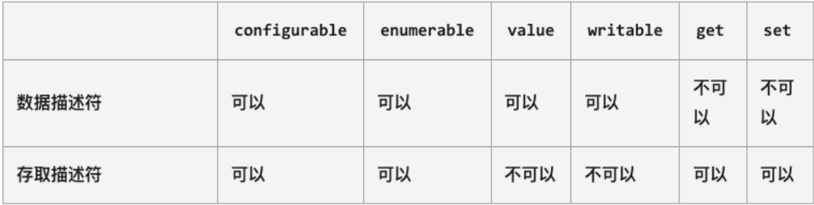

# **Object.defineProperty**

◼ 在前面我们的属性都是直接定义在对象内部，或者直接添加到对象内部的：

​		 但是这样来做的时候我们就不能对这个属性进行一些限制：比如这个属性是否是可以通过delete删除的？这个属性是否在for in遍历的时候被遍历出来呢？

◼ 如果我们想要对一个属性进行比较精准的操作控制，那么我们就可以使用属性描述符。

​		 通过属性描述符可以精准的添加或修改对象的属性；

​		 属性描述符需要使用 Object.defineProperty 来对属性进行添加或者修改；

◼ **Object.defineProperty()** 方法会直接在一个对象上定义一个新属性，或者修改一个对象的现有属性，并返回此对象。

`Object.defineProperty(obj,prop,descriptor)`

◼ 可接收三个参数：

​		 obj要定义属性的对象；

​		 prop要定义或修改的属性的名称或 Symbol；

​		 descriptor要定义或修改的属性描述符；

◼ 返回值：

​		 被传递给函数的对象。

## **属性描述符分类**

◼ 属性描述符的类型有两种：

​		 数据属性（Data Properties）描述符（Descriptor）；

​		 存取属性（Accessor访问器 Properties）描述符（Descriptor）；



### **数据属性描述符**

◼ [[Configurable]]：表示属性是否可以通过delete删除属性，是否可以修改它的特性，或者是否可以将它修改为存取属性描述符；

​		 当我们直接在一个对象上定义某个属性时，这个属性的[[Configurable]]为true；

​		 当我们通过属性描述符定义一个属性时，这个属性的[[Configurable]]默认为false；

◼ [[Enumerable]]：表示属性是否可以通过for-in或者Object.keys()返回该属性；

​		 当我们直接在一个对象上定义某个属性时，这个属性的[[Enumerable]]为true；

​		 当我们通过属性描述符定义一个属性时，这个属性的[[Enumerable]]默认为false；

◼ [[Writable]]：表示是否可以修改属性的值；

​		 当我们直接在一个对象上定义某个属性时，这个属性的[[Writable]]为true；

​		 当我们通过属性描述符定义一个属性时，这个属性的[[Writable]]默认为false；

◼ [[value]]：属性的value值，读取属性时会返回该值，修改属性时，会对其进行修改；

​		 默认情况下这个值是undefined；

### **存取属性描述符**

◼ [[Configurable]]：表示属性是否可以通过delete删除属性，是否可以修改它的特性，或者是否可以将它修改为存取属性描述符；

​		 和数据属性描述符是一致的；

​		 当我们直接在一个对象上定义某个属性时，这个属性的[[Configurable]]为true；

​		 当我们通过属性描述符定义一个属性时，这个属性的[[Configurable]]默认为false；

◼ [[Enumerable]]：表示属性是否可以通过for-in或者Object.keys()返回该属性；

​		 和数据属性描述符是一致的；

​		 当我们直接在一个对象上定义某个属性时，这个属性的[[Enumerable]]为true；

​		 当我们通过属性描述符定义一个属性时，这个属性的[[Enumerable]]默认为false；

◼ [[get]]：获取属性时会执行的函数。默认为undefined

◼ [[set]]：设置属性时会执行的函数。默认为undefined

## **同时定义多个属性**

```js
var obj={
  _age:18
}

Object.defineProperties(obj,{
  name:{
    writable:true,
    value:"why"
  },
  age:{
    get:function(){
      return this._age
    }
  }
})
```

# **对象方法补充**

◼ **获取对象的属性描述符：**

​		 getOwnPropertyDescriptor

​		 getOwnPropertyDescriptors

```js
const person = {
  name: 'Alice',
  age: 30
};

const descriptors = Object.getOwnPropertyDescriptors(person);

console.log(descriptors.name.value); // 'Alice'
console.log(descriptors.age.writable); // true

```

◼ **禁止对象扩展新属性：preventExtensions**

​		 给一个对象添加新的属性会失败（在严格模式下会报错）；

◼ **密封对象，不允许配置和删除属性：seal**

​		 实际是调用*preventExtensions*

​		 并且将现有属性的*configurable:false*

◼ **冻结对象，不允许修改现有属性：** **freeze**

​		 实际上是调用*seal*

​		 并且将现有属性的*writable: false*

◼ **hasOwnProperty**

​		 对象是否有某一个属于自己的属性（不是在原型上的属性）

`console.log(info.hasOwnProperty("name"))`

◼ **in/for in 操作符**

​		 判断某个属性是否在某个对象或者对象的原型上

`console.log("name" in info)`

for..in遍历不仅遍历自己对象上的内容，也包括原型对象上的内容

◼ **instanceof(实例对象和类之间的判断）**

​		 用于检测构造函数（Person、Student类）的pototype，是否出现在某个实例对象的原型链上

``console.log(stu1 instanceof Student) //stu1是实例（instance）对象``

`console.log(stu1 instanceof Person) `

`console.log(stu1 instanceof Object) `

◼ **isPrototypeOf（对象和对象之间的判断）**

​		 用于检测某个对象，是否出现在某个实例对象的原型链上

`console.log(Student.prototype.isPrototypeOf(stu1))`

`console.log(Person.prototype.isPrototypeOf(stu1))`