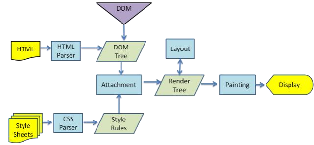
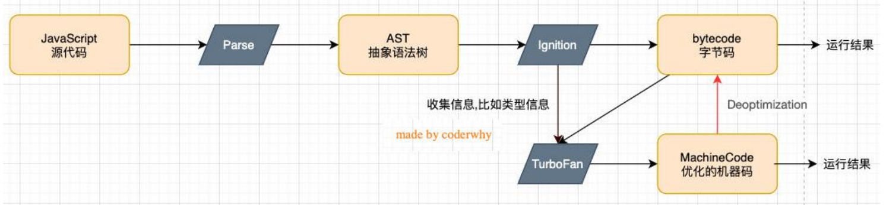
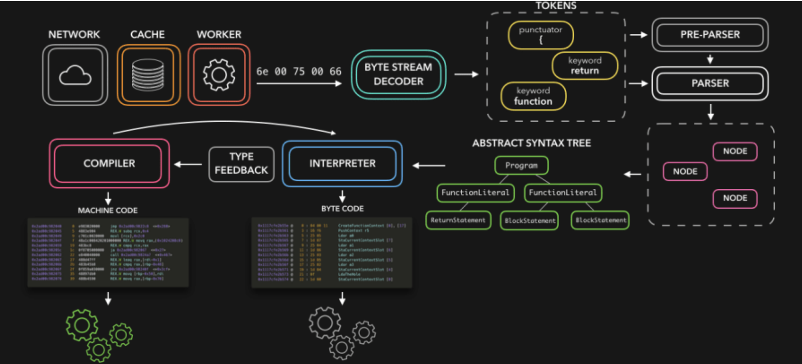
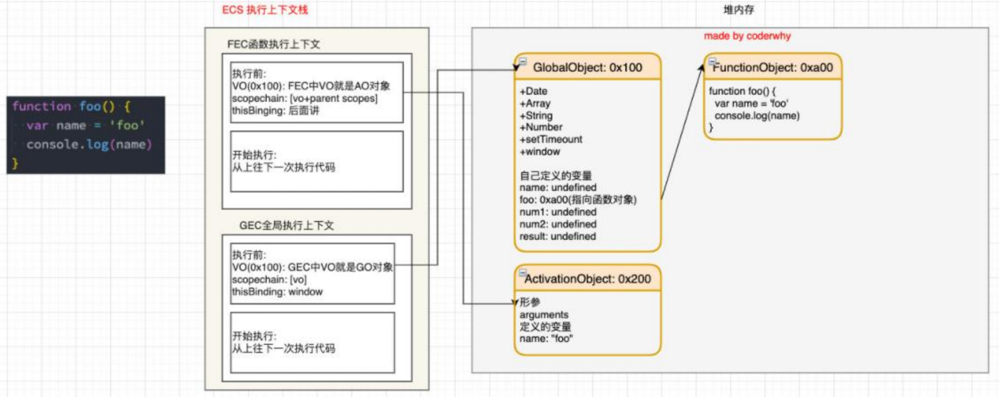
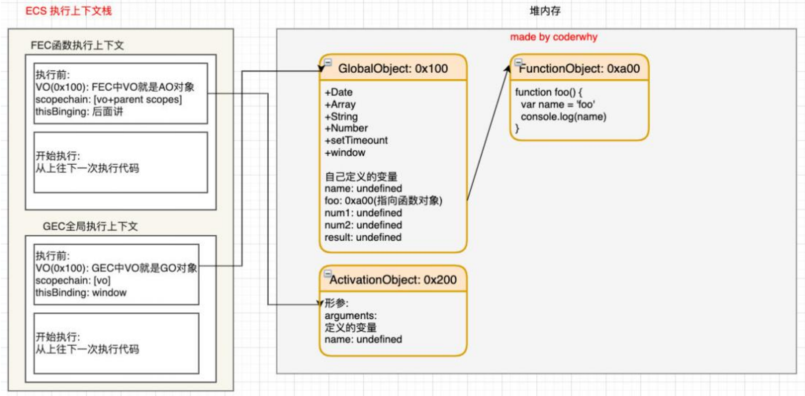

# this

 1.函数在调用时，JavaScript会默认给this绑定一个值；

 2.this的绑定**和定义的位置（编写的位置）没有关系**；

 3.this的绑定和调用方式以及调用的位置有关系；

 4.this是**在运行时被绑定**的；

## 默认绑定

◼ **什么情况下使用默认绑定呢？独立函数调用。**

​		 独立的函数调用我们可以理解成函数没有被绑定到某个对象上进行调用；

==**注意：一般指向全局window。但严格模式下，this会指向undefined。**==

## 隐式绑定

◼ 另外一种比较常见的调用方式是通过某个对象进行调用的：

​		也就是它的调用位置中，是通过某个对象发起的函数调用。

## new绑定

回顾JS基础笔记：

◼ **如果一个函数被使用new操作符调用了，那么它会执行如下操作：**

​		 1. 在内存中创建一个新的对象（空对象）；

​		 2. 这个对象内部的[[prototype]]属性会被赋值为该构造函数的prototype属性

​		 3. 构造函数内部的this，**会指向创建出来的新对象**；

​		 4. 执行函数的内部代码（函数体代码）；

​		 5. 如果构造函数没有返回非空对象，则返回创建出来的新对象

## 显式绑定

◼ **隐式绑定有一个前提条件：**

​		 必须在调用的对象内部有一个对函数的引用（比如一个属性）；

​		 如果没有这样的引用，在进行调用时，会报找不到该函数的错误；

​		 正是通过这个引用，间接的将this绑定到了这个对象上；

◼ **如果我们不希望在 对象内部包含这个函数的引用，同时又希望在这个对象上进行强制调用，可以用apply、call、bind**

**◼ apply和call**

​		 第一个参数是相同的，要求传入一个对象；

​				✓ 这个对象的作用是什么呢？就是给this准备的。

​				✓ 在调用这个函数时，会将this绑定到这个传入的对象上。

​		 后面的参数，apply为数组，call为参数列表；

```js
function.apply(thisArg,[argsArray])
function.call(thisArg,arg1,arg2,...)
```

◼ **bind**

**会让一个函数总是显示的绑定到一个对象上**

​		 使用bind方法，bind() 方法创建一个新的绑定函数（bound function，BF）；

​		 绑定函数是一个 exotic function object（怪异函数对象，ECMAScript 2015 中的术语）

​		 在 bind() 被调用时，这个**新函数的 this 被指定为 bind() 的第一个参数，而其余参数将作为新函数的参数，供调用时使用。**

​		 后续再调用传参，不会改写，只会往后传参

## 内置函数的绑定

根据经验判断、、

内置函数：些JavaScript的内置函数，或者一些第三方库中的内置函数。这些函数会要求我们传入另一个函数。比如setTimeout、数组的forEach、div的点击。这些函数中的this根据经验判断指向。

## 绑定规则优先级

◼ **1.默认规则的优先级最低**

◼ **2.显示绑定优先级高于隐式绑定**

◼ **3.new绑定优先级高于隐式绑定**

◼ **4.new绑定优先级高于bind**

​		 new绑定和call、apply是不允许同时使用的，所以不存在谁的优先级更高

​		 new绑定可以和bind一起使用，new绑定优先级更高

### this规则之外

◼ **情况一：如果在显示绑定中，我们传入一个null或者undefined，那么这个显示绑定会被忽略，使用默认规则：**

```js
function foo(){
    console.log(this)
}
var obj={
    name:"why"
}
foo.call(null)   //window
foo.call(undefined)  //window
```

◼ **情况二：创建一个函数的间接引用，这种情况使用默认绑定规则。**

​		 赋值(obj2.foo = obj1.foo)的结果是foo函数；

​		 foo函数被直接调用，那么是默认绑定；

```js
function foo(){
    console.log(this)
}
var obj={
    name:"obj1"
    foo:foo
}
var obj2={
    name:"obj2"
}
obj1.foo()   //obj1对象
(obj2.foo=obj1.foo)()   //window
```

◼ **情况三：箭头函数**

 就没有this，用显式绑定也没有用

# 箭头函数

 箭头函数不会绑定this、arguments属性；

 箭头函数不能作为构造函数来使用（不能和new一起来使用，会抛出错误）；

## 编写优化

◼ **优化一: 如果只有一个参数()可以省略**

`nums.forEach(item=>{})`

◼ **优化二: 如果函数执行体中只有一行代码, 那么可以省略大括号**

​		 并且这行代码的返回值会作为整个函数的返回值

`nums.forEach(item => console.log(item))`

`nums.filter(item => true)`

◼ **优化三: 如果函数执行体只有返回一个对象, 那么需要给这个对象加上()**

```js
var foo=()=>{
    return {name:"abc"}
}
var bar=()=>({name:"abc"})
```

## 场景示例

```js
//模拟网络请求
function request(url,callbackFn){
  var results=["abc","buc","fds"]
  callbackFn(results)   //不做处理的话，这里单独调用this会指向全局
}

var obj={
  names:[],
  network:function(){
    //早期解决办法
    // var _this=this
    // request("/names",function(res){
    //   _this.names=[].concat(res)
    // })
    //箭头函数解决办法
    request("/names",(res)=>{
      this.names=[].concat(res)
    })
  }
}

obj.network();
```

```js
//定时器中的回调函数
var obj={
  data:[],
  getData:function () {
      setTimeout(()=>{
        var res=["abc","vdx","sdd"]
        this.data.push(...res)
      },1000)
    }
}
//如果getData也是一个箭头函数，this则指向window
var obj={
  data:[],
  getData:()=> {
      setTimeout(()=>{
        console.log(this)  //this
      },1000)
    }
}
```

# 网页的解析

输入url→DNS→服务器加载静态资源→index.html→遇到link元素css文件、script元素js文件则对应下载

## 渲染引擎（浏览器内核）



◼ **因为默认情况下服务器会给浏览器返回index.html文件，所以解析HTML是所有步骤的开始**

◼ **解析HTML，会构建DOM Tree**

◼ **在解析的过程中，如果遇到CSS的link元素，那么会由浏览器负责下载对应的CSS文件：**

​		 注意：下载CSS文件是不会影响DOM的解析的；

◼ **浏览器下载完CSS文件后，就会对CSS文件进行解析，解析出对应的规则树**

◼ **当有了DOM Tree和 CSSOM Tree后，就可以两个结合来构建Render Tree**

​		 link元素不会阻塞DOM Tree的构建过程，但会阻塞Render Tree的构建过程

​		 Render Tree和DOM Tree并不是一一对应的关系**，**比如对于display为none的元素，压根不会出现在render tree中

◼ **第四步是在渲染树上运行布局（Layout）以计算每个节点的几何体。**

​		 布局是确定呈现树中所有节点的宽度、高度和位置信息；

◼ **第五步是将每个节点绘制（Paint）到屏幕上**

​		 在绘制阶段，浏览器将布局阶段计算的每个frame转为屏幕上实际的像素点；

​		 包括将元素的可见部分进行绘制，比如文本、颜色、边框、阴影、替换元素（比如img）

## 回流、重绘

**回流（重排）：**

​		布局后对节点的大小、位置修改重新计算称之为回流。

​		◼ **什么情况下引起回流呢？**

​				 比如DOM结构发生改变（添加新的节点或者移除节点）；

​				 比如改变了布局（修改了width、height、padding、font-size等值）

​				 比如窗口resize（修改了窗口的尺寸等）

​				 比如调用getComputedStyle方法获取尺寸、位置信息；

**重绘：**

​		绘制之后重新渲染称为重绘。

​		◼ **什么情况下会引起重绘呢？**

​				 比如修改背景色、文字颜色、边框颜色、样式等；

◼ **回流一定会引起重绘，所以回流是一件很消耗性能的事情。**

◼ **所以在开发中要尽量避免发生回流：**

​		◼ 1.修改样式时尽量一次性修改

​				 比如通过cssText修改，比如通过添加class修改

​		◼ 2.尽量避免频繁的操作DOM

​				 我们可以在一个DocumentFragment或者父元素中将要操作的DOM操作完成，再一次性的操作；

​		◼ 3.尽量避免通过getComputedStyle获取尺寸、位置等信息；

​		◼ 4.对某些元素使用position的fixed和absolute

​				 并不是不会引起回流，而是开销相对较小，不会对其他元素造成影响。

## 合成composite

◼ **绘制的过程，可以将布局后的元素绘制到多个合成图层中。**

​		 这是浏览器的一种优化手段；

◼ **默认情况下，标准流中的内容都是被绘制在同一个图层（Layer）中的；**

◼ **而一些特殊的属性，会创建一个新的合成层（** **CompositingLayer** **），并且新的图层可以利用GPU来加速绘制；**

​		 因为每个合成层都是单独渲染的；

◼ **那么哪些属性可以形成新的合成层呢？常见的一些属性：**

​		 3D transforms

​		 video、canvas、iframe

​		 opacity 动画转换时；

​		 position: fixed

​		 will-change：一个实验性的属性，提前告诉浏览器元素可能发生哪些变化；

​		 animation 或 transition 设置了opacity、transform；

◼ 分层确实可以提高性能，但是它以内存管理为代价，因此不应作为 web 性能优化策略的一部分过度使用。

## script元素

◼ **我们现在已经知道了页面的渲染过程，但是JavaScript在哪里呢？**

​		 事实上，浏览器在解析HTML的过程中，遇到了script元素是不能继续构建DOM树的；

​		 它会停止继续构建，首先下载JavaScript代码，并且执行JavaScript的脚本；

​		 只有等到JavaScript脚本执行结束后，才会继续解析HTML，构建DOM树；

◼ **为什么要这样做呢？**

​		 这是因为JavaScript的作用之一就是操作DOM，并且可以修改DOM；

​		 如果我们等到DOM树构建完成并且渲染再执行JavaScript，会造成严重的回流和重绘，影响页面的性能；

​		 所以会在遇到script元素时，优先下载和执行JavaScript代码，再继续构建DOM树；

◼ **但是这个也往往会带来新的问题，特别是现代页面开发中：**

​		 在目前的开发模式中（比如Vue、React），脚本往往比HTML页面更“重”，处理时间需要更长；

​		 所以会造成页面的解析阻塞，在脚本下载、执行完成之前，用户在界面上什么都看不到；

◼ **为了解决这个问题，script元素给我们提供了两个属性（attribute）：defer和async。**

### **defer属性**

◼ **defer 属性告诉浏览器不要等待脚本下载，而继续解析HTML，构建DOM Tree**

​		 脚本会由浏览器来进行下载，但是不会阻塞DOM Tree的构建过程；

​		 如果脚本提前下载好了，它会等待DOM Tree构建完成，**在DOMContentLoaded事件之前先执行defer中的代码**；（即先操作完再生成DOM树）

◼ **所以DOMContentLoaded总是会等待defer中的代码先执行完成。**

```html
<script defer src="./demo1.js"><script>
<script defer src="./demo2.js"><script>
```

◼ **另外多个带defer的脚本是可以保持正确的顺序执行的。**

​		 根据代码编写顺序执行

◼ **从某种角度来说，defer可以提高页面的性能，并且推荐放到head元素中；**

◼ **注意：defer仅适用于外部脚本，对于script默认内容会被忽略。**

### **async属性**

◼ **async 特性与 defer 有些类似，它也能够让脚本不阻塞页面。**

◼ **async是让一个脚本完全独立的：**

​		 浏览器不会因 async 脚本而阻塞（与 defer 类似）；

​		 async脚本**不能保证顺序**，它是独立下载、独立运行，不会等待其他脚本；

​		 async**不能保证在DOMContentLoaded之前或者之后执行**；

**总结：**

◼ defer通常用于需要在文档解析后操作DOM的JavaScript代码，并且对多个script文件有顺序要求的；

◼ async通常用于独立的脚本，对其他脚本，甚至DOM没有依赖的；

# JS运行原理

浏览器内核分为：web Core和JavaScript Core→V8引擎



◼ Parse模块会将JavaScript代码转换成AST（抽象语法树），这是因为解释器并不直接认识JavaScript代码；

​		 如果函数没有被调用，那么是不会被转换成AST的；

◼ Ignition是一个解释器，会将AST转换成ByteCode（字节码）

​		 同时会收集TurboFan优化所需要的信息（比如函数参数的类型信息，有了类型才能进行真实的运算）；

​		 如果函数只调用一次，Ignition会解释执行ByteCode；

◼ TurboFan是一个编译器，可以将字节码编译为CPU可以直接执行的机器码；

​		 如果**一个函数被多次调用**，那么就会**被标记为热点函数**，那么就会经过TurboFan转换成**优化的机器码**，提高代码的执行性能；

​		 但是，机器码实际上也会被还原为ByteCode，这是因为**如果**后续执行函数的过程中，**类型发生了变化**（比如sum函数原来执行的是number类型，后来执行变成了string类型），之前优化的机器码并不能正确的处理运算，就会**逆向的转换成字节码**；



◼ **词法分析**

​		 将字符序列转换成token序列的过程。

​		 **词法分析器**，也叫**扫描器**（scanner）

◼ **语法分析**

​		 语法分析器也可以称之为parser。

# JS执行过程

## 初始化全局对象

◼ js引擎会在执行代码之前，会在堆内存中创建一个全局对象：Global Object（GO）

​		 该对象 所有的作用域（scope）都可以访问；

​		 里面会包含Date、Array、String、Number、setTimeout、setInterval等等；

​		 其中还有一个window属性指向自己；

## **执行上下文**

◼ js引擎内部有一个**执行上下文栈（Execution Context Stack，简称ECS）**，它是用于执行**代码的调用栈**。（先进后出）

◼ 那么现在它要执行谁呢？执行的是**全局的代码块**：

​		 全局的代码块为了执行会构建一个 **Global Execution Context（GEC）**；

​		 GEC会 被放入到ECS中 执行；

◼ **GEC被放入到ECS中里面包含两部分内容：**

​		 **第一部分：**在代码执行前，在parser转成AST的过程中，会将全局定义的变量、函数等加入到GlobalObject中，但是并不会赋值；

​					✓ 这个过程也称之为==变量的作用域提升==（hoisting）

​		 **第二部分：**在代码执行中，对变量赋值，或者执行其他的函数；

## **VO对象**

◼ **每一个执行上下文会关联一个VO（Variable Object，变量对象），变量和函数声明会被添加到这个VO对象中。**

◼ **当全局代码被执行的时候，VO就是GO对象了**

## **函数如何被执行**

◼ 在执行的过程中**执行到一个函数时**，就会根据**函数体**创建一个**函数执行上下文（Functional Execution Context，简称FEC）**，并且压入到**EC Stack**中。

◼ **因为每个执行上下文都会关联一个VO，那么函数执行上下文关联的VO是什么呢？**

​		 当进入一个函数执行上下文时，会**创建一个AO对象**（Activation Object）；

​		 这个AO对象会**使用arguments作为初始化**，并且**初始值是传入的参数**；

​		 这个AO对象会作为执行上下文的VO来存放变量的初始化；

执行前：



执行后：



# **作用域和作用域链**

◼ **当进入到一个执行上下文时，执行上下文也会关联一个作用域链（Scope Chain）**

​		 作用域链是一个对象列表，用于变量标识符的求值；

​		 当进入一个执行上下文时，这个作用域链被创建，并且根据代码类型，添加一系列的对象；

# 内存管理和垃圾回收

## JS的内存管理

**在代码的执行过程中都是需要给它分配内存的内存的管理都会有如下的生命周期**：

​		 第一步：分配申请你需要的内存（申请）；

​		 第二步：使用分配的内存（存放一些东西，比如对象等）；

​		 第三步：不需要使用时，对其进行释放；

◼ **JS对于原始数据类型直接在栈空间进行分配**

◼ **JS对于复杂数据类型（即对象类型）内存的分配会在堆内存中开辟一块空间，并且将这块空间的指针返回值变量引用；**

## JS的垃圾回收

### **引用计数**

◼ **引用计数：**

​		 当一个对象有一个引用指向它时，那么这个对象的引用就+1；

​		 当一个对象的引用为0时，这个对象就可以被销毁掉；

◼ **这个算法有一个很大的弊端就是会产生循环引用；**

### **标记清除**

◼ **标记清除：**

​		 标记清除的核心思路是可达性（Reachability）

​		 这个算法是设置一个根对象（root object），垃圾回收器会定期从这个根开始，找所有从根开始有引用到的对象，对于哪些没有引用到的对象，就认为是不可用的对象；

​		 这个算法可以很好的解决循环引用的问题；

### 其它

◼ **JS引擎比较广泛的采用的就是可达性中的标记清除算法，当然类似于V8引擎为了进行更好的优化，它在算法的实现细节上也会结合一些其他的算法。**

◼ **标记整理**和“标记－清除”相似；

​		 不同的是，回收期间同时会将保留的存储对象搬运汇集到连续的内存空间，从而整合空闲空间，避免内存碎片化；

◼ **分代收集**—— 对象被分成两组：“新的”和“旧的”。

​		 许多对象出现，完成它们的工作并很快死去，它们可以很快被清理；

​		 那些长期存活的对象会变得“老旧”，而且被检查的频次也会减少；

◼ **增量收集**

​		 如果有许多对象，并且我们试图一次遍历并标记整个对象集，则可能需要一些时间，并在执行过程中带来明显的延迟。

​		 所以引擎试图将垃圾收集工作分成几部分来做，然后将这几部分会逐一进行处理，这样会有许多微小的延迟而不是一个大的延迟；

◼ **闲时收集**

​		 垃圾收集器只会在 CPU 空闲时尝试运行，以减少可能对代码执行的影响。

# 闭包

 一个普通的函数function，如果它可以访问外层作用域的自由变量，那么这个函数和周围环境就是一个闭包；

 从广义的角度来说：JavaScript中的函数都是闭包；

 从狭义的角度来说：JavaScript中一个函数，如果访问了外层作用域的变量，那么它是一个闭包；

## 内存泄漏