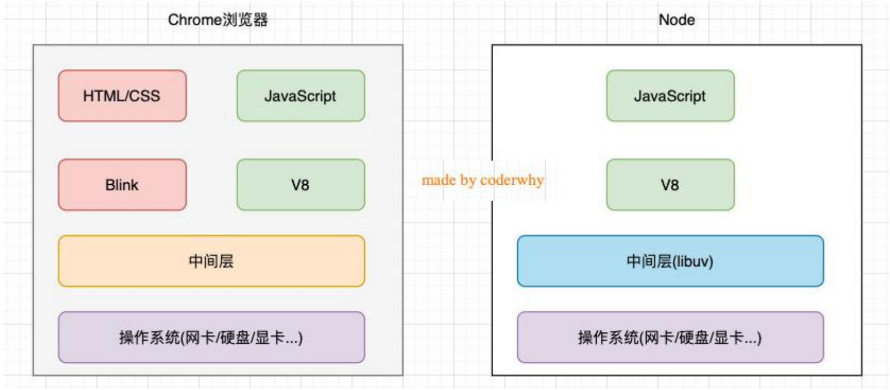
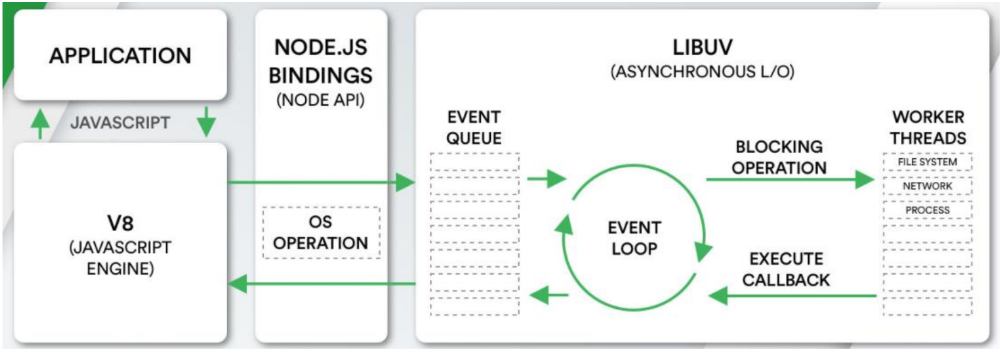
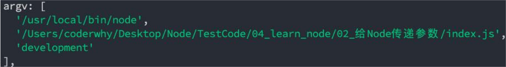
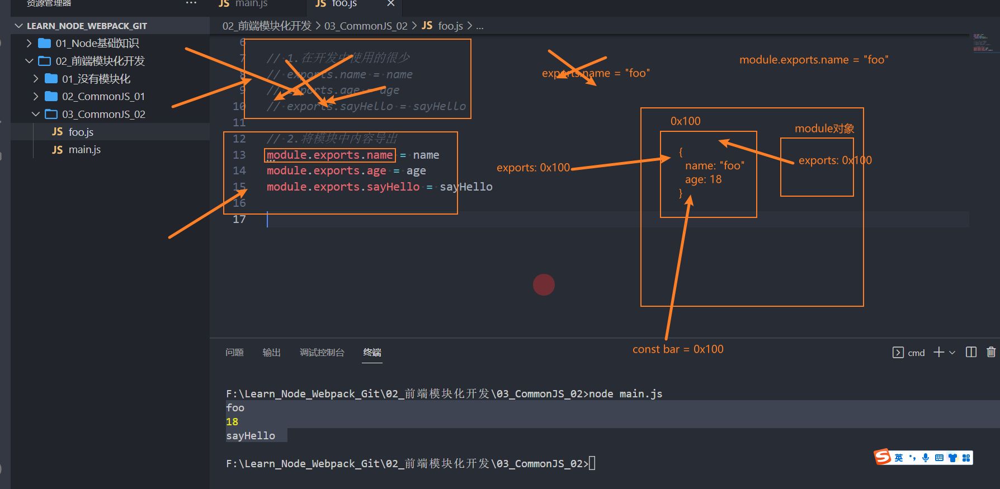

# **Node.js**

◼ **官方对Node.js的定义：**

​		 Node.js是一个基于V8 JavaScript引擎的JavaScript运行时环境。

◼ **也就是说Node.js基于V8引擎来执行JavaScript的代码，但是不仅仅只有V8引擎：**

​		 前面我们知道V8可以嵌入到任何C ++应用程序中，无论是Chrome还是Node.js，事实上都是嵌入了V8引擎来执行JavaScript代码；

​		 但是在Chrome浏览器中，还需要解析、渲染HTML、CSS等相关渲染引擎，另外还需要提供支持浏览器操作的API、浏览器

自己的事件循环等；

​		 另外，在Node.js中我们也需要进行一些额外的操作，比如文件系统读/写、网络IO、加密、压缩解压文件等操作；



◼ **我们来看一个单独的Node.js的架构图：**

​		 我们编写的JavaScript代码会经过V8引擎，再通过Node.js的Bindings，将任务放到Libuv的事件循环中；

​		 **libuv**（Unicorn Velociraptor—独角伶盗龙）是使用C语言编写的库；

​		 libuv提供了事件循环、文件系统读写、网络IO、线程池等等内容；



## node中传参

◼ **正常情况下执行一个node程序，直接跟上我们对应的文件即可：**

`node index.js`

◼ **但是，在某些情况下执行node程序的过程中，我们可能希望给node传递一些参数：**

`node index.js development`

◼ **如果我们这样来使用程序，就意味着我们需要在程序中获取到传递的参数：**

​		 获取参数其实是在**process的内置对象**中的；

​		 如果我们直接打印这个内置对象，它里面包含特别的信息：

​				✓ 其他的一些信息，比如版本、操作系统等大家可以自行查看，后面用到一些其他的我们还会提到；

◼ **现在，我们先找到其中的argv属性：**

​		 我们发现它是一个数组，里面包含了我们需要的参数；

​		 第一个元素是Node.js的可执行文件路径，第二个元素是当前执行的JavaScript文件路径，从第三个元素开始是命令行参数。



◼ **我们可以在代码中，将这些参数信息遍历出来，使用：**

```js
console.log(process.argv)
process.argv.forEach(item=>{
    console.log(item)
})
```

## 全局对象

### 常见全局对象

◼ **process对象：**process提供了Node进程中相关的信息：

​		 比如Node的运行环境、参数信息等；

​		 后面在项目中，我也会讲解，如何将一些环境变量读取到 process 的 env 中；

◼ **console对象：**提供了简单的调试控制台，在前面讲解输入内容时已经学习过了。

​		 更加详细的查看官网文档：https://nodejs.org/api/console.html

◼ **定时器函数：**在Node中使用定时器有好几种方式：

​		 setTimeout(callback, delay[, ...args])：callback在delay毫秒后执行一次；

​		 setInterval(callback, delay[, ...args])：callback每delay毫秒重复执行一次；

​		 setImmediate(callback[, ...args])：callbackI / O事件后的回调的“立即”执行；

​				✓ 这里先不展开讨论它和setTimeout(callback, 0)之间的区别；

​				✓ 因为它涉及到事件循环的阶段问题，我会在后续详细讲解事件循环相关的知识；

​		 process.nextTick(callback[, ...args])：添加到下一次tick队列中；

​				✓ 具体的讲解，也放到事件循环中说明；

### 特殊全局对象

◼ **为什么我称之为特殊的全局对象呢？**

​		 这些全局对象实际上是模块中的变量，只是每个模块都有，看来像是全局变量；

​		 在命令行交互中是不可以使用的；

​		 包括：\__dirname、__filename、exports、module、require()

◼ **__dirname：**获取当前文件所在的路径：

​		 注意：不包括后面的文件名

◼ **__filename：**获取当前文件所在的路径和文件名称：

​		 注意：包括后面的文件名称

### **global对象**

◼ **global是一个全局对象，事实上前端我们提到的process、console、setTimeout等都有被放到global中：**

​		 我们之前讲过：在新的标准中还有一个globalThis，也是指向全局对象的；

​		 类似于浏览器中的window；

#### **global和window的区别**

◼ **在浏览器中执行的JavaScript代码，如果我们在顶级范围内通过var定义的一个属性，默认会被添加到window对象上：**

```js
var name='coderwhy'
console.log(window.name)//coderwhy
```

◼ **但是在node中，我们通过var定义一个变量，它只是在当前模块中有一个变量，不会放到全局中：**

```js
var name='coderwhy'
console.log(global.name) //undefined
```

# 模块化

◼ **到底什么是模块化、模块化开发呢？**

​		 事实上模块化开发最终的目的是将程序划分成一个个小的结构；

​		 这个结构中编写属于**自己的逻辑代码**，有**自己的作用域**，定义变量名词时不会影响到其他的结构；

​		 这个结构可以将自己希望**暴露**的变量、函数、对象等导出给其结构使用；

​		 也可以通过某种方式，**导入**另外结构中的变量、函数、对象等；

## **CommonJS**

◼ **我们需要知道CommonJS是一个规范，最初提出来是在浏览器以外的地方使用，并且当时被命名为ServerJS，后来为了体现它的广泛性，修改为CommonJS，平时我们也会简称为CJS。**

​		 Node是CommonJS在服务器端一个具有代表性的实现；

​		 Browserify是CommonJS在浏览器中的一种实现；

​		 webpack打包工具具备对CommonJS的支持和转换；

◼ **所以，Node中对CommonJS进行了支持和实现，让我们在开发node的过程中可以方便的进行模块化开发：**

​		 在Node中每一个js文件都是一个单独的模块；

​		 这个模块中包括CommonJS规范的核心变量：exports、module.exports、require；

​		 我们可以使用这些变量来方便的进行模块化开发；

◼ **前面我们提到过模块化的核心是导出和导入，Node中对其进行了实现：**

​		 exports和module.exports可以负责对模块中的内容进行导出；

​		 require函数可以帮助我们导入其他模块（自定义模块、系统模块、第三方库模块）中的内容；

### **exports导出**

◼ **注意：exports是一个对象，我们可以在这个对象中添加很多个属性，添加的属性会导出；**

```js
exports.name=name
exports.age=age
exports.sayHello=sayHello
```

◼ **另外一个文件中可以导入：**

```js
const bar=require('./bar')
```

◼ **上面这行完成了什么操作呢？理解下面这句话，Node中的模块化一目了然**

​		 **意味着main中的bar变量等于exports对象；**

​		 也就是require通过各种查找方式，最终找到了exports这个对象；

​		 并且将这个exports对象赋值给了bar变量；

​		 bar变量就是exports对象了；

### **module.exports导出**

◼ **但是Node中我们经常导出东西的时候，又是通过module.exports导出的：**

​		 module.exports和exports有什么关系或者区别呢？

◼ **我们追根溯源，通过维基百科中对CommonJS规范的解析：**

​		 CommonJS中是没有module.exports的概念的；

​		 但是为了实现模块的导出，Node中使用的是Module的类，每一个模块都是Module的一个实例，也就是module；

​		 所以在Node中真正用于导出的其实根本不是exports，而是module.exports；

​		 因为module才是导出的真正实现者；

◼ **但是，为什么exports也可以导出呢？**

​		 这是因为module对象的exports属性是exports对象的一个引用；

​		 也就是说 module.exports = exports = main中的bar；



### **CommonJS规范缺点**

◼ **CommonJS加载模块是同步的：**

​		 同步的意味着只有等到对应的模块加载完毕，当前模块中的内容才能被运行；

​		 这个在服务器不会有什么问题，因为服务器加载的js文件都是本地文件，加载速度非常快；

◼ **如果将它应用于浏览器呢？**

​		 浏览器加载js文件需要先从服务器将文件下载下来，之后再加载运行；

​		 那么采用同步的就意味着后续的js代码都无法正常运行，即使是一些简单的DOM操作；

◼ **所以在浏览器中，我们通常不使用CommonJS规范：**

​		 当然在webpack中使用CommonJS是另外一回事；

​		 因为它会将我们的代码转成浏览器可以直接执行的代码；

◼ 在早期为了可以**在浏览器中使用模块化，通常会采用AMD或CMD**：

​		 但是目前一方面现代的浏览器已经支持ES Modules，另一方面借助于webpack等工具可以实现对CommonJS或者ES Module代码的转换；

​		 AMD和CMD已经使用非常少了；

## **ES Module**

◼ **ES Module和CommonJS的模块化有一些不同之处：**

​		 一方面它使用了import和export关键字；

​		 另一方面它采用编译期的静态分析，并且也加入了动态引用的方式；

◼ **ES Module模块采用export和import关键字来实现模块化：**

​		 export负责将模块内的内容导出；

​		 import负责从其他模块导入内容；

◼ **采用ES Module将自动采用严格模式：use strict**

### export关键字

◼ **export关键字将一个模块中的变量、函数、类等导出；**

◼ **我们希望将其他中内容全部导出，它可以有如下的方式：**

​		◼ 方式一：在语句声明的前面直接加上export关键字

​		◼ 方式二：将所有需要导出的标识符，放到export后面的 {}中

​				 注意：==这里的 {}里面不是ES6的对象字面量的增强写法，{}也不是表示一个对象的==；

​				 所以： export {name: name}，是错误的写法；

​		◼ 方式三：导出时给标识符起一个别名

​				 通过as关键字起别名

​		◼ 方式四： **default用法**

​				 默认导出export时可以不需要指定名字；

​				 在导入时不需要使用 {}，并且可以自己来指定名字；

​				 它也方便我们和现有的CommonJS等规范相互操作；

​				◼ **注意：在一个模块中，只能有一个默认导出**

### import关键字

◼ **import关键字负责从另外一个模块中导入内容**

◼ **导入内容的方式也有多种：**

​		◼ 方式一：import {标识符列表} from '模块'；

​				 注意：这里的{}也不是一个对象，里面只是存放导入的标识符列表内容；

​		◼ 方式二：导入时给标识符起别名

​				 通过as关键字起别名

​		◼ 方式三：通过 * 将模块功能放到一个模块功能对象（a module object）上

### **export和import结合使用**

`export {sum as barSum} from './bar.js'`

◼ **为什么要这样做呢？**

​		 在开发和封装一个功能库时，通常我们希望将暴露的所有接口放到一个文件中（index.js）；

​		 这样方便指定统一的接口规范，也方便阅读；

​		 这个时候，我们就可以使用export和import结合使用；

### **import函数**

◼ **通过import加载一个模块，是不可以在其放到逻辑代码中的，比如：**

```js
if(true){
    import sub from './modules/foo.js'
}
```

◼ **为什么会出现这个情况呢？**

​		 这是因为ES Module在被JS引擎解析时，就必须知道它的依赖关系；

​		 由于这个时候js代码没有任何的运行，所以无法在进行类似于if判断中根据代码的执行情况；

​		 甚至拼接路径的写法也是错误的：因为我们必须到运行时能确定path的值；

◼ **但是某些情况下，我们确确实实希望动态的来加载某一个模块：**

​		 如果根据不懂的条件，动态来选择加载模块的路径；

​		 这个时候我们需要使用 import() 函数来动态加载；

​				✓ import函数返回一个Promise，可以通过then获取结果；

```js
let flag=true
if(flag){
    import('./modules/aaa.js').then(aaa=>{
        aaa.aaa()
    })
}
```

### **import meta**

◼ **import.meta是一个给JavaScript模块暴露特定上下文的元数据属性的对象。**

​		 它包含了这个模块的信息，比如说这个模块的URL；

​		 在ES11（ES2020）中新增的特性；

### **ES Module的解析流程**

◼ **ES Module是如何被浏览器解析并且让模块之间可以相互引用的呢？**

​		 https://hacks.mozilla.org/2018/03/es-modules-a-cartoon-deep-dive/

◼ **ES Module的解析过程可以划分为三个阶段：**

​		 阶段一：构建（Construction），根据地址查找js文件，并且下载，将其解析成模块记录（Module Record）；

​		 阶段二：实例化（Instantiation），对模块记录进行实例化，并且分配内存空间，解析模块的导入和导出语句，把模块指向对应的内存地址。

​		 阶段三：运行（Evaluation），运行代码，计算值，并且将值填充到内存地址中；