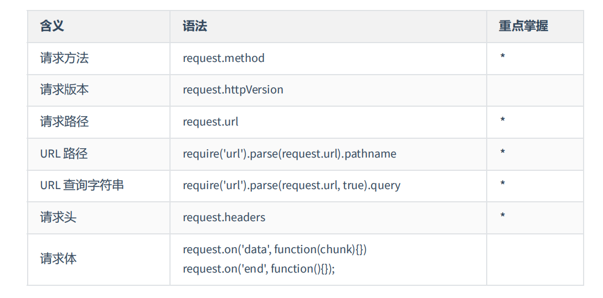
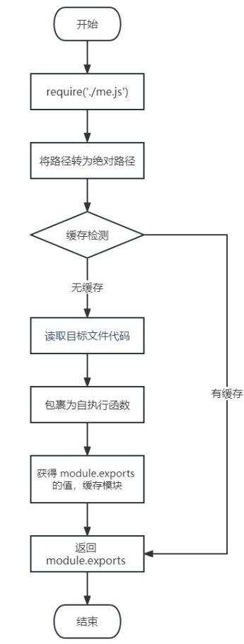

# Buffer

创建方式：

1. **Buffer.alloc(size[, fill[, encoding]])** 

   返回一个指定大小的 Buffer 实例，如果没有设置 fill，则默认填满 0

2. **Buffer.allocUnsafe(size)**

   返回一个指定大小的 Buffer 实例，但是它不会被初始化，所以它可能包含敏感的数据

3. **Buffer.from(array/arrayBuffer/buffer/string)**

   返回一个被 array 的值初始化的新的 Buffer 实例（传入的 array 的元素只能是数字，不然就会自动被 0 覆盖）

**溢出**

一个字节8个byte，故最大长度255，如果写了

```js
let buf=Buffer.from('hello');
buf[0]=361  //超出255。0001 0110 1001 => 0110 1001
```

会被舍弃8位外的byte。

**中文**

一个中文占3个字节

```js
let buf=Buffer.from('你好');
console.log(buf); //<Buffer e4 bd a0 e5 a5 bd>2汉字输出6位
```

# fs

Node 导入文件系统模块(fs)语法

```js
var fs = require("fs")
```

## **写入文件**

```js
fs.writeFile(file, data[, options], callback)
```

writeFile 直接打开文件默认是 **w** 模式，所以如果文件存在，该方法写入的内容会覆盖旧的文件内容。

参数使用说明如下：

- **file** - 文件名或文件描述符。
- **data** - 要写入文件的数据，可以是 String(字符串) 或 Buffer(缓冲) 对象。
- **options** - 该参数是一个对象，包含 {encoding, mode, flag}。默认编码为 utf8, 模式为 0666 ， flag 为 'w'
- **callback** - 回调函数，回调函数只包含错误信息参数(err)，在写入失败时返回。

```js
var fs=require("fs");

fs.writeFile('what.txt',"whatever!",(err)=>{
  //上面的err参数，在写入失败时是错误对象，写入成功时是null
  if(err){
   console.log("error");
   return;
  }
  console.log("ok")
})
```

以上是异步写入文件，同步写入代码用**fs.writeFileSync**

### 追加写入

`fs.appendFile(path, data[, options], callback)`（异步）

`fs.appendFileSync(path, data[, options])`（同步）

```js
fs.appendFile('./1.txt','\r\n你好呀~',(err)=>{
  if(err){        //上面的“\r\n”可以实现追加内容换行！
   console.log("error");
   return;
  }
  console.log("ok")
}))
```

也可以用writeFile实现追加写入，options可选参数写作{flag:'a'}即可

### 流式写入

`fs.createWriteStream(path[,options])`

```js
let ws=fs.createWriteStream('./1.txt');
ws.write('你好\r\n');
ws.write('拜~');
ws.close();   //可写可不写，不写会自动回收
```

> 程序打开一个文件要消耗资源，流式写入可以减少打开关闭文件的次数。
>
> 流式写入适用于大文件写入或者频繁写入的场景，writeFile适合写入频率低的场景

## 读取文件

`fs.readFile(path[,options], callback)`

回调callback有两个参数，一个错误信息，一个读取文件的内容（不做处理就返回buffer）

```js
fs.readFile('./1.txt',(err,data)=>{
    if(err){
        console.log('error');
        return;
    }
    console.log(data.toString());
})
```

同步读取`fs.readFileSync`

### 流式读取

`fs.createReadStream`

```js
const rs=fs.createReadStream('./1.mp4');
//绑定data事件获取数据  chunk 块儿
rs.on('data',chunk=>{
    console.log(chunk);//返回buffer，一块是64字节
})
//可选事件end
rs.on('end',()=>{
	console.log('读取完成~')
})
```

#### 文件复制小案例

```js
var fs=require("fs");
//流式
const rs=fs.createReadStream('chun.mp4');
let ws=fs.createWriteStream('chun2.mp4');
//以下代码可以简写一行：rs.pipe(ws)
rs.on('data',chunk=>{
    ws.write(chunk);
})
```

注意`rs.pipe(ws)`更简单~

## 文件移动和重命名

`fs.rename(oldPath,newPath,callback)`

`fs.renameSync(oldPath,newPath)`

## 文件删除

`fs.unlink(Path,callback)`

`fs.unlinkSync(Path)`

`fs.rm(Path,callback)`

`fs.rmSync(Path)`

## 文件夹操作

### 创建文件夹

`fs.mkdir(path[, options], callback)`

参数使用说明如下：

- **path** - 文件路径。
- options 参数可以是：
  - **recursive** - 是否以递归的方式创建目录，默认为 false。
  - **mode** - 设置目录权限，默认为 0777。
- **callback** - 回调函数，没有参数。

### 读取文件夹

`fs.readdir(path, callback)`

参数使用说明如下：

- **path** - 文件路径。
- **callback** - 回调函数，回调函数带有两个参数err, files，err 为错误信息，files 为 目录下的文件数组列表。

### 删除文件夹

`fs.rmdir(path[, options], callback)`

参数使用说明如下：

- **path** - 文件路径。
- options 参数可以是：
  - **recursive** - 是否以递归的方式删除不为空的目录，默认为 false。
- **callback** - 回调函数，没有参数。

==建议使用`fs.rm(path[, options], callback)`==

## 查看资源信息

`fs.stat(path, callback)`
异步 stat(). 回调函数有两个参数 err, stats，stats 是 fs.Stats 对象。

```js
fs.stat('./1.txt',(err,data)=>{
    if(err){
        throw err;
        return;
    }
    console.log(data.isFile()); //是否是文件
    console.log(data.isDirectory()); //是否是文件夹
})
```

## 路径

- 相对路径

  `./1.txt`         当前目录下的1.txt

  `1.txt`             同上

  `../1.txt`       当前目录上一级目录中的1.txt

- 绝对路径

  `D:/Program Files`     windows系统下的绝对路径

  `/user/bin`                    Linux系统下的绝对路径

> 相对路径中所谓**当前目录**，指的是**命令行的工作目录**，而并非是文件的所在目录。所以当命令行的工作目录与文件所在目录不一致时，会出现一些Bug。

为解决上述bug，可以使用“全局”变量==**__dirname**==

__dirname保存当前**文件所在目录的绝对路径**，可以与文件名拼接成绝对路径。

```js
let data=fs.readFileSync(__dirname+'/data.txt');
console.log(data);
```

# Path

| path.resolve  | 拼接规范的绝对路径 常用  |
| ------------- | ------------------------ |
| path.sep      | 获取操作系统的路径分隔符 |
| path.parse    | 解析路径并返回对象       |
| path.basename | 获取路径的基础名称       |
| path.dirname  | 获取路径的目录名         |
| path.extname  | 获得路径的扩展名         |

代码示例：

```js
const path = require('path');

//获取路径分隔符
console.log(path.sep);

//拼接绝对路径
console.log(path.resolve(__dirname, 'test'));

//解析路径
let pathname = 'D:/program file/nodejs/node.exe';

console.log(path.parse(pathname));

//获取路径基础名称
console.log(path.basename(pathname))

//获取路径的目录名
console.log(path.dirname(pathname));

//获取路径的扩展名
console.log(path.extname(pathname));
```

# HTTP

```js
//1. 导入 http 模块
const http = require('http');
//2. 创建服务对象 create 创建 server 服务
// request 意为请求. 是对请求报文的封装对象, 通过 request 对象可以获得请求报文的数据
// response 意为响应. 是对响应报文的封装对象, 通过 response 对象可以设置响应报文
//回调函数在有http请求发来时则请求一次
const server = http.createServer((request, response) => {
response.end('Hello HTTP server');//该内容即为响应体，并结束响应
});
//3. 监听端口, 启动服务
//9000是端口号
//回调在服务启动成功后调用
server.listen(9000, () => {
console.log('服务已经启动, 端口 9000 监听中...');
});
```

**注意事项**

1. 命令行 ctrl + c 停止服务

2. 当服务启动后，更新代码  必须重启服务才能生效

3. 响应内容中文乱码的解决办法

   `response.setHeader('content-type','text/html;charset=utf-8')`

4. 端口号被占用

> **HTTP** 协议默认端口是 **80** 。**HTTPS** 协议的默认端口是 **443**。
>
> 如果端口被其他程序占用，可以使用 **资源监视器** 找到占用端口的程序，然后使用 **任务管理器** 关闭对应的程序

## 获取请求报文



**新方法**

```js
const server = http.createServer((request, response) => {
  //实例化URL的对象
  //参数1：请求路径，参数2：协议、主机名   缺一不可！
  let url=new URL(request.url,'http://127.0.0.1');
  console.log(url.pathname);//url路径
  console.log(url.searchParams.get('keywww'))//查询字符串的值  不能直接.，要用get获取
  response.end('Hello HTTP server')
})
```

## 设置响应报文


write 和 end 的两种使用情况：

```js
//1. write 和 end 的结合使用 响应体相对分散
response.write('xx');
response.write('xx');
response.write('xx');
response.end(); //每一个请求，在处理的时候必须要执行 end 方法的

//2. 单独使用 end 方法 响应体相对集中
response.end('xxx');
```

# 模块化

## 暴露数据

模块暴露数据的方式有两种：
1. **module.exports = value**

2. **exports.name = value**

  > 使用时有几点注意：
  > module.exports 可以暴露 任意 数据
  > 不能使用 exports = value 的形式暴露数据，模块内部 module 与 exports 的隐式关系
  > exports = module.exports = {} ，require 返回的是目标模块中 module.exports 的值

为何exports.name=value可以？因为这样存的是引用类型，即exports=module.exports={function:function}

## 导入模块

在模块中使用 require 传入文件路径即可引入文件

`const test = require('./me.js');`

require 使用的一些注意事项：

1. 对于自己创建的模块，导入时路径建议写 相对路径 ，且不能省略 ./ 和 ../。
2. js 和 json 文件导入时可以不用写后缀，c/c++编写的 node 扩展文件也可以不写后缀，但是一般用不到。
3. 如果导入其他类型的文件，会以 js 文件进行处理。
4. 如果导入的路径是个文件夹，则会首先检测该文件夹下package.json 文件中 main 属性对应的文件，如果存在则导入。如果 main 属性不存在，或者 package.json 不存在，则会尝试导入文件夹下的 index.js 和index.json ，如果还是没找到，就会报错。
5. 导入 node.js 内置模块时，直接 require 模块的名字即可，无需加 ./ 和 ../。

> 这里我们介绍一下 require 导入 自定义模块 的基本流程
> 1. 将相对路径转为绝对路径，定位目标文件
> 2. 缓存检测
> 3. 读取目标文件代码
> 4. 包裹为一个函数并执行（自执行函数）。通过 arguments.callee.toString() 查看自执行函数
> 5. 缓存模块的值
> 6. 返回 module.exports 的值

