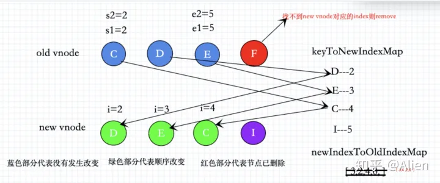
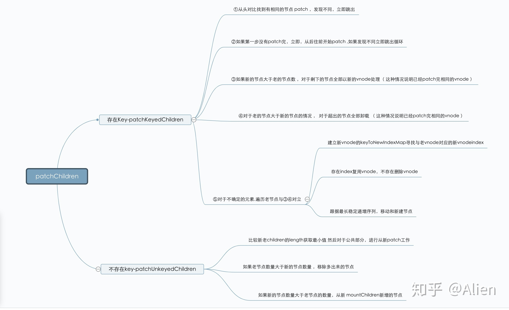
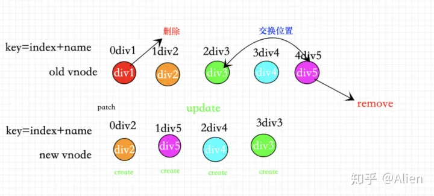

> 与vue2区别：不再做头尾交叉对比，增加了最长递增子序列算法

# diff算法作用域

patchChildren根据**是否存在key**进行真正的diff或者直接patch

**diff算法存在patchChildren方法中，而patchChildren方法用在Fragment类型和element类型的vnode中**

# diff作用

diff作用就是在patch子vnode过程中，**找到与新vnode对应的老vnode，复用真实的dom节点，避免不必要的性能开销**

# 无key时具体操作

1.  比较新老children的length获取最小值 然后对于公共部分，进行从新patch工作。

2.  如果老节点数量大于新的节点数量 ，移除多出来的节点。

3.  如果新的节点数量大于老节点的数量，从新 mountChildren新增的节点。

通俗来讲：挨个更新

# 有key时具体操作

源码中有一个isSameVNodeType函数，**判断type（如div）和key（如id）是否都一致，一致返回true。**

再通过该函数进行一个比较。先前序对比算法，遇到不一样的break出来进行尾序对比算法。

在元素未移动时，新节点多就新增，旧节点多就删除。

在元素有移动时，即没用patch完所有相同的vnode：

**1.构建新节点的映射关系**

key 1 2 3 4 5

index 0 1 2 3 4 

sort

key 5 4 3 2 1

index 0 1 2 3 4

keyToNewIndexMap:Map(5){5=>0,4=>1,3=>2,2=>3,1=>4}

**2.记录新节点在旧节点中的位置数组**

1. 开始遍历老的节点，判断有没有key， 如果存在key通过新节点的keyToNewIndexMap找到新节点index,如果不存在key那么会遍历剩下来的新节点试图找到对应index。

2. 如果存在index证明有对应的老节点，那么直接复用老节点进行patch，没有找到与老节点对应的新节点，删除当前老节点。

3. newIndexToOldIndexMap[新节点index,旧节点index]找到对应新老节点关系。

   

**3.最长稳定序列**

通过getSequence得到一个最长稳定序列，对于index === 0 的情况也就是新增节点（图中I）需要从新挂载一个新的vnode,然后对于发生移动的节点进行统一的移动操作

> 最长递增子序列算法
>
> ​       [10 , 9 , 2 , 5 , 3 , 7 , 101 , 18]
>
> dp     1    1   1   2   2   3     4      4

如果当前遍历的这个节点不在子序列说明要进行移动，如果节点在序列中直接跳过。

# 流程总结

1. 从头对比找到有相同的节点 patch ，发现不同，立即跳出。

2. 如果第一步没有patch完，立即，从后往前开始patch ,如果发现不同立即跳出循环。

3. 如果新的节点大于老的节点数 ，对于剩下的节点全部以新的vnode处理（ 这种情况说明已经patch完相同的vnode ）。

4. 对于老的节点大于新的节点的情况 ， 对于超出的节点全部卸载 （ 这种情况说明已经patch完相同的vnode ）。

5. 不确定的元素（ 这种情况说明没有patch完相同的vnode ） 与 3 ，4对立关系。

   > 把没有比较过的新的vnode节点,通过map保存
   >
   > 记录已经patch的新节点的数量 patched
   >
   > 没有经过patch新的节点的数量 toBePatched
   >
   > 建立一个数组newIndexToOldIndexMap[新节点index,旧节点index]
   >

6. 开始遍历老节点

   > ① 如果toBePatched新的节点数量为0 ，那么统一卸载老的节点
   >
   > ② 如果老节点的key存在 ，通过key找到对应的index
   >
   > ③ 如果老节点的key不存在
   >
   > ​            遍历剩下的所有新节点
   >
   > ​            如果找到与当前老节点对应的新节点那么 ，将新节点的索引，赋值给newIndex
   >
   > ④ 没有找到与老节点对应的新节点，卸载当前老节点
   >
   > ⑤ 如果找到与老节点对应的新节点，把老节点的索引，记录在存放新节点的数组中，
   >
   > ​            如果节点发生移动 记录已经移动了
   >
   > ​            patch新老节点 找到新的节点进行patch节点
   >

   遍历结束

7. 如果发生移动

   > ① 根据 newIndexToOldIndexMap 新老节点索引列表找到最长稳定序列
   >
   > ② 对于 newIndexToOldIndexMap - item =0 证明不存在老节点 ，从新形成新的vnode
   >
   > ③ 对于发生移动的节点进行移动处理。

# key的作用

判断newVnode和OldVnode的key是否相等，从而复用与新节点对应的老节点，节约性能的开销

# key的正确用法

用唯一id值做key。

### 错误操作

**①错误用法 1：用index做key**。

用index做key的效果实际和没有用diff算法是一样的

当我们用index作为key的时候，无论我们怎么样移动删除节点，到了diff算法中都会从头到尾依次patch

**②错误用法2 ：用index拼接其他值作为key。**

当已用index拼接其他值作为索引的时候，因为每一个节点都找不到对应的key，导致所有的节点都不能复用,所有的新vnode都需要重新创建。都需要重新create

